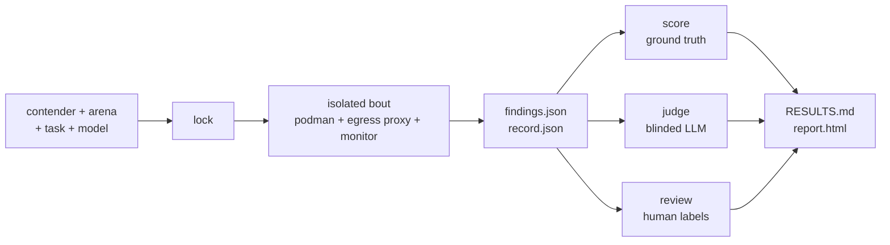

# skillordeal-trials

[](https://github.com/thereisnotime/skillordeal-trials/actions/workflows/ci.yml)

Studies run with [skillordeal](https://github.com/thereisnotime/skillordeal), a harness that benchmarks LLM agent skills (`SKILL.md` packs, Claude Code plugins, plain prompts) against a no-skill baseline, with every input pinned and every run kept.

- **Isolation:** each bout runs in a fresh rootless podman container with nothing else in context and network access only to `api.anthropic.com:443` (see [How a bout is isolated](#how-a-bout-is-isolated)).
- **Locking:** a round's `lock.yaml` pins skill commits, target repos, full model IDs, the CLI version and the image digest, and is committed before the round runs.
- **Resource metrics:** cost, tokens, turns, wall time and client-side RAM/CPU/threads/file handles for every bout.
- **Four ways to score:** ground-truth matching, duplicate clustering across contenders, a blinded LLM judge, and blind human labels.
- **Reports:** each round gets a generated `RESULTS.md` and `report.html`, and every number in them traces back to a transcript in this repo.

## Contents

- [How it fits together](#how-it-fits-together)
- [Words used everywhere](#words-used-everywhere)
- [Trials](#trials)
- [How a bout is isolated](#how-a-bout-is-isolated)
- [Reproduce a round in 3 commands](#reproduce-a-round-in-3-commands)
- [Trace a number](#trace-a-number)
- [How to label findings](#how-to-label-findings)
- [Repo layout](#repo-layout)
- [Auth and secrets](#auth-and-secrets)
- [Contributing](#contributing)

## How it fits together



The engine README has the [detailed version](https://github.com/thereisnotime/skillordeal#how-it-works), and [docs/data-contracts.md](https://github.com/thereisnotime/skillordeal/blob/main/docs/data-contracts.md) defines every file format.

## Words used everywhere

| Term | Meaning |
|---|---|
| **Trial** | One study: a question plus a fixed design (`trial.yaml`). Example: `2026-09-secure-coding-audit`. |
| **Round** | One locked execution of a trial (`rounds/r01/lock.yaml`). Reproductions add new rounds. |
| **Contender** | A skill under test, or `baseline` (no skill). Kinds: `skill`, `plugin`, `prompt`, `baseline`, and `pipeline` (a finder followed by one or more verifier stages). |
| **Arena** | A target repo pinned to a commit, optionally with ground truth. |
| **Task** | A prompt template, e.g. `security-audit`. |
| **Bout** | One run: contender × arena × task × model × rep. Its ID is a hash of its locked inputs. |
| **Verdict** | What a finding turned out to be. Ground truth gives `tp` / `dup` / `fp` / `unknown`, the judge gives `valid` / `invalid` / `unverifiable`, humans give `tp` / `fp` / `dup` / `unsure`. Human beats ground truth beats judge; `unknown`, `unverifiable` and `unsure` fall through to the next source. |

## Trials

| Trial | Question | Status | Latest round | Results | Lock |
|---|---|---|---|---|---|
| [2026-09-secure-coding-audit](trials/2026-09-secure-coding-audit/) | Which openly available secure-code-review skills find more real vulnerabilities per dollar than a plain Claude Code baseline? | r01 done | r01 | [RESULTS.md](trials/2026-09-secure-coding-audit/rounds/r01/RESULTS.md) | [r01/lock.yaml](trials/2026-09-secure-coding-audit/rounds/r01/lock.yaml) |

`just trials` prints the same list from the files on disk.

## How a bout is isolated

- **Container:** a fresh rootless podman container per bout, read-only root filesystem, tmpfs `HOME`, and an empty Claude config dir. No MCP servers, no host `~/.claude`, no session persistence.
- **Arena:** mounted read-only with `.git` removed, and agent context files (`CLAUDE.md`, `AGENTS.md`, `.claude/`, `.mcp.json`, `.cursor*` and similar) stripped at any depth.
- **Tools:** read-only (`Read`, `Grep`, `Glob`, `Skill` and a few `Bash` commands such as `ls` and `git log`).
- **Network:** the container sits on an internal-only podman network. Its only way out is a per-bout proxy sidecar that tunnels to `api.anthropic.com:443` and nothing else. Every allowed and denied connection attempt is counted in the bout's `record.json` under `egress`, so a skill that tries to phone home is visible, e.g. `{"mode": "allowlist", "allowed": {"api.anthropic.com:443": 3}, "denied": {}}`.
- **Isolation gate:** the harness checks what the CLI reports at startup and marks the bout `invalid` (excluded from scoring) if the loaded skills or plugins aren't what the contender should provide, an MCP server shows up, or the model isn't the locked one.

Full details: [What "zero context" means here](https://github.com/thereisnotime/skillordeal#what-zero-context-means-here) in the engine README.

## Reproduce a round in 3 commands

You need `asdf`, `just` and rootless `podman` (cgroup v2), plus a Claude credential (see [Auth and secrets](#auth-and-secrets)).

```bash
just setup engine=git+https://github.com/thereisnotime/skillordeal@v0.1.2   # toolchain, engine, runner image
just lock  trial=2026-09-secure-coding-audit round=r01-repro-$USER         # pin everything into a new round
just run   trial=2026-09-secure-coding-audit round=r01-repro-$USER --max-cost-usd 50
```

- Use the engine version recorded in the original round's `lock.yaml` (`engine.version`).
- `run` is resumable. Finished bouts are skipped, so re-running after a crash or a spend limit picks up where it stopped.
- `j=4` runs four bouts at once. Limit the round with `--contender baseline`, `--arena dvpwa` or `--rep 1` to spend less.
- Afterwards: `just score …`, `just judge …`, `just report …` with the same `trial=` and `round=`. Then `diff` your `lock.yaml` against the original to see what moved.

Without just, every recipe is one engine command, e.g. `skillordeal run trials/<trial>/trial.yaml -r <round> -j 1`.

## Trace a number

This walkthrough uses real values from the engine's smoke round (`examples/smoke/rounds/smoke/` in an engine checkout after `just smoke`; that output isn't committed). The smoke round is 1 rep on Haiku, so the numbers prove the plumbing, not anything about skill quality. The layout is the same for every round here: replace the paths with `trials/<trial>/rounds/<round>/`.

Its `RESULTS.md` says `sentry-security-review` found 6 true positives on `dvpwa` at $0.022 per TP. To check it:

1. **Find the bouts behind the row.** Each row in `RESULTS.md` links to its bouts. The same data is in `scores/bouts.csv`, one row per bout:

   ```bash
   cd examples/smoke/rounds/smoke
   grep sentry-security-review scores/bouts.csv | cut -d, -f1-9
   # b-538a92af2574a056,sentry-security-review,dvpwa,security-audit,claude-haiku-4-5-20251001,1,ok,6,0.13267
   ```

   Cost per TP is the total cost of the row's ok bouts over their TPs: $0.13267 / 6 = $0.022.

2. **Open one bout.** `record.json` has status, versions, hashes, cost, tokens, turns, tool calls, whether the skill fired, egress and RAM/CPU peaks:

   ```bash
   skillordeal show bouts/b-538a92af2574a056      # in this repo: just show bout=<bout-id>
   jq -c '{status, skill_fired, cost: .usage.total_cost_usd, tokens: .usage.tokens.total_tokens, turns: .usage.num_turns, tool_calls}' \
     bouts/b-538a92af2574a056/record.json
   # {"status":"ok","skill_fired":true,"cost":0.13267009999999999,"tokens":536667,"turns":37,"tool_calls":{"Bash":11,"Read":24,"StructuredOutput":1}}
   ```

3. **See what it reported.** `findings.json` is the model's structured output:

   ```bash
   jq -r '.findings[] | "\(.severity)\t\(.cwe // "-")\t\(.file):\(.line_start)\t\(.title)"' \
     bouts/b-538a92af2574a056/findings.json
   # critical  CWE-89    sqli/dao/student.py:42           SQL Injection in Student.create()
   # high      CWE-79    sqli/templates/courses.jinja2:17  Stored XSS via Course Title and Description
   # high      CWE-79    sqli/templates/course.jinja2:22   Stored XSS via Review Text
   # high      CWE-326   sqli/dao/user.py:40               Weak Password Hashing Algorithm
   # high      CWE-1004  sqli/middlewares.py:20            Session Cookies Missing HttpOnly Flag
   # medium    CWE-352   sqli/app.py:25                    CSRF Protection Disabled
   ```

4. **See how each finding was scored.** Finding ids are `<bout_id>:<n>` (1-based position in `findings.json`). `verdicts.jsonl` shows every source side by side and which one won:

   ```bash
   grep b-538a92af2574a056:4 scores/gt_matches.jsonl | jq -c '{finding_id, verdict, issue_id, match_basis, line_distance}'
   # {"finding_id":"b-538a92af2574a056:4","verdict":"tp","issue_id":"dvpwa-md5-password-hash","match_basis":"cwe","line_distance":0}
   grep b-538a92af2574a056:4 scores/verdicts.jsonl | jq -c '{human, gt, judge, verdict, source}'
   # {"human":null,"gt":"tp","judge":"valid","verdict":"tp","source":"gt"}
   ```

   A `tp` with an `issue_id` points at an entry in the arena's `groundtruth.yaml`. Here `dvpwa-md5-password-hash` lists `sqli/dao/user.py` lines 40 to 41 and CWE-326 among its CWEs, which is why this finding matched on CWE at distance 0. Human labels for a trial are in `trials/<trial>/labels/labels.jsonl`, keyed by `finding_hash`.

5. **Read the transcript.** The full scrubbed stream-json of the run:

   ```bash
   skillordeal transcript bouts/b-538a92af2574a056 \
     | jq -c 'select(.type=="assistant") | .message.content[]? | select(.type=="tool_use") | {name, input}' | less
   skillordeal transcript bouts/b-538a92af2574a056 | jq -c 'select(.type=="result") | {subtype, num_turns, total_cost_usd}'
   # {"subtype":"success","num_turns":37,"total_cost_usd":0.13267009999999999}
   ```

   `prompt.md` in the bout directory is the exact prompt that was sent, and `resources.jsonl` has the 1 s resource samples.

## How to label findings

Ground truth can't settle everything: warpgate-operator has none yet, and dvpwa's is not exhaustive. Humans fill the gap.

```bash
just score  trial=2026-09-secure-coding-audit round=r01   # ground-truth matches first
just review trial=2026-09-secure-coding-audit round=r01   # prints a local URL for the review UI
```

The UI shows one finding at a time with its code excerpt, the ground-truth match and the judge's verdict, and hides which contender wrote it. Pick `tp`, `fp`, `dup` or `unsure` (keys `t`, `f`, `d`, `u`), optionally link a ground-truth issue and add a note. Every verdict appends one line to `trials/<trial>/labels/labels.jsonl`:

```json
{"finding_hash": "…", "finding_id": "b-…:3", "arena": "dvpwa", "verdict": "tp",
 "issue_id": "dvpwa-sqli-student-create", "labeler": "human:<you>", "ts": "…", "note": ""}
```

- Later lines override earlier ones for the same `finding_hash` and `labeler`, so fixing a label is just labeling again.
- Labels are keyed by `finding_hash`, so they carry over to any round where the same finding shows up.
- A `tp` with no `issue_id` is a candidate for promotion into ground truth by hand: add it to the arena's `groundtruth.yaml` with `source: human-label`.
- Commit `labels.jsonl` and re-run `just report …` to update the results.

## Repo layout

```text
.
├── README.md                  you are here
├── justfile                   every workflow step; `just` prints the menu
├── arenas/
│   ├── dvpwa/
│   │   ├── arena.yaml         repo, pinned commit, language, strip/scope
│   │   └── groundtruth.yaml   known issues with file + line ranges + CWE
│   └── warpgate-operator/
│       └── arena.yaml         no ground truth yet
├── contenders/
│   └── secure-coding-2026-09.yaml   skills under test, each pinned to a sha
├── templates/trial/           scaffold for `just new-trial`
├── trials/
│   └── 2026-09-secure-coding-audit/
│       ├── README.md          question, hypothesis, setup, contenders, how to reproduce
│       ├── trial.yaml         the design
│       ├── tasks/             prompt templates
│       ├── labels/labels.jsonl   human verdicts (written by `just review`)
│       └── rounds/<round>/
│           ├── lock.yaml      every input resolved to an immutable value
│           ├── bouts/<bout-id>/   record.json, findings.json, prompt.md,
│           │                      transcript.jsonl.zst, resources.jsonl, stderr.log
│           ├── scores/        findings.jsonl, gt_matches.jsonl, judge.jsonl, verdicts.jsonl,
│           │                  bouts.csv, summary.parquet
│           └── RESULTS.md     generated leaderboard (plus report.html)
├── openspec/                  specs and change history for this repo
└── .github/workflows/         ci.yml (validate, actionlint, gitleaks), round.yml (run a round on Actions)
```

Transcripts (`*.jsonl.zst`) and `*.parquet` are committed as plain binary files; a round is a few MB.

## Auth and secrets

Trials only name the environment variable that holds a credential, never the value. The engine hands it to podman with `-e NAME`, so it doesn't show up in argv, logs or artifacts, and every artifact goes through a scrubber before it is written.

| `runtime.auth.mode` | Credential | Notes |
|---|---|---|
| `api_key` | `ANTHROPIC_API_KEY` | Pay-per-token. Bouts run with `--bare`. |
| `oauth` | `CLAUDE_CODE_OAUTH_TOKEN` | Long-lived token from `claude setup-token` (subscription). Cost is the CLI's estimate and notional. |
| `credentials_file` | `~/.claude/.credentials.json` | Copied into the bout's throwaway config dir, nothing else from `~/.claude`. |

To use a personal token that lives under another name or in another file, override it for one run instead of editing the trial:

```bash
SKILLORDEAL_TOKEN_ENV=TOC_CLAUDE_CODE_OAUTH_TOKEN \
SKILLORDEAL_ENV_FILE=~/Private/Secret/xxRC/.env \
  just run trial=2026-09-secure-coding-audit round=r01
```

Never commit tokens. `.env` and `.env.*` are gitignored (only `.env.example` is tracked), and `just secrets-scan` runs gitleaks over history and staged changes. CI runs gitleaks too. On GitHub Actions, `round.yml` reads `ANTHROPIC_API_KEY` or `CLAUDE_CODE_OAUTH_TOKEN` from repo secrets depending on the `auth_mode` input.

### CI secrets

Set these on the repo (Settings, Secrets and variables, Actions):

| Secret | Needed for |
|---|---|
| `CLAUDE_CODE_OAUTH_TOKEN` | `auth_mode: oauth` rounds (a long-lived `claude setup-token` token) |
| `ANTHROPIC_API_KEY` | `auth_mode: api_key` rounds |
| `ENGINE_READ_TOKEN` | while the engine repo and runner image are private: a classic PAT with `repo` and `read:packages` |

## Contributing

Run `just verify` before you push (validates every trial, runs actionlint and gitleaks).

### A new trial

1. `just new-trial name=2026-10-my-question` scaffolds `trials/2026-10-my-question/` from [`templates/trial/`](templates/trial/).
2. Fill in `trial.yaml` (full model IDs only, aliases are rejected) and the README's Question and Hypothesis *before* running anything.
3. `just validate trial=…`, then `just lock trial=… round=r01` and commit the lock before the run, so the design is fixed in history.
4. Run, score, judge, label, report. Commit the round and update the [trial index](#trials).

### A new arena

Add `arenas/<id>/arena.yaml` with `repo`, a full-sha `ref` (or a release tag, which the lock resolves), `language`, `strip` for build output and agent context files, and `scope` if only part of the repo matters. If you write ground truth, follow the [ground truth contract](https://github.com/thereisnotime/skillordeal/blob/main/docs/data-contracts.md#ground-truth-arenasarenagroundtruthyaml-trials-repo): every issue needs a stable `id`, exact `file` and inclusive `lines`, `cwe`, `severity` and `source`. Only list issues you verified in the source at that sha, and set `complete: false` unless you can back up the claim that nothing else is there.

### A new contender

Add an entry to a file under `contenders/` with `ref` set to a full commit sha. Check the subpath exists at that sha:

```bash
gh api "repos/<owner>/<repo>/contents/<subpath>?ref=<sha>" -q '.[].name // .name'
```

Then prove it materializes without spending anything:

```bash
skillordeal lock trials/<trial>/trial.yaml -r dryrun --skip-image && rm -rf trials/<trial>/rounds/dryrun
```

Use `kind: prompt` for a single `.md` file, `skill` for a directory with `SKILL.md`, `plugin` for a Claude Code plugin directory, and `pipeline` to chain existing contenders as finder then verifiers (see [Pipelines](https://github.com/thereisnotime/skillordeal#pipelines)). Use `strip:` for files that need tools the sandbox doesn't have. Don't add `extra_tools` unless the skill can't work without them, and say why in `notes`.
