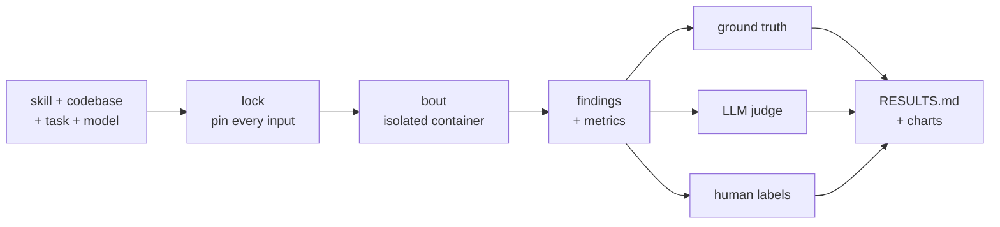

# skillordeal-trials

[](https://github.com/thereisnotime/skillordeal-trials/actions/workflows/ci.yml)

Do agent skills (`SKILL.md` packs, Claude Code plugins, prompts) actually make an LLM better at reviewing code? This repo holds the studies that test it with [skillordeal](https://github.com/thereisnotime/skillordeal): every skill runs alone in an isolated container against pinned code, next to a no-skill baseline, and every run is kept so any number can be traced back to its transcript.

## Start here

| I want to… | Go to |
|---|---|
| **See the results** | [Latest results](#latest-results) below, then the trial's [RESULTS.md](trials/2026-09-secure-coding-audit/rounds/r01/RESULTS.md) |
| **Understand the method** | [docs/method.md](docs/method.md): isolation, scoring, how to read the statistics |
| **Check where a number came from** | [docs/trace-a-number.md](docs/trace-a-number.md) |
| **Reproduce a round** | [docs/reproduce.md](docs/reproduce.md): 3 commands, auth, CI secrets |
| **Label findings** | [docs/labeling.md](docs/labeling.md): the blind review UI |
| **Add a trial, arena or skill** | [CONTRIBUTING.md](CONTRIBUTING.md) |

## Latest results

**[2026-09-secure-coding-audit](trials/2026-09-secure-coding-audit/), round r01:** 23 skills and pipelines plus a baseline, on 2 codebases, 3 runs each (150 bouts, Opus 4.8 at high effort).

- No skill is a clear, reliable win over plain Opus 4.8 yet. On dvpwa the baseline finds 6 of 19 known vulnerabilities per run; the best skills find 7.7 to 8.
- One lead reproduced in a same-day [control round](trials/2026-09-secure-coding-audit/README.md#control-round-r01-control-2026-10-04): `anthropic-security-auditor` found 8 known bugs in all 6 runs, +1.7 [1.2, 2.3] over the baseline, at the baseline's cost. On a [real codebase with 11 published CVEs](trials/2026-10-filebrowser-cve-audit/) it found none.
- On warpgate-operator a threat-model-aware judge panel refuted about half of all findings (109 of 210), mostly issues only an already-privileged user could trigger; on dvpwa it kept 96% of the findings that match known vulnerabilities.
- On that real codebase no contender beats the baseline on CVEs found (best: 0.7 of 11 per run). Skills differ on noise instead: a threat-model-aware judge panel refuted none of the Sentry-based and fp-check findings and most of `agamm-owasp-security`'s and `samber-golang-security`'s.
- One skill (`anthropic-security-review-cmd`) can't run a full-repo audit at all.

Caveats and every number with its confidence interval are in the trial's [README](trials/2026-09-secure-coding-audit/README.md#tldr-result) and [RESULTS.md](trials/2026-09-secure-coding-audit/rounds/r01/RESULTS.md).

## Trials

| Trial | Question | Status | Results | Lock |
|---|---|---|---|---|
| [2026-09-secure-coding-audit](trials/2026-09-secure-coding-audit/) | Which openly available secure-code-review skills find more real vulnerabilities per dollar than a plain Claude Code baseline? | r01 done (150 bouts) | [RESULTS.md](trials/2026-09-secure-coding-audit/rounds/r01/RESULTS.md) | [lock.yaml](trials/2026-09-secure-coding-audit/rounds/r01/lock.yaml) |
| [2026-10-filebrowser-cve-audit](trials/2026-10-filebrowser-cve-audit/) | Confirmation on a real Go app with 11 published CVEs: do the leads and verifier pipelines beat the baseline? | r01 done (33 bouts) | [RESULTS.md](trials/2026-10-filebrowser-cve-audit/rounds/r01/RESULTS.md) | [lock.yaml](trials/2026-10-filebrowser-cve-audit/rounds/r01/lock.yaml) |

`just trials` prints the same list from the files on disk; `just` alone shows every command.

## How it works


```mermaid
flowchart LR
  I["skill + codebase<br/>+ task + model"] --> L["lock<br/>pin every input"]
  L --> B["bout<br/>isolated container"]
  B --> O["findings<br/>+ metrics"]
  O --> S["ground truth"]
  O --> J["LLM judge"]
  O --> H["human labels"]
  S --> R["RESULTS.md<br/>+ charts"]
  J --> R
  H --> R
```

| Term | Meaning |
|---|---|
| **Trial** | One study: a question and a fixed design (`trial.yaml`). |
| **Round** | One locked run of a trial (`rounds/r01/`). Reproductions become new rounds. |
| **Contender** | A skill under test, a finder + verifier `pipeline`, or `baseline` (no skill). |
| **Arena** | A codebase pinned to a commit, optionally with known issues (ground truth). |
| **Bout** | One run: contender × arena × task × model × rep. |

Each bout gets a fresh container, a read-only copy of the code, read-only tools and network access to the model API only. Details in [docs/method.md](docs/method.md).

<details>
<summary><b>Repo layout</b></summary>

```text
.
├── README.md                  you are here
├── docs/                      method, reproduce, labeling, trace a number
├── justfile                   every workflow step; `just` prints the menu
├── arenas/<arena>/
│   ├── arena.yaml             repo, pinned commit, language, strip/scope
│   └── groundtruth.yaml       known issues with file + line ranges + CWE
├── contenders/                skills under test (pinned to a commit) and candidate lists
├── templates/trial/           scaffold for `just new-trial`
└── trials/<trial>/
    ├── README.md              question, hypothesis, results summary, contenders
    ├── trial.yaml             the design
    ├── tasks/                 prompt templates
    ├── labels/labels.jsonl    human verdicts
    └── rounds/<round>/
        ├── lock.yaml          every input resolved to an immutable value
        ├── RESULTS.md         generated report, charts in charts/
        ├── report.html        interactive version (open locally)
        ├── bouts/<bout-id>/   record.json, findings.json, prompt.md, transcript.jsonl.zst, ...
        └── scores/            per-finding and per-bout scores
```

Round output is committed as plain files; a round is a few tens of MB.

</details>

## License

Apache-2.0, see [LICENSE](LICENSE). Skills and codebases under test are referenced by repository and commit, not copied, and keep their own licenses (listed in `contenders/*.yaml` and the trial READMEs). Transcripts and findings are model output about that code and may quote short excerpts of it.
