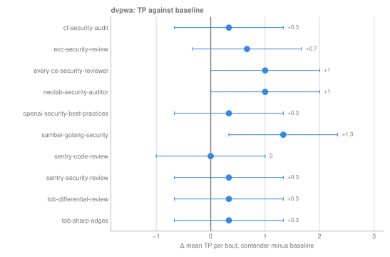
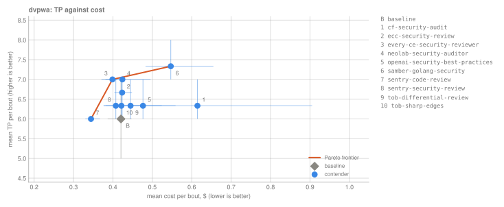

# 2026-09-secure-coding-audit

**Design:** 12 contenders × 2 arenas × 1 task × 1 model × 3 reps = 72 bouts. Model under test `claude-opus-4-8` at `high` effort, judge `claude-sonnet-5`.

**Status:** r01 done (72 bouts, 2026-09-23). Results: [`rounds/r01/RESULTS.md`](rounds/r01/RESULTS.md). Findings are judged but not human-labeled yet.

## Question

Which openly available secure-code-review skills find more real vulnerabilities per dollar than a plain Claude Code baseline?

## Hypothesis

Written before r01 started:

- Most skills will not beat the baseline on recall by much. Opus at high effort already knows the OWASP checklist, so a skill mostly changes how thorough the model is and how it reports.
- The big methodical skills (cf-security-audit, sentry-security-review) will find a few more issues on dvpwa but cost noticeably more tokens, so per dollar they may land near the baseline.
- Diff-scoped prompts (tob-differential-review, anthropic-security-review-cmd, neolab-security-auditor) will do worse than the baseline because the arena has no git history to diff against.
- sentry-code-review (a thin general checklist) and samber-golang-security on dvpwa (wrong language) act as controls and should not beat the baseline.
- On warpgate-operator, precision will matter more than recall: the interesting question is how many findings survive the judge and human review.

## TL;DR result

From r01 (Opus 4.8 at high effort, 3 reps per cell, 95% bootstrap CIs; [full results](rounds/r01/RESULTS.md)):

- **No skill clearly beats the plain baseline.** On dvpwa the baseline finds 6 of the 19 known issues per run (recall 0.32). Contenders land between 6 and 7.3, and only `samber-golang-security` has a CI that excludes zero (+1.3 [0.3, 2.3]). That's a Go skill on a Python app, so read it as noise or a side effect of it asking for a broader sweep, not as Go expertise.
- **Skills mostly change cost, not quality.** Per-bout cost ranges from $0.34 (`sentry-code-review`, same TP as the baseline) to $0.61 (`cf-security-audit`, +0.3 TP). On warpgate-operator every contender reports 2 to 4 findings per run at $1.29 to $1.94.
- **The diff-scoped command can't run a full audit.** `anthropic-security-review-cmd` runs `git diff` while it loads. In the sandbox that's denied and there is no history, so all 6 bouts stopped before the model's first turn (`schema_violation`, 0 turns, $0). `tob-differential-review` adapted and scored like the rest.
- **The judge found no hallucinations, and that's all it proves.** Sonnet 5 read the cited code and marked all 311 findings `valid`. It confirms the code does what each finding says, not that it's exploitable under the right threat model (on warpgate-operator most findings need someone who can already create the CR). Human labels are the next step.

Against the [hypothesis](#hypothesis): skills barely moving recall and the big skills costing more both held. The diff-scoped prediction held for one of the three diff-oriented prompts (`anthropic-security-review-cmd`); the other two scored like everyone else. Of the controls, `sentry-code-review` matched the baseline as predicted, while `samber-golang-security` beat it on dvpwa, against the prediction.

## Setup

| | |
|---|---|
| Model under test | `claude-opus-4-8`, effort `high`, `max_budget_usd` 5 per bout |
| Judge | `claude-sonnet-5`, `max_budget_usd` 2 |
| Claude Code CLI | 2.1.280 (inside the image) |
| Engine | skillordeal v0.1.2 |
| Runner image | `ghcr.io/thereisnotime/skillordeal-runner:v0.1.2`, digest pinned in [`rounds/r01/lock.yaml`](rounds/r01/lock.yaml) |
| Auth | `oauth` (`CLAUDE_CODE_OAUTH_TOKEN`) |
| Invocation | `forced`: the prompt starts with `/<skill-name>` |
| Reps | 3 per contender × arena |
| Per-bout limits | 1800 s, 4,000,000 tokens, 250 turns, 2 CPUs, 4 GB |
| Task | [`tasks/security-audit.md`](tasks/security-audit.md), read-only tools |
| Network | egress only to `api.anthropic.com:443` through a per-bout proxy |


## Contenders

Full definitions: [`contenders/secure-coding-2026-09.yaml`](../../contenders/secure-coding-2026-09.yaml). Excluded candidates and the reasons are listed at the bottom of that file.

| id | source (pinned sha) | license | role | why included |
|---|---|---|---|---|
| baseline | plain Claude Code, no skill | | finder | the reference every number is compared to |
| cf-security-audit | [cloudflare/security-audit-skill@c1c8a8c](https://github.com/cloudflare/security-audit-skill/tree/c1c8a8c1471069fb0e188eeaff69b8e8db6564a8/skills/security-audit) | MIT | finder | largest and most rigorous single skill; `.cjs` validators stripped (no node in the sandbox) |
| sentry-security-review | [getsentry/skills@c2f99a5](https://github.com/getsentry/skills/tree/c2f99a5b04b4cd992ec3022d7c2c3e23e938d241/skills/security-review) | Apache-2.0 | finder | confidence-based, fully read-only, has python guides |
| sentry-code-review | [getsentry/skills@c2f99a5](https://github.com/getsentry/skills/tree/c2f99a5b04b4cd992ec3022d7c2c3e23e938d241/skills/code-review) | Apache-2.0 | general-review | thin general checklist, control for "any review skill" |
| openai-security-best-practices | [openai/skills@49f948f](https://github.com/openai/skills/tree/49f948faa9258a0c61caceaf225e179651397431/skills/.curated/security-best-practices) | Apache-2.0 | finder | curated OpenAI skill with python and Go guides |
| ecc-security-review | [affaan-m/ECC@bf70150](https://github.com/affaan-m/ECC/tree/bf70150eb2df8070024e5bdf08e4aa08959e2735/skills/security-review) | MIT | finder | most-starred collection in the survey, checklist style |
| samber-golang-security | [samber/cc-skills-golang@19a0626](https://github.com/samber/cc-skills-golang/tree/19a0626ae8565d27a7b7bdf59d8d99d94d7e284c/skills/golang-security) | MIT | finder | Go specialist for warpgate-operator; off-topic control on dvpwa |
| tob-sharp-edges | [trailofbits/skills@32e34f8](https://github.com/trailofbits/skills/tree/32e34f8173796e3566a51aee877dc96bc5191f64/plugins/sharp-edges) | CC-BY-SA-4.0 | finder | footgun and dangerous-default hunting, read-only |
| tob-differential-review | [trailofbits/skills@32e34f8](https://github.com/trailofbits/skills/tree/32e34f8173796e3566a51aee877dc96bc5191f64/plugins/differential-review) | CC-BY-SA-4.0 | finder | diff-oriented; measures how a diff skill copes with a full audit |
| anthropic-security-review-cmd | [anthropics/claude-code-security-review@0c6a49f](https://github.com/anthropics/claude-code-security-review/blob/0c6a49f1fa56a1d472575da86a94dbc1edb78eda/.claude/commands/security-review.md) | MIT | finder | the `/security-review` command prompt, wrapped as a skill |
| every-ce-security-reviewer | [EveryInc/compound-engineering-plugin@4fbabcd](https://github.com/EveryInc/compound-engineering-plugin/blob/4fbabcd32b6ca7d8ebb82f15840fe34ef7562a64/skills/ce-code-review/references/personas/security-reviewer.md) | MIT | finder | security persona from a popular review orchestrator |
| neolab-security-auditor | [NeoLabHQ/context-engineering-kit@23e2428](https://github.com/NeoLabHQ/context-engineering-kit/blob/23e2428e809d77717f8acc9659c374a3a1fcb93e/plugins/review/agents/security-auditor.md) | GPL-3.0 | finder | long security-auditor agent prompt |

Defined but not in r01: `tob-fp-check` (verifier, needs a finder's output) and `tob-entry-point-analyzer` (context pre-pass, no findings).

## Arenas

| id | repo @ ref | language | ground truth |
|---|---|---|---|
| dvpwa | [anxolerd/dvpwa@a1d8f89](https://github.com/anxolerd/dvpwa/tree/a1d8f89fac2e57093189853c6527c2b01fc1d9c1) | python | [19 issues](../../arenas/dvpwa/groundtruth.yaml), `complete: false` |
| warpgate-operator | [thereisnotime/warpgate-operator@warpgate-operator-v0.4.11](https://github.com/thereisnotime/warpgate-operator/tree/b31dfff6595115435dbf7411504188edfd8de9a8) (b31dfff) | go | none yet; judge + human labels |

## Leaderboard

[`rounds/r01/RESULTS.md`](rounds/r01/RESULTS.md) has the full tables (TP, recall, judge-valid, cost, tokens, time, turns, RAM, all with CIs and links to every bout) and the charts. Excerpt, dvpwa, TP against the baseline:





`report.html` next to it is the interactive version (open it locally).

## How to reproduce

```bash
just setup engine=git+https://github.com/thereisnotime/skillordeal@v0.1.2
just lock  trial=2026-09-secure-coding-audit round=r01-repro-$USER
just run   trial=2026-09-secure-coding-audit round=r01-repro-$USER j=2 --max-cost-usd 400
```

Then score and compare with r01:

```bash
just score  trial=2026-09-secure-coding-audit round=r01-repro-$USER
just judge  trial=2026-09-secure-coding-audit round=r01-repro-$USER
just report trial=2026-09-secure-coding-audit round=r01-repro-$USER
```

`lock` refuses if the image's CLI version differs from the one the trial pins, and `run` refuses on any drift from the lock. Your new lock records its own image digest, contender tree hashes and arena commits, so diff it against [`rounds/r01/lock.yaml`](rounds/r01/lock.yaml) to see exactly what changed.

## How to dig in

Run these from this directory (`just` finds the repo's justfile from here):

```bash
just status trial=2026-09-secure-coding-audit round=r01           # every bout: status, cost, tokens, RAM
just show bout=<bout-id>                                          # one bout: record + findings
just transcript bout=<bout-id> | jq -c 'select(.type=="assistant")' | less
jq '.findings[] | {title, file, line_start, cwe}' rounds/r01/bouts/<bout-id>/findings.json
```

Per-finding verdicts live in `rounds/r01/scores/gt_matches.jsonl` (ground truth), `rounds/r01/scores/judge.jsonl` (judge) and `labels/labels.jsonl` (humans, written by `just review`); `rounds/r01/scores/verdicts.jsonl` shows all three side by side. Human labels win, then ground truth, then the judge. The top-level README walks through [tracing one number](../../README.md#trace-a-number) end to end.
