# Secure code review skills, September 2026: round r01-control

> Which openly available secure-code-review skills find more real vulnerabilities per dollar than a plain Claude Code baseline?

| | |
|---|---|
| trial | `2026-09-secure-coding-audit` |
| lock hash | `c7f10c91e739c86cfeeb531faaaafba57f93cbe451559f031367b284a2a882e0` |
| engine | skillordeal 0.1.4 |
| agent CLI | claude-code 2.1.280 |
| image | `ghcr.io/thereisnotime/skillordeal-runner:v0.1.2` id `819ae9ea1b12` digest `sha256:3b70b0ff01291bd5dc55f799f01ee4dceb69fbf60c435552bf990a5f1f9744fe` |
| models | `claude-opus-4-8 (effort high)` |
| judge | `claude-sonnet-5` |
| reps, invocation | 3, forced |
| bouts | 12 ok of 150; $6.11 spent (client-side estimate) |
| scores from | `scores/summary.parquet` |
| generated | 2026-10-04 05:48 UTC |

Cells show the mean over ok bouts with a 95% bootstrap CI in brackets (2000 resamples, seed 20260923); no interval means n < 2. **n** is ok bouts over all bouts in the cell. Cost and resource numbers are per bout. Resource numbers describe the client harness, not model-side compute.

## Key takeaways

- 12 of 150 bouts finished `ok`; the rest are left out of every mean and chart. `addyosmani-security-auditor`: no bout finished ok (6 pending; bouts [dvpwa #1](bouts/b-04a7ec235b7ebf07/) [dvpwa #2](bouts/b-1643efa123763e7d/) [dvpwa #3](bouts/b-3844b5f631a47dab/) [warpgate-operator #1](bouts/b-b4fe4db3237ebb71/) [warpgate-operator #2](bouts/b-1713fa59928d5994/) [warpgate-operator #3](bouts/b-36820c46158dfcf0/)); `agamm-owasp-security`: 3 of 6 bouts ok (3 pending; bouts [#1](bouts/b-64f73dc38ec37c01/) [#2](bouts/b-beb755e846ee1161/) [#3](bouts/b-e3db9161e178ca04/)); `anthropic-security-auditor`: 3 of 6 bouts ok (3 pending; bouts [#1](bouts/b-3280a23a3c40f5d9/) [#2](bouts/b-42c007f9c6362a44/) [#3](bouts/b-f43aeea3facd688f/)); `anthropic-security-review-cmd`: no bout finished ok (6 pending; bouts [dvpwa #1](bouts/b-08dd1d9fb474d4a5/) [dvpwa #2](bouts/b-1459059465f378aa/) [dvpwa #3](bouts/b-daabc0ef32f8a9c3/) [warpgate-operator #1](bouts/b-ddbb49a7d6458c6d/) [warpgate-operator #2](bouts/b-42720681044a1b70/) [warpgate-operator #3](bouts/b-dfecf314fbe26617/)); `baseline`: 3 of 6 bouts ok (3 pending; bouts [#1](bouts/b-654071d0681ebd3c/) [#2](bouts/b-259b9259b3f17a57/) [#3](bouts/b-b462e00c512ab75f/)); `cf-security-audit`: no bout finished ok (6 pending; bouts [dvpwa #1](bouts/b-31983800358aff05/) [dvpwa #2](bouts/b-7c9ec5dfea8b00f0/) [dvpwa #3](bouts/b-804bdfee01c983a4/) [warpgate-operator #1](bouts/b-12ba8651f5033db1/) [warpgate-operator #2](bouts/b-24e36a49998de2de/) [warpgate-operator #3](bouts/b-18e18d909a683352/)); `claude-security-flat`: no bout finished ok (6 pending; bouts [dvpwa #1](bouts/b-32e1bd35f066b7c8/) [dvpwa #2](bouts/b-7274ef30b87277d1/) [dvpwa #3](bouts/b-568ffe163a45e649/) [warpgate-operator #1](bouts/b-67c39e038fc3aa31/) [warpgate-operator #2](bouts/b-de8de5efec0d5429/) [warpgate-operator #3](bouts/b-38f22d6b7294b1b7/)); `claude-security-researcher`: no bout finished ok (6 pending; bouts [dvpwa #1](bouts/b-a4dbe5cd76faac8d/) [dvpwa #2](bouts/b-23966641f45eba37/) [dvpwa #3](bouts/b-cfd75ae04e6c60f4/) [warpgate-operator #1](bouts/b-316cd035d45c1d7d/) [warpgate-operator #2](bouts/b-9291f20a9a1bb6c6/) [warpgate-operator #3](bouts/b-5cf1daa98eff2958/)); `ecc-security-review`: no bout finished ok (6 pending; bouts [dvpwa #1](bouts/b-2ced92f493905977/) [dvpwa #2](bouts/b-ba883032b40f4cc6/) [dvpwa #3](bouts/b-8c02f71718d194f9/) [warpgate-operator #1](bouts/b-ded7e2d21ba11170/) [warpgate-operator #2](bouts/b-12ee5184ce532933/) [warpgate-operator #3](bouts/b-eaeee864a0f635dc/)); `evandervecht-security-audit`: no bout finished ok (6 pending; bouts [dvpwa #1](bouts/b-7b178dbf573400fc/) [dvpwa #2](bouts/b-15d489ede015e97a/) [dvpwa #3](bouts/b-13e544849058cef4/) [warpgate-operator #1](bouts/b-4262d9ba9fe5a6ae/) [warpgate-operator #2](bouts/b-b2240a1a57c49e44/) [warpgate-operator #3](bouts/b-ca6cb9f9202a5585/)); `every-ce-security-reviewer`: no bout finished ok (6 pending; bouts [dvpwa #1](bouts/b-b8899439c83812cd/) [dvpwa #2](bouts/b-e3091b2c2dbe53b9/) [dvpwa #3](bouts/b-6df1e36caf1209b6/) [warpgate-operator #1](bouts/b-e6678b9062024b29/) [warpgate-operator #2](bouts/b-31572c580fb48d65/) [warpgate-operator #3](bouts/b-177691869dcc2ff6/)); `gemini-security-analyze-full`: no bout finished ok (6 pending; bouts [dvpwa #1](bouts/b-c2ccaa26130a0bf7/) [dvpwa #2](bouts/b-fa8c3867fac23f31/) [dvpwa #3](bouts/b-f89a2d7e0afe07ef/) [warpgate-operator #1](bouts/b-ba99d016565a194a/) [warpgate-operator #2](bouts/b-b26bb6233b1a6c54/) [warpgate-operator #3](bouts/b-826d69862cfe3114/)); `github-copilot-se-security-reviewer`: no bout finished ok (6 pending; bouts [dvpwa #1](bouts/b-fa875bbc8db93d16/) [dvpwa #2](bouts/b-1fcc34972017855f/) [dvpwa #3](bouts/b-2d8aab97846fcfa0/) [warpgate-operator #1](bouts/b-03e34a617d220248/) [warpgate-operator #2](bouts/b-d1fc2f4393268892/) [warpgate-operator #3](bouts/b-74512d6bcf227e31/)); `github-copilot-security-review`: no bout finished ok (6 pending; bouts [dvpwa #1](bouts/b-8193dd834e705db1/) [dvpwa #2](bouts/b-421218f269a1b527/) [dvpwa #3](bouts/b-40d35aeabf7b3e4a/) [warpgate-operator #1](bouts/b-2ba7a434c99ddefd/) [warpgate-operator #2](bouts/b-4579334abc5fad0b/) [warpgate-operator #3](bouts/b-4dc27e94caf24384/)); `ivan-sincek-cwe-secure-code-review`: no bout finished ok (6 pending; bouts [dvpwa #1](bouts/b-5bc74ed61cacab81/) [dvpwa #2](bouts/b-989fd6358dc51bd1/) [dvpwa #3](bouts/b-b5e3b5f3086ed061/) [warpgate-operator #1](bouts/b-6a47b6b7d660f818/) [warpgate-operator #2](bouts/b-4cf084a5511195db/) [warpgate-operator #3](bouts/b-53ed0bec31f47eb7/)); `neolab-security-auditor`: no bout finished ok (6 pending; bouts [dvpwa #1](bouts/b-301eceadefed5b1d/) [dvpwa #2](bouts/b-6f80a9523c599403/) [dvpwa #3](bouts/b-c28cac0fd14b2094/) [warpgate-operator #1](bouts/b-d72092394c638c3c/) [warpgate-operator #2](bouts/b-360a0d69e3b47249/) [warpgate-operator #3](bouts/b-e8c3e586227cffe1/)); `openai-security-best-practices`: no bout finished ok (6 pending; bouts [dvpwa #1](bouts/b-1f92577235dc9338/) [dvpwa #2](bouts/b-c1156de5ee691d8d/) [dvpwa #3](bouts/b-add8a984f3049dd1/) [warpgate-operator #1](bouts/b-8cf65b8faa333583/) [warpgate-operator #2](bouts/b-f78f7216039fa301/) [warpgate-operator #3](bouts/b-fb7c02ac3a6eb369/)); `samber-golang-security`: 3 of 6 bouts ok (3 pending; bouts [#1](bouts/b-a712c1f0d617102f/) [#2](bouts/b-727196b09036ee11/) [#3](bouts/b-c8bff40931aa21e1/)); `sari3l-security-code-audit`: no bout finished ok (6 pending; bouts [dvpwa #1](bouts/b-06151d54e4d5d1ee/) [dvpwa #2](bouts/b-a8e5cba972d63676/) [dvpwa #3](bouts/b-9c7f5c64b1086696/) [warpgate-operator #1](bouts/b-c85f33c2443d4682/) [warpgate-operator #2](bouts/b-673ddd2d1df82220/) [warpgate-operator #3](bouts/b-cb301d01233249eb/)); `sentry-code-review`: no bout finished ok (6 pending; bouts [dvpwa #1](bouts/b-fb08d8b8fa9931d1/) [dvpwa #2](bouts/b-3628e1593a51e3a9/) [dvpwa #3](bouts/b-17179680af456bd5/) [warpgate-operator #1](bouts/b-39d2d2bad56357dd/) [warpgate-operator #2](bouts/b-c1e46773a300bb5f/) [warpgate-operator #3](bouts/b-420c5f9114f7c3b0/)); `sentry-security-review`: no bout finished ok (6 pending; bouts [dvpwa #1](bouts/b-faf3fb8e784d797a/) [dvpwa #2](bouts/b-38b305986b0a9dae/) [dvpwa #3](bouts/b-76fc29074a147acb/) [warpgate-operator #1](bouts/b-780cbe96e439ff2f/) [warpgate-operator #2](bouts/b-3a504c9ad501eb39/) [warpgate-operator #3](bouts/b-44ae5d1c4213ad73/)); `sentry-then-fp-check`: no bout finished ok (6 pending; bouts [dvpwa #1](bouts/b-d1d637b6ba226bf0/) [dvpwa #2](bouts/b-2ca35255abd04a39/) [dvpwa #3](bouts/b-33575c9481a3f904/) [warpgate-operator #1](bouts/b-dfe8c957b82b17ae/) [warpgate-operator #2](bouts/b-2264ea92b9d39712/) [warpgate-operator #3](bouts/b-e40859cab9d9648a/)); `tob-differential-review`: no bout finished ok (6 pending; bouts [dvpwa #1](bouts/b-be64f32258e6fc0b/) [dvpwa #2](bouts/b-03189a2ffa95cccd/) [dvpwa #3](bouts/b-6e24aac2bac7947f/) [warpgate-operator #1](bouts/b-929e2986604958da/) [warpgate-operator #2](bouts/b-b35deca9d5855f34/) [warpgate-operator #3](bouts/b-0686275246850f0f/)); `tob-sharp-edges`: no bout finished ok (6 pending; bouts [dvpwa #1](bouts/b-903a610341585706/) [dvpwa #2](bouts/b-9dbcb8fdeaa5180f/) [dvpwa #3](bouts/b-6ce90cfa7b122c73/) [warpgate-operator #1](bouts/b-9429e15cfa55309a/) [warpgate-operator #2](bouts/b-b30175294edf3197/) [warpgate-operator #3](bouts/b-fa3a994ee516c746/)); `unitone-secure-code-review`: no bout finished ok (6 pending; bouts [dvpwa #1](bouts/b-6c6088fa0c79f8cb/) [dvpwa #2](bouts/b-3f3fe3704ebc23c6/) [dvpwa #3](bouts/b-debfd93f565d0c1a/) [warpgate-operator #1](bouts/b-fae5978d7171be23/) [warpgate-operator #2](bouts/b-da7417ca6f012c98/) [warpgate-operator #3](bouts/b-5b3d3ddacf55ae36/)).
- **dvpwa**: highest mean TP per bout: `anthropic-security-auditor` 8 [8, 8] (n=3; bouts [#1](bouts/b-03e8db4d52b98d3e/) [#2](bouts/b-b7a53f7c51dbf387/) [#3](bouts/b-d9b4f43862cb3118/)); baseline 6.7 [6, 7] (n=3).
- **dvpwa**: Δ TP vs baseline with a 95% CI excluding 0 (n=3 ok bouts each), above the baseline: `anthropic-security-auditor` +1.3 [1, 2]. The other 2 contenders' CIs include 0.
- **dvpwa**: lowest cost per TP: `baseline` $0.064 (20 TP over 3 bouts); highest: `samber-golang-security` $0.084 (20 over 3 bouts).
- **dvpwa**: 9 of 19 ground-truth issues were found by at least one bout; no contender found 10: `missing-authz-course-create`, `session-fixation`, `xss-student-name`, `default-admin-credentials`, `missing-authn-student-create`, `postgres-exposed-no-password`, `xss-course-fields`, `container-runs-as-root`, `unverified-download`, `vulnerable-dependencies`. 5 were found in every ok bout of every contender. Found by one contender only: `error-page-info-leak` (`agamm-owasp-security`, 1 bout).
- **dvpwa**: 2 of 10 distinct problems (finding clusters) were reported by a single contender: `agamm-owasp-security` 1, `anthropic-security-auditor` 1.
- Every skill contender's first-turn prompt was larger than the baseline's (+3,829 to +7,851 tokens), as expected when the skill loads.

Generated from the numbers below, without interpretation: means are over ok bouts, brackets are 95% bootstrap CIs, and numbers link to the bouts behind them.

## Round at a glance

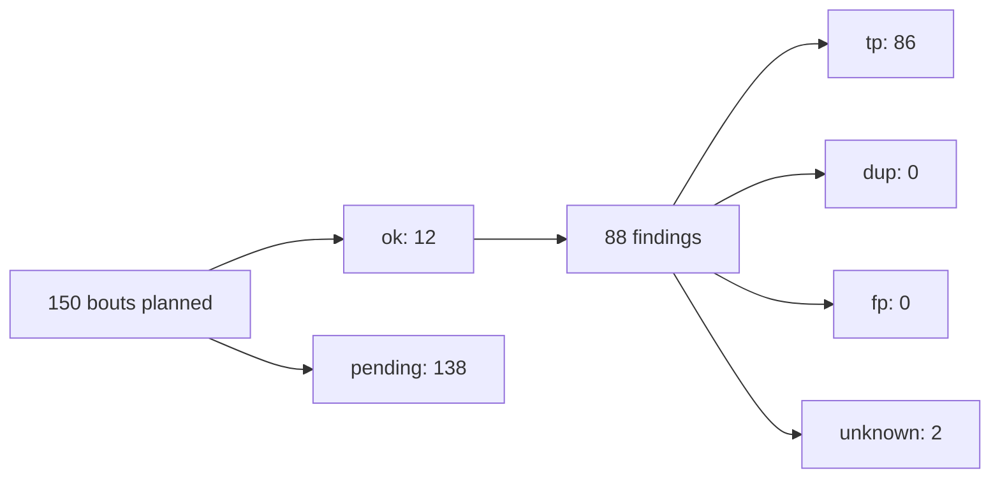

Findings and verdicts count ok bouts only; verdicts are the final ones when scored, else ground truth, else the judge.

## dvpwa

### Charts

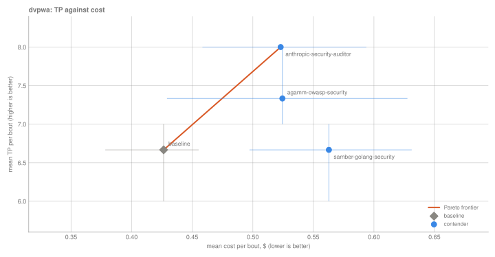

*How to read: Up and to the left is better; the orange line joins contenders no one beats on both TP and cost, whiskers are 95% CIs, gray is the baseline. n = 12 ok bouts of 12.*

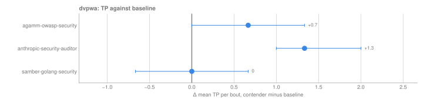

*How to read: Right of the line beats the baseline; a CI that crosses zero isn't a clear difference. n = 12 ok bouts of 12.*

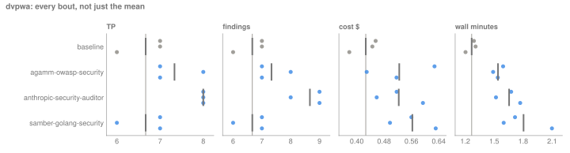

*How to read: Each dot is one ok bout, the dark tick is the mean and the gray line is the baseline's mean; dots far apart mean the contender is inconsistent from run to run. n = 12 ok bouts of 12.*

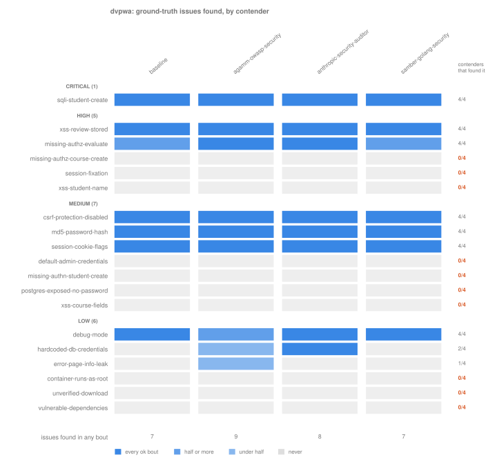

*How to read: Each row is a known issue (grouped by severity), each column a contender; darker means found in more of its ok bouts. The right column counts contenders that found the issue at least once (10 of 19 issues: none). n = 12 ok bouts of 75.*

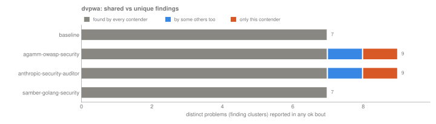

*How to read: Distinct problems each contender reported across its bouts, split by how many other contenders reported them too; orange is what only this contender found (10 problems in all). n = 12 ok bouts of 75.*

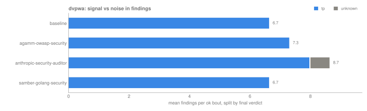

*How to read: Mean findings per bout split by final verdict; the blue share is signal, the rest is noise or undecided. n = 12 ok bouts of 12.*

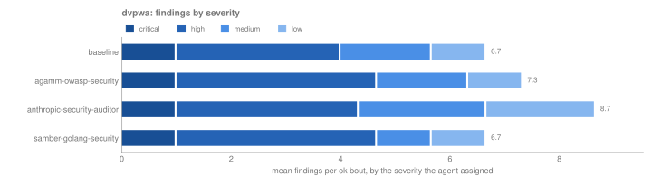

*How to read: Mean findings per bout stacked by self-reported severity, darkest is critical; a contender that rates the same issues higher shows more dark. n = 12 ok bouts of 75.*

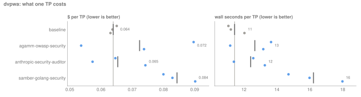

*How to read: Dollars and wall-clock seconds per TP: dots are single bouts (bouts with no TP are left out), the tick and number are the pooled ratio (total over total). n = 12 ok bouts of 75.*

### Tables · security-audit · `claude-opus-4-8@high`

**Quality**

| contender | n | findings | TP | recall | judge-valid | bouts |
|---|---|---:|---:|---:|---:|---|
| baseline | 3/3 | 6.7 [6, 7] | 6.7 [6, 7] | 0.35 [0.32, 0.37] | 0 [0, 0] | [#1](bouts/b-451cb0cbf8d3d39f/) [#2](bouts/b-81d5a569957aec07/) [#3](bouts/b-0948285cdfbd009e/) |
| addyosmani-security-auditor | 0/3 | n/a | n/a | n/a | n/a | [#1 (pending)](bouts/b-04a7ec235b7ebf07/) [#2 (pending)](bouts/b-1643efa123763e7d/) [#3 (pending)](bouts/b-3844b5f631a47dab/) |
| agamm-owasp-security | 3/3 | 7.3 [7, 8] | 7.3 [7, 8] | 0.39 [0.37, 0.42] | 0 [0, 0] | [#1](bouts/b-9dd955a5c9c0357c/) [#2](bouts/b-6f695b9cde49dde2/) [#3](bouts/b-0f0040f4f6311464/) |
| anthropic-security-auditor | 3/3 | 8.7 [8, 9] | 8 [8, 8] | 0.42 [0.42, 0.42] | 0 [0, 0] | [#1](bouts/b-03e8db4d52b98d3e/) [#2](bouts/b-b7a53f7c51dbf387/) [#3](bouts/b-d9b4f43862cb3118/) |
| anthropic-security-review-cmd | 0/3 | n/a | n/a | n/a | n/a | [#1 (pending)](bouts/b-08dd1d9fb474d4a5/) [#2 (pending)](bouts/b-1459059465f378aa/) [#3 (pending)](bouts/b-daabc0ef32f8a9c3/) |
| cf-security-audit | 0/3 | n/a | n/a | n/a | n/a | [#1 (pending)](bouts/b-31983800358aff05/) [#2 (pending)](bouts/b-7c9ec5dfea8b00f0/) [#3 (pending)](bouts/b-804bdfee01c983a4/) |
| claude-security-flat | 0/3 | n/a | n/a | n/a | n/a | [#1 (pending)](bouts/b-32e1bd35f066b7c8/) [#2 (pending)](bouts/b-7274ef30b87277d1/) [#3 (pending)](bouts/b-568ffe163a45e649/) |
| claude-security-researcher | 0/3 | n/a | n/a | n/a | n/a | [#1 (pending)](bouts/b-a4dbe5cd76faac8d/) [#2 (pending)](bouts/b-23966641f45eba37/) [#3 (pending)](bouts/b-cfd75ae04e6c60f4/) |
| ecc-security-review | 0/3 | n/a | n/a | n/a | n/a | [#1 (pending)](bouts/b-2ced92f493905977/) [#2 (pending)](bouts/b-ba883032b40f4cc6/) [#3 (pending)](bouts/b-8c02f71718d194f9/) |
| evandervecht-security-audit | 0/3 | n/a | n/a | n/a | n/a | [#1 (pending)](bouts/b-7b178dbf573400fc/) [#2 (pending)](bouts/b-15d489ede015e97a/) [#3 (pending)](bouts/b-13e544849058cef4/) |
| every-ce-security-reviewer | 0/3 | n/a | n/a | n/a | n/a | [#1 (pending)](bouts/b-b8899439c83812cd/) [#2 (pending)](bouts/b-e3091b2c2dbe53b9/) [#3 (pending)](bouts/b-6df1e36caf1209b6/) |
| gemini-security-analyze-full | 0/3 | n/a | n/a | n/a | n/a | [#1 (pending)](bouts/b-c2ccaa26130a0bf7/) [#2 (pending)](bouts/b-fa8c3867fac23f31/) [#3 (pending)](bouts/b-f89a2d7e0afe07ef/) |
| github-copilot-se-security-reviewer | 0/3 | n/a | n/a | n/a | n/a | [#1 (pending)](bouts/b-fa875bbc8db93d16/) [#2 (pending)](bouts/b-1fcc34972017855f/) [#3 (pending)](bouts/b-2d8aab97846fcfa0/) |
| github-copilot-security-review | 0/3 | n/a | n/a | n/a | n/a | [#1 (pending)](bouts/b-8193dd834e705db1/) [#2 (pending)](bouts/b-421218f269a1b527/) [#3 (pending)](bouts/b-40d35aeabf7b3e4a/) |
| ivan-sincek-cwe-secure-code-review | 0/3 | n/a | n/a | n/a | n/a | [#1 (pending)](bouts/b-5bc74ed61cacab81/) [#2 (pending)](bouts/b-989fd6358dc51bd1/) [#3 (pending)](bouts/b-b5e3b5f3086ed061/) |
| neolab-security-auditor | 0/3 | n/a | n/a | n/a | n/a | [#1 (pending)](bouts/b-301eceadefed5b1d/) [#2 (pending)](bouts/b-6f80a9523c599403/) [#3 (pending)](bouts/b-c28cac0fd14b2094/) |
| openai-security-best-practices | 0/3 | n/a | n/a | n/a | n/a | [#1 (pending)](bouts/b-1f92577235dc9338/) [#2 (pending)](bouts/b-c1156de5ee691d8d/) [#3 (pending)](bouts/b-add8a984f3049dd1/) |
| samber-golang-security | 3/3 | 6.7 [6, 7] | 6.7 [6, 7] | 0.35 [0.32, 0.37] | 0 [0, 0] | [#1](bouts/b-a7a7ec5865fde305/) [#2](bouts/b-012a098fe655c672/) [#3](bouts/b-22f879233b1a37a5/) |
| sari3l-security-code-audit | 0/3 | n/a | n/a | n/a | n/a | [#1 (pending)](bouts/b-06151d54e4d5d1ee/) [#2 (pending)](bouts/b-a8e5cba972d63676/) [#3 (pending)](bouts/b-9c7f5c64b1086696/) |
| sentry-code-review | 0/3 | n/a | n/a | n/a | n/a | [#1 (pending)](bouts/b-fb08d8b8fa9931d1/) [#2 (pending)](bouts/b-3628e1593a51e3a9/) [#3 (pending)](bouts/b-17179680af456bd5/) |
| sentry-security-review | 0/3 | n/a | n/a | n/a | n/a | [#1 (pending)](bouts/b-faf3fb8e784d797a/) [#2 (pending)](bouts/b-38b305986b0a9dae/) [#3 (pending)](bouts/b-76fc29074a147acb/) |
| sentry-then-fp-check | 0/3 | n/a | n/a | n/a | n/a | [#1 (pending)](bouts/b-d1d637b6ba226bf0/) [#2 (pending)](bouts/b-2ca35255abd04a39/) [#3 (pending)](bouts/b-33575c9481a3f904/) |
| tob-differential-review | 0/3 | n/a | n/a | n/a | n/a | [#1 (pending)](bouts/b-be64f32258e6fc0b/) [#2 (pending)](bouts/b-03189a2ffa95cccd/) [#3 (pending)](bouts/b-6e24aac2bac7947f/) |
| tob-sharp-edges | 0/3 | n/a | n/a | n/a | n/a | [#1 (pending)](bouts/b-903a610341585706/) [#2 (pending)](bouts/b-9dbcb8fdeaa5180f/) [#3 (pending)](bouts/b-6ce90cfa7b122c73/) |
| unitone-secure-code-review | 0/3 | n/a | n/a | n/a | n/a | [#1 (pending)](bouts/b-6c6088fa0c79f8cb/) [#2 (pending)](bouts/b-3f3fe3704ebc23c6/) [#3 (pending)](bouts/b-debfd93f565d0c1a/) |

**Against baseline**

| contender | Δ TP | Δ F1 | Δ cost $ | cost per TP $ | skill fired | first-turn tokens vs baseline | check |
|---|---:|---:|---:|---:|---:|---:|---|
| addyosmani-security-auditor | n/a | n/a | n/a | n/a | n/a | n/a |  |
| agamm-owasp-security | +0.7 [0, 1.3] | n/a | +0.098 [0.003, 0.190] | 0.072 | 100% (n=3) | +7,851 | ok |
| anthropic-security-auditor | +1.3 [1, 2] | n/a | +0.097 [0.026, 0.167] | 0.065 | 100% (n=3) | +3,829 | ok |
| anthropic-security-review-cmd | n/a | n/a | n/a | n/a | n/a | n/a |  |
| cf-security-audit | n/a | n/a | n/a | n/a | n/a | n/a |  |
| claude-security-flat | n/a | n/a | n/a | n/a | n/a | n/a |  |
| claude-security-researcher | n/a | n/a | n/a | n/a | n/a | n/a |  |
| ecc-security-review | n/a | n/a | n/a | n/a | n/a | n/a |  |
| evandervecht-security-audit | n/a | n/a | n/a | n/a | n/a | n/a |  |
| every-ce-security-reviewer | n/a | n/a | n/a | n/a | n/a | n/a |  |
| gemini-security-analyze-full | n/a | n/a | n/a | n/a | n/a | n/a |  |
| github-copilot-se-security-reviewer | n/a | n/a | n/a | n/a | n/a | n/a |  |
| github-copilot-security-review | n/a | n/a | n/a | n/a | n/a | n/a |  |
| ivan-sincek-cwe-secure-code-review | n/a | n/a | n/a | n/a | n/a | n/a |  |
| neolab-security-auditor | n/a | n/a | n/a | n/a | n/a | n/a |  |
| openai-security-best-practices | n/a | n/a | n/a | n/a | n/a | n/a |  |
| samber-golang-security | 0 [-0.7, 0.7] | n/a | +0.136 [0.066, 0.207] | 0.084 | 100% (n=3) | +7,274 | ok |
| sari3l-security-code-audit | n/a | n/a | n/a | n/a | n/a | n/a |  |
| sentry-code-review | n/a | n/a | n/a | n/a | n/a | n/a |  |
| sentry-security-review | n/a | n/a | n/a | n/a | n/a | n/a |  |
| sentry-then-fp-check | n/a | n/a | n/a | n/a | n/a | n/a |  |
| tob-differential-review | n/a | n/a | n/a | n/a | n/a | n/a |  |
| tob-sharp-edges | n/a | n/a | n/a | n/a | n/a | n/a |  |
| unitone-secure-code-review | n/a | n/a | n/a | n/a | n/a | n/a |  |

<details>
<summary>Cost and resources per bout, mean [95% CI]</summary>

| contender | n | cost $ | tokens | duration s | turns | RSS peak MB | spent, all bouts |
|---|---|---:|---:|---:|---:|---:|---:|
| baseline | 3/3 | 0.426 [0.378, 0.455] | 115.3k [114.5k, 115.8k] | 76 [72, 78] | 22.3 [22, 23] | 244 [219, 270] | $1.279 |
| addyosmani-security-auditor | 0/3 | n/a | n/a | n/a | n/a | n/a | $0.000 |
| agamm-owasp-security | 3/3 | 0.524 [0.429, 0.628] | 181.7k [145.5k, 209.9k] | 92 [89, 96] | 25.3 [21, 30] | 263 [257, 268] | $1.573 |
| anthropic-security-auditor | 3/3 | 0.523 [0.458, 0.594] | 168.5k [161.5k, 173.6k] | 99 [91, 106] | 24.3 [23, 26] | 276 [258, 290] | $1.569 |
| anthropic-security-review-cmd | 0/3 | n/a | n/a | n/a | n/a | n/a | $0.000 |
| cf-security-audit | 0/3 | n/a | n/a | n/a | n/a | n/a | $0.000 |
| claude-security-flat | 0/3 | n/a | n/a | n/a | n/a | n/a | $0.000 |
| claude-security-researcher | 0/3 | n/a | n/a | n/a | n/a | n/a | $0.000 |
| ecc-security-review | 0/3 | n/a | n/a | n/a | n/a | n/a | $0.000 |
| evandervecht-security-audit | 0/3 | n/a | n/a | n/a | n/a | n/a | $0.000 |
| every-ce-security-reviewer | 0/3 | n/a | n/a | n/a | n/a | n/a | $0.000 |
| gemini-security-analyze-full | 0/3 | n/a | n/a | n/a | n/a | n/a | $0.000 |
| github-copilot-se-security-reviewer | 0/3 | n/a | n/a | n/a | n/a | n/a | $0.000 |
| github-copilot-security-review | 0/3 | n/a | n/a | n/a | n/a | n/a | $0.000 |
| ivan-sincek-cwe-secure-code-review | 0/3 | n/a | n/a | n/a | n/a | n/a | $0.000 |
| neolab-security-auditor | 0/3 | n/a | n/a | n/a | n/a | n/a | $0.000 |
| openai-security-best-practices | 0/3 | n/a | n/a | n/a | n/a | n/a | $0.000 |
| samber-golang-security | 3/3 | 0.563 [0.497, 0.631] | 212.1k [172.4k, 257.3k] | 108 [96, 126] | 28 [25, 34] | 228 [219, 234] | $1.689 |
| sari3l-security-code-audit | 0/3 | n/a | n/a | n/a | n/a | n/a | $0.000 |
| sentry-code-review | 0/3 | n/a | n/a | n/a | n/a | n/a | $0.000 |
| sentry-security-review | 0/3 | n/a | n/a | n/a | n/a | n/a | $0.000 |
| sentry-then-fp-check | 0/3 | n/a | n/a | n/a | n/a | n/a | $0.000 |
| tob-differential-review | 0/3 | n/a | n/a | n/a | n/a | n/a | $0.000 |
| tob-sharp-edges | 0/3 | n/a | n/a | n/a | n/a | n/a | $0.000 |
| unitone-secure-code-review | 0/3 | n/a | n/a | n/a | n/a | n/a | $0.000 |

</details>


### What each contender found

<details>
<summary>Ground-truth issues: who found what (19 issues, 10 found by nobody)</summary>

| issue | title | severity | CWE | contenders | found by (ok bouts that found it) |
|---|---|---|---|---:|---|
| `sqli-student-create` | SQL injection in student creation | critical | CWE-89 | 4/4 | every contender, every ok bout |
| `xss-review-stored` | Stored XSS in course reviews (Jinja2 autoescape disabled) | high | CWE-79, CWE-80 | 4/4 | every contender, every ok bout |
| `missing-authz-evaluate` | Grading endpoint has no authentication or admin check | high | CWE-862, CWE-285 | 4/4 | baseline 2/3 [#1](bouts/b-451cb0cbf8d3d39f/) [#2](bouts/b-81d5a569957aec07/); agamm-owasp-security 3/3 [#1](bouts/b-9dd955a5c9c0357c/) [#2](bouts/b-6f695b9cde49dde2/) [#3](bouts/b-0f0040f4f6311464/); anthropic-security-auditor 3/3 [#1](bouts/b-03e8db4d52b98d3e/) [#2](bouts/b-b7a53f7c51dbf387/) [#3](bouts/b-d9b4f43862cb3118/); samber-golang-security 2/3 [#1](bouts/b-a7a7ec5865fde305/) [#3](bouts/b-22f879233b1a37a5/) |
| `missing-authz-course-create` | Course creation has no authentication or admin check | high | CWE-862, CWE-285 | 0/4 | nobody |
| `session-fixation` | Session identifier not rotated on login or logout | high | CWE-384 | 0/4 | nobody |
| `xss-student-name` | Stored XSS via student name on list and evaluate pages | high | CWE-79, CWE-80 | 0/4 | nobody |
| `csrf-protection-disabled` | CSRF middleware disabled, state-changing POSTs unprotected | medium | CWE-352 | 4/4 | every contender, every ok bout |
| `md5-password-hash` | Passwords stored as unsalted MD5 | medium | CWE-916, CWE-328, CWE-759, CWE-327, CWE-326 | 4/4 | every contender, every ok bout |
| `session-cookie-flags` | Session cookie set without HttpOnly or Secure | medium | CWE-1004, CWE-614 | 4/4 | every contender, every ok bout |
| `default-admin-credentials` | Seeded admin account with password equal to username | medium | CWE-1392, CWE-521 | 0/4 | nobody |
| `missing-authn-student-create` | Student creation has no authentication check | medium | CWE-306, CWE-862 | 0/4 | nobody |
| `postgres-exposed-no-password` | Postgres published on the host with trust authentication | medium | CWE-306, CWE-1188 | 0/4 | nobody |
| `xss-course-fields` | Stored XSS via course title and description | medium | CWE-79, CWE-80 | 0/4 | nobody |
| `debug-mode` | Application runs in debug mode with DEBUG logging | low | CWE-489, CWE-215 | 4/4 | baseline 3/3 [#1](bouts/b-451cb0cbf8d3d39f/) [#2](bouts/b-81d5a569957aec07/) [#3](bouts/b-0948285cdfbd009e/); agamm-owasp-security 2/3 [#2](bouts/b-6f695b9cde49dde2/) [#3](bouts/b-0f0040f4f6311464/); anthropic-security-auditor 3/3 [#1](bouts/b-03e8db4d52b98d3e/) [#2](bouts/b-b7a53f7c51dbf387/) [#3](bouts/b-d9b4f43862cb3118/); samber-golang-security 3/3 [#1](bouts/b-a7a7ec5865fde305/) [#2](bouts/b-012a098fe655c672/) [#3](bouts/b-22f879233b1a37a5/) |
| `hardcoded-db-credentials` | Database credentials hardcoded in committed config | low | CWE-798, CWE-260 | 2/4 | agamm-owasp-security 1/3 [#2](bouts/b-6f695b9cde49dde2/); anthropic-security-auditor 3/3 [#1](bouts/b-03e8db4d52b98d3e/) [#2](bouts/b-b7a53f7c51dbf387/) [#3](bouts/b-d9b4f43862cb3118/) |
| `error-page-info-leak` | 5xx error page dumps exception internals | low | CWE-209 | 1/4 | agamm-owasp-security 1/3 [#1](bouts/b-9dd955a5c9c0357c/) |
| `container-runs-as-root` | Application container runs as root | low | CWE-250 | 0/4 | nobody |
| `unverified-download` | Build downloads a script from a moving branch without verification | low | CWE-494, CWE-829 | 0/4 | nobody |
| `vulnerable-dependencies` | Pinned dependencies with known vulnerabilities | low | CWE-1395, CWE-1104 | 0/4 | nobody |

</details>

<details>
<summary>Distinct problems (finding clusters): who reported what (10 problems, 2 reported by one contender only)</summary>

| problem | title | severity | CWE | contenders | found by (ok bouts that found it) |
|---|---|---|---|---:|---|
| `sqli/app.py:24 CWE-352` | CSRF protection middleware disabled | high | CWE-352 | 4/4 | every contender, every ok bout |
| `sqli/app.py:33 CWE-79` | Stored XSS from globally disabled Jinja2 autoescaping | high | CWE-79 | 4/4 | every contender, every ok bout |
| `sqli/dao/student.py:42 CWE-89` | Unauthenticated SQL injection in Student.create | critical | CWE-89 | 4/4 | every contender, every ok bout |
| `sqli/dao/user.py:40 CWE-916` | Passwords hashed with unsalted MD5 | high | CWE-916 | 4/4 | every contender, every ok bout |
| `sqli/middlewares.py:20 CWE-1004` | Session cookie set with HttpOnly disabled | medium | CWE-1004 | 4/4 | every contender, every ok bout |
| `sqli/app.py:23 CWE-489` | Application runs with debug mode enabled | low | CWE-489 | 4/4 | baseline 3/3 [#1](bouts/b-451cb0cbf8d3d39f/) [#2](bouts/b-81d5a569957aec07/) [#3](bouts/b-0948285cdfbd009e/); agamm-owasp-security 2/3 [#2](bouts/b-6f695b9cde49dde2/) [#3](bouts/b-0f0040f4f6311464/); anthropic-security-auditor 3/3 [#1](bouts/b-03e8db4d52b98d3e/) [#2](bouts/b-b7a53f7c51dbf387/) [#3](bouts/b-d9b4f43862cb3118/); samber-golang-security 3/3 [#1](bouts/b-a7a7ec5865fde305/) [#2](bouts/b-012a098fe655c672/) [#3](bouts/b-22f879233b1a37a5/) |
| `sqli/views.py:134 CWE-862` | Missing server-side authorization on state-changing endpoints | high | CWE-862 | 4/4 | baseline 2/3 [#1](bouts/b-451cb0cbf8d3d39f/) [#2](bouts/b-81d5a569957aec07/); agamm-owasp-security 3/3 [#1](bouts/b-9dd955a5c9c0357c/) [#2](bouts/b-6f695b9cde49dde2/) [#3](bouts/b-0f0040f4f6311464/); anthropic-security-auditor 3/3 [#1](bouts/b-03e8db4d52b98d3e/) [#2](bouts/b-b7a53f7c51dbf387/) [#3](bouts/b-d9b4f43862cb3118/); samber-golang-security 2/3 [#1](bouts/b-a7a7ec5865fde305/) [#3](bouts/b-22f879233b1a37a5/) |
| `config/dev.yaml:1 CWE-798` | Hardcoded default database credentials in config | low | CWE-798 | 2/4 | agamm-owasp-security 1/3 [#2](bouts/b-6f695b9cde49dde2/); anthropic-security-auditor 3/3 [#1](bouts/b-03e8db4d52b98d3e/) [#2](bouts/b-b7a53f7c51dbf387/) [#3](bouts/b-d9b4f43862cb3118/) |
| `requirements.txt:1 CWE-1035` | Outdated dependencies with known CVEs (aiohttp 3.5.3, jinja2 2.10, pyyaml 3.13) | medium | CWE-1035 | 1/4 | anthropic-security-auditor 2/3 [#1](bouts/b-03e8db4d52b98d3e/) [#3](bouts/b-d9b4f43862cb3118/) |
| `50x.jinja2:6 CWE-209` | Exception internals leaked to users via debug mode and 50x template | medium | CWE-209 | 1/4 | agamm-owasp-security 1/3 [#1](bouts/b-9dd955a5c9c0357c/) |

</details>

<details>
<summary>Findings by CWE (10 CWEs)</summary>

| CWE | findings | contenders | findings per contender (all ok bouts) |
|---|---:|---:|---|
| CWE-1004 | 12 | 4/4 | agamm-owasp-security 3, anthropic-security-auditor 3, baseline 3, samber-golang-security 3 |
| CWE-352 | 12 | 4/4 | agamm-owasp-security 3, anthropic-security-auditor 3, baseline 3, samber-golang-security 3 |
| CWE-79 | 12 | 4/4 | agamm-owasp-security 3, anthropic-security-auditor 3, baseline 3, samber-golang-security 3 |
| CWE-89 | 12 | 4/4 | agamm-owasp-security 3, anthropic-security-auditor 3, baseline 3, samber-golang-security 3 |
| CWE-916 | 12 | 4/4 | agamm-owasp-security 3, anthropic-security-auditor 3, baseline 3, samber-golang-security 3 |
| CWE-489 | 11 | 4/4 | anthropic-security-auditor 3, baseline 3, samber-golang-security 3, agamm-owasp-security 2 |
| CWE-862 | 10 | 4/4 | agamm-owasp-security 3, anthropic-security-auditor 3, baseline 2, samber-golang-security 2 |
| CWE-798 | 4 | 2/4 | anthropic-security-auditor 3, agamm-owasp-security 1 |
| CWE-1035 | 2 | 1/4 | anthropic-security-auditor 2 |
| CWE-209 | 1 | 1/4 | agamm-owasp-security 1 |

</details>

<details>
<summary>Findings per bout by severity</summary>

| contender | ok bouts | critical | high | medium | low |
|---|---:|---:|---:|---:|---:|
| baseline | 3 | 1 | 3 | 1.7 | 1 |
| agamm-owasp-security | 3 | 1 | 3.7 | 1.7 | 1 |
| anthropic-security-auditor | 3 | 1 | 3.3 | 2.3 | 2 |
| samber-golang-security | 3 | 1 | 3.7 | 1 | 1 |

</details>

## warpgate-operator

### Tables · security-audit · `claude-opus-4-8@high`

**Quality**

| contender | n | findings | TP | bouts |
|---|---|---:|---:|---|
| baseline | 0/3 | n/a | n/a | [#1 (pending)](bouts/b-654071d0681ebd3c/) [#2 (pending)](bouts/b-259b9259b3f17a57/) [#3 (pending)](bouts/b-b462e00c512ab75f/) |
| addyosmani-security-auditor | 0/3 | n/a | n/a | [#1 (pending)](bouts/b-b4fe4db3237ebb71/) [#2 (pending)](bouts/b-1713fa59928d5994/) [#3 (pending)](bouts/b-36820c46158dfcf0/) |
| agamm-owasp-security | 0/3 | n/a | n/a | [#1 (pending)](bouts/b-64f73dc38ec37c01/) [#2 (pending)](bouts/b-beb755e846ee1161/) [#3 (pending)](bouts/b-e3db9161e178ca04/) |
| anthropic-security-auditor | 0/3 | n/a | n/a | [#1 (pending)](bouts/b-3280a23a3c40f5d9/) [#2 (pending)](bouts/b-42c007f9c6362a44/) [#3 (pending)](bouts/b-f43aeea3facd688f/) |
| anthropic-security-review-cmd | 0/3 | n/a | n/a | [#1 (pending)](bouts/b-ddbb49a7d6458c6d/) [#2 (pending)](bouts/b-42720681044a1b70/) [#3 (pending)](bouts/b-dfecf314fbe26617/) |
| cf-security-audit | 0/3 | n/a | n/a | [#1 (pending)](bouts/b-12ba8651f5033db1/) [#2 (pending)](bouts/b-24e36a49998de2de/) [#3 (pending)](bouts/b-18e18d909a683352/) |
| claude-security-flat | 0/3 | n/a | n/a | [#1 (pending)](bouts/b-67c39e038fc3aa31/) [#2 (pending)](bouts/b-de8de5efec0d5429/) [#3 (pending)](bouts/b-38f22d6b7294b1b7/) |
| claude-security-researcher | 0/3 | n/a | n/a | [#1 (pending)](bouts/b-316cd035d45c1d7d/) [#2 (pending)](bouts/b-9291f20a9a1bb6c6/) [#3 (pending)](bouts/b-5cf1daa98eff2958/) |
| ecc-security-review | 0/3 | n/a | n/a | [#1 (pending)](bouts/b-ded7e2d21ba11170/) [#2 (pending)](bouts/b-12ee5184ce532933/) [#3 (pending)](bouts/b-eaeee864a0f635dc/) |
| evandervecht-security-audit | 0/3 | n/a | n/a | [#1 (pending)](bouts/b-4262d9ba9fe5a6ae/) [#2 (pending)](bouts/b-b2240a1a57c49e44/) [#3 (pending)](bouts/b-ca6cb9f9202a5585/) |
| every-ce-security-reviewer | 0/3 | n/a | n/a | [#1 (pending)](bouts/b-e6678b9062024b29/) [#2 (pending)](bouts/b-31572c580fb48d65/) [#3 (pending)](bouts/b-177691869dcc2ff6/) |
| gemini-security-analyze-full | 0/3 | n/a | n/a | [#1 (pending)](bouts/b-ba99d016565a194a/) [#2 (pending)](bouts/b-b26bb6233b1a6c54/) [#3 (pending)](bouts/b-826d69862cfe3114/) |
| github-copilot-se-security-reviewer | 0/3 | n/a | n/a | [#1 (pending)](bouts/b-03e34a617d220248/) [#2 (pending)](bouts/b-d1fc2f4393268892/) [#3 (pending)](bouts/b-74512d6bcf227e31/) |
| github-copilot-security-review | 0/3 | n/a | n/a | [#1 (pending)](bouts/b-2ba7a434c99ddefd/) [#2 (pending)](bouts/b-4579334abc5fad0b/) [#3 (pending)](bouts/b-4dc27e94caf24384/) |
| ivan-sincek-cwe-secure-code-review | 0/3 | n/a | n/a | [#1 (pending)](bouts/b-6a47b6b7d660f818/) [#2 (pending)](bouts/b-4cf084a5511195db/) [#3 (pending)](bouts/b-53ed0bec31f47eb7/) |
| neolab-security-auditor | 0/3 | n/a | n/a | [#1 (pending)](bouts/b-d72092394c638c3c/) [#2 (pending)](bouts/b-360a0d69e3b47249/) [#3 (pending)](bouts/b-e8c3e586227cffe1/) |
| openai-security-best-practices | 0/3 | n/a | n/a | [#1 (pending)](bouts/b-8cf65b8faa333583/) [#2 (pending)](bouts/b-f78f7216039fa301/) [#3 (pending)](bouts/b-fb7c02ac3a6eb369/) |
| samber-golang-security | 0/3 | n/a | n/a | [#1 (pending)](bouts/b-a712c1f0d617102f/) [#2 (pending)](bouts/b-727196b09036ee11/) [#3 (pending)](bouts/b-c8bff40931aa21e1/) |
| sari3l-security-code-audit | 0/3 | n/a | n/a | [#1 (pending)](bouts/b-c85f33c2443d4682/) [#2 (pending)](bouts/b-673ddd2d1df82220/) [#3 (pending)](bouts/b-cb301d01233249eb/) |
| sentry-code-review | 0/3 | n/a | n/a | [#1 (pending)](bouts/b-39d2d2bad56357dd/) [#2 (pending)](bouts/b-c1e46773a300bb5f/) [#3 (pending)](bouts/b-420c5f9114f7c3b0/) |
| sentry-security-review | 0/3 | n/a | n/a | [#1 (pending)](bouts/b-780cbe96e439ff2f/) [#2 (pending)](bouts/b-3a504c9ad501eb39/) [#3 (pending)](bouts/b-44ae5d1c4213ad73/) |
| sentry-then-fp-check | 0/3 | n/a | n/a | [#1 (pending)](bouts/b-dfe8c957b82b17ae/) [#2 (pending)](bouts/b-2264ea92b9d39712/) [#3 (pending)](bouts/b-e40859cab9d9648a/) |
| tob-differential-review | 0/3 | n/a | n/a | [#1 (pending)](bouts/b-929e2986604958da/) [#2 (pending)](bouts/b-b35deca9d5855f34/) [#3 (pending)](bouts/b-0686275246850f0f/) |
| tob-sharp-edges | 0/3 | n/a | n/a | [#1 (pending)](bouts/b-9429e15cfa55309a/) [#2 (pending)](bouts/b-b30175294edf3197/) [#3 (pending)](bouts/b-fa3a994ee516c746/) |
| unitone-secure-code-review | 0/3 | n/a | n/a | [#1 (pending)](bouts/b-fae5978d7171be23/) [#2 (pending)](bouts/b-da7417ca6f012c98/) [#3 (pending)](bouts/b-5b3d3ddacf55ae36/) |

**Against baseline**

| contender | Δ TP | Δ F1 | Δ cost $ | cost per TP $ | skill fired | first-turn tokens vs baseline | check |
|---|---:|---:|---:|---:|---:|---:|---|
| addyosmani-security-auditor | n/a | n/a | n/a | n/a | n/a | n/a |  |
| agamm-owasp-security | n/a | n/a | n/a | n/a | n/a | n/a |  |
| anthropic-security-auditor | n/a | n/a | n/a | n/a | n/a | n/a |  |
| anthropic-security-review-cmd | n/a | n/a | n/a | n/a | n/a | n/a |  |
| cf-security-audit | n/a | n/a | n/a | n/a | n/a | n/a |  |
| claude-security-flat | n/a | n/a | n/a | n/a | n/a | n/a |  |
| claude-security-researcher | n/a | n/a | n/a | n/a | n/a | n/a |  |
| ecc-security-review | n/a | n/a | n/a | n/a | n/a | n/a |  |
| evandervecht-security-audit | n/a | n/a | n/a | n/a | n/a | n/a |  |
| every-ce-security-reviewer | n/a | n/a | n/a | n/a | n/a | n/a |  |
| gemini-security-analyze-full | n/a | n/a | n/a | n/a | n/a | n/a |  |
| github-copilot-se-security-reviewer | n/a | n/a | n/a | n/a | n/a | n/a |  |
| github-copilot-security-review | n/a | n/a | n/a | n/a | n/a | n/a |  |
| ivan-sincek-cwe-secure-code-review | n/a | n/a | n/a | n/a | n/a | n/a |  |
| neolab-security-auditor | n/a | n/a | n/a | n/a | n/a | n/a |  |
| openai-security-best-practices | n/a | n/a | n/a | n/a | n/a | n/a |  |
| samber-golang-security | n/a | n/a | n/a | n/a | n/a | n/a |  |
| sari3l-security-code-audit | n/a | n/a | n/a | n/a | n/a | n/a |  |
| sentry-code-review | n/a | n/a | n/a | n/a | n/a | n/a |  |
| sentry-security-review | n/a | n/a | n/a | n/a | n/a | n/a |  |
| sentry-then-fp-check | n/a | n/a | n/a | n/a | n/a | n/a |  |
| tob-differential-review | n/a | n/a | n/a | n/a | n/a | n/a |  |
| tob-sharp-edges | n/a | n/a | n/a | n/a | n/a | n/a |  |
| unitone-secure-code-review | n/a | n/a | n/a | n/a | n/a | n/a |  |

<details>
<summary>Cost and resources per bout, mean [95% CI]</summary>

| contender | n | cost $ | tokens | duration s | turns | RSS peak MB | spent, all bouts |
|---|---|---:|---:|---:|---:|---:|---:|
| baseline | 0/3 | n/a | n/a | n/a | n/a | n/a | $0.000 |
| addyosmani-security-auditor | 0/3 | n/a | n/a | n/a | n/a | n/a | $0.000 |
| agamm-owasp-security | 0/3 | n/a | n/a | n/a | n/a | n/a | $0.000 |
| anthropic-security-auditor | 0/3 | n/a | n/a | n/a | n/a | n/a | $0.000 |
| anthropic-security-review-cmd | 0/3 | n/a | n/a | n/a | n/a | n/a | $0.000 |
| cf-security-audit | 0/3 | n/a | n/a | n/a | n/a | n/a | $0.000 |
| claude-security-flat | 0/3 | n/a | n/a | n/a | n/a | n/a | $0.000 |
| claude-security-researcher | 0/3 | n/a | n/a | n/a | n/a | n/a | $0.000 |
| ecc-security-review | 0/3 | n/a | n/a | n/a | n/a | n/a | $0.000 |
| evandervecht-security-audit | 0/3 | n/a | n/a | n/a | n/a | n/a | $0.000 |
| every-ce-security-reviewer | 0/3 | n/a | n/a | n/a | n/a | n/a | $0.000 |
| gemini-security-analyze-full | 0/3 | n/a | n/a | n/a | n/a | n/a | $0.000 |
| github-copilot-se-security-reviewer | 0/3 | n/a | n/a | n/a | n/a | n/a | $0.000 |
| github-copilot-security-review | 0/3 | n/a | n/a | n/a | n/a | n/a | $0.000 |
| ivan-sincek-cwe-secure-code-review | 0/3 | n/a | n/a | n/a | n/a | n/a | $0.000 |
| neolab-security-auditor | 0/3 | n/a | n/a | n/a | n/a | n/a | $0.000 |
| openai-security-best-practices | 0/3 | n/a | n/a | n/a | n/a | n/a | $0.000 |
| samber-golang-security | 0/3 | n/a | n/a | n/a | n/a | n/a | $0.000 |
| sari3l-security-code-audit | 0/3 | n/a | n/a | n/a | n/a | n/a | $0.000 |
| sentry-code-review | 0/3 | n/a | n/a | n/a | n/a | n/a | $0.000 |
| sentry-security-review | 0/3 | n/a | n/a | n/a | n/a | n/a | $0.000 |
| sentry-then-fp-check | 0/3 | n/a | n/a | n/a | n/a | n/a | $0.000 |
| tob-differential-review | 0/3 | n/a | n/a | n/a | n/a | n/a | $0.000 |
| tob-sharp-edges | 0/3 | n/a | n/a | n/a | n/a | n/a | $0.000 |
| unitone-secure-code-review | 0/3 | n/a | n/a | n/a | n/a | n/a | $0.000 |

</details>


## All arenas

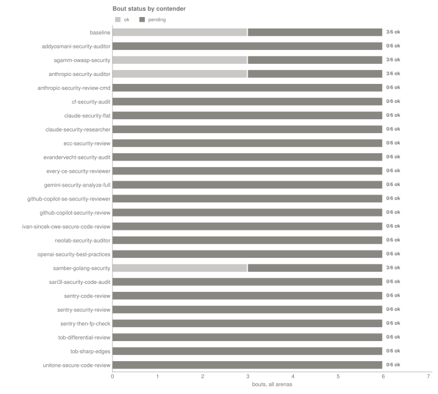

*How to read: How every bout ended; colored segments are the 138 that did not finish ok and are left out of every mean (reasons in the table at the end). n = 12 ok bouts of 150.*

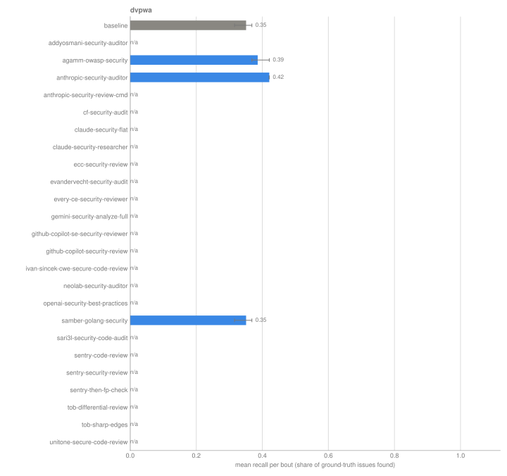

*How to read: Share of each arena's ground-truth issues a bout found, mean with 95% CI; gray is the baseline. n = 12 ok bouts of 75.*

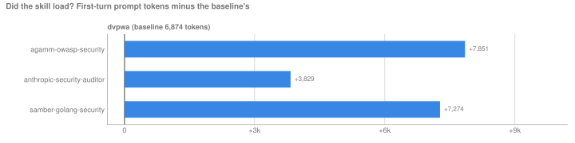

*How to read: How many more tokens each contender's first prompt carried than the baseline's (mean over ok bouts). A loaded skill adds tokens; zero or less is flagged: none at or below zero. n = 12 ok bouts of 150.*

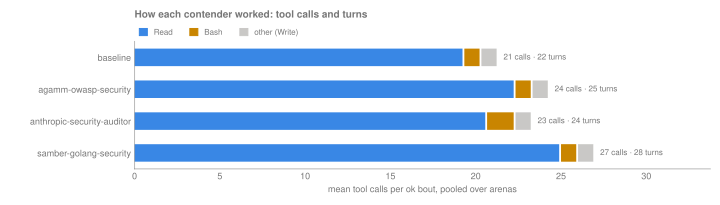

*How to read: Mean tool calls per bout by tool (from each bout's record.json), with mean agent turns at the end of the bar, pooled over arenas. n = 12 ok bouts of 150.*

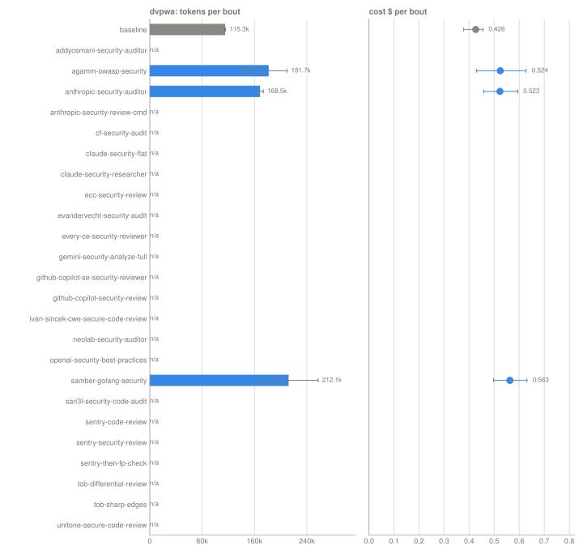

*How to read: Mean tokens (bars) and cost (dots) per ok bout, one row per arena, whiskers 95% CI; gray is the baseline. n = 12 ok bouts of 75.*

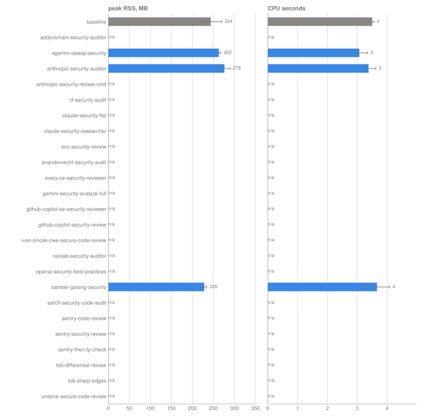

*How to read: Peak RSS and CPU time of the client harness per ok bout, pooled over arenas, whiskers 95% CI (not model-side compute). n = 12 ok bouts of 150.*

<details>
<summary>Tool calls per bout (mean over ok bouts, all arenas)</summary>

| contender | bouts | turns | Read | Bash | Write |
|---|---:|---:|---:|---:|---:|
| baseline | 3 | 22.3 | 19.3 | 1 | 1 |
| agamm-owasp-security | 3 | 25.3 | 22.3 | 1 | 1 |
| anthropic-security-auditor | 3 | 24.3 | 20.7 | 1.7 | 1 |
| samber-golang-security | 3 | 28 | 25 | 1 | 1 |

</details>

## Bouts that did not finish ok

**pending**: 138. These are excluded from the means above but counted in **n** and in spend.

| bout | contender | arena | task | model | rep | status | reason |
|---|---|---|---|---|---|---|---|
| [b-04a7ec235b7ebf07](bouts/b-04a7ec235b7ebf07/) | addyosmani-security-auditor | dvpwa | security-audit | `claude-opus-4-8@high` | 1 | pending | no record.json |
| [b-1643efa123763e7d](bouts/b-1643efa123763e7d/) | addyosmani-security-auditor | dvpwa | security-audit | `claude-opus-4-8@high` | 2 | pending | no record.json |
| [b-3844b5f631a47dab](bouts/b-3844b5f631a47dab/) | addyosmani-security-auditor | dvpwa | security-audit | `claude-opus-4-8@high` | 3 | pending | no record.json |
| [b-08dd1d9fb474d4a5](bouts/b-08dd1d9fb474d4a5/) | anthropic-security-review-cmd | dvpwa | security-audit | `claude-opus-4-8@high` | 1 | pending | no record.json |
| [b-1459059465f378aa](bouts/b-1459059465f378aa/) | anthropic-security-review-cmd | dvpwa | security-audit | `claude-opus-4-8@high` | 2 | pending | no record.json |
| [b-daabc0ef32f8a9c3](bouts/b-daabc0ef32f8a9c3/) | anthropic-security-review-cmd | dvpwa | security-audit | `claude-opus-4-8@high` | 3 | pending | no record.json |
| [b-31983800358aff05](bouts/b-31983800358aff05/) | cf-security-audit | dvpwa | security-audit | `claude-opus-4-8@high` | 1 | pending | no record.json |
| [b-7c9ec5dfea8b00f0](bouts/b-7c9ec5dfea8b00f0/) | cf-security-audit | dvpwa | security-audit | `claude-opus-4-8@high` | 2 | pending | no record.json |
| [b-804bdfee01c983a4](bouts/b-804bdfee01c983a4/) | cf-security-audit | dvpwa | security-audit | `claude-opus-4-8@high` | 3 | pending | no record.json |
| [b-32e1bd35f066b7c8](bouts/b-32e1bd35f066b7c8/) | claude-security-flat | dvpwa | security-audit | `claude-opus-4-8@high` | 1 | pending | no record.json |
| [b-7274ef30b87277d1](bouts/b-7274ef30b87277d1/) | claude-security-flat | dvpwa | security-audit | `claude-opus-4-8@high` | 2 | pending | no record.json |
| [b-568ffe163a45e649](bouts/b-568ffe163a45e649/) | claude-security-flat | dvpwa | security-audit | `claude-opus-4-8@high` | 3 | pending | no record.json |
| [b-a4dbe5cd76faac8d](bouts/b-a4dbe5cd76faac8d/) | claude-security-researcher | dvpwa | security-audit | `claude-opus-4-8@high` | 1 | pending | no record.json |
| [b-23966641f45eba37](bouts/b-23966641f45eba37/) | claude-security-researcher | dvpwa | security-audit | `claude-opus-4-8@high` | 2 | pending | no record.json |
| [b-cfd75ae04e6c60f4](bouts/b-cfd75ae04e6c60f4/) | claude-security-researcher | dvpwa | security-audit | `claude-opus-4-8@high` | 3 | pending | no record.json |
| [b-2ced92f493905977](bouts/b-2ced92f493905977/) | ecc-security-review | dvpwa | security-audit | `claude-opus-4-8@high` | 1 | pending | no record.json |
| [b-ba883032b40f4cc6](bouts/b-ba883032b40f4cc6/) | ecc-security-review | dvpwa | security-audit | `claude-opus-4-8@high` | 2 | pending | no record.json |
| [b-8c02f71718d194f9](bouts/b-8c02f71718d194f9/) | ecc-security-review | dvpwa | security-audit | `claude-opus-4-8@high` | 3 | pending | no record.json |
| [b-7b178dbf573400fc](bouts/b-7b178dbf573400fc/) | evandervecht-security-audit | dvpwa | security-audit | `claude-opus-4-8@high` | 1 | pending | no record.json |
| [b-15d489ede015e97a](bouts/b-15d489ede015e97a/) | evandervecht-security-audit | dvpwa | security-audit | `claude-opus-4-8@high` | 2 | pending | no record.json |
| [b-13e544849058cef4](bouts/b-13e544849058cef4/) | evandervecht-security-audit | dvpwa | security-audit | `claude-opus-4-8@high` | 3 | pending | no record.json |
| [b-b8899439c83812cd](bouts/b-b8899439c83812cd/) | every-ce-security-reviewer | dvpwa | security-audit | `claude-opus-4-8@high` | 1 | pending | no record.json |
| [b-e3091b2c2dbe53b9](bouts/b-e3091b2c2dbe53b9/) | every-ce-security-reviewer | dvpwa | security-audit | `claude-opus-4-8@high` | 2 | pending | no record.json |
| [b-6df1e36caf1209b6](bouts/b-6df1e36caf1209b6/) | every-ce-security-reviewer | dvpwa | security-audit | `claude-opus-4-8@high` | 3 | pending | no record.json |
| [b-c2ccaa26130a0bf7](bouts/b-c2ccaa26130a0bf7/) | gemini-security-analyze-full | dvpwa | security-audit | `claude-opus-4-8@high` | 1 | pending | no record.json |
| [b-fa8c3867fac23f31](bouts/b-fa8c3867fac23f31/) | gemini-security-analyze-full | dvpwa | security-audit | `claude-opus-4-8@high` | 2 | pending | no record.json |
| [b-f89a2d7e0afe07ef](bouts/b-f89a2d7e0afe07ef/) | gemini-security-analyze-full | dvpwa | security-audit | `claude-opus-4-8@high` | 3 | pending | no record.json |
| [b-fa875bbc8db93d16](bouts/b-fa875bbc8db93d16/) | github-copilot-se-security-reviewer | dvpwa | security-audit | `claude-opus-4-8@high` | 1 | pending | no record.json |
| [b-1fcc34972017855f](bouts/b-1fcc34972017855f/) | github-copilot-se-security-reviewer | dvpwa | security-audit | `claude-opus-4-8@high` | 2 | pending | no record.json |
| [b-2d8aab97846fcfa0](bouts/b-2d8aab97846fcfa0/) | github-copilot-se-security-reviewer | dvpwa | security-audit | `claude-opus-4-8@high` | 3 | pending | no record.json |
| [b-8193dd834e705db1](bouts/b-8193dd834e705db1/) | github-copilot-security-review | dvpwa | security-audit | `claude-opus-4-8@high` | 1 | pending | no record.json |
| [b-421218f269a1b527](bouts/b-421218f269a1b527/) | github-copilot-security-review | dvpwa | security-audit | `claude-opus-4-8@high` | 2 | pending | no record.json |
| [b-40d35aeabf7b3e4a](bouts/b-40d35aeabf7b3e4a/) | github-copilot-security-review | dvpwa | security-audit | `claude-opus-4-8@high` | 3 | pending | no record.json |
| [b-5bc74ed61cacab81](bouts/b-5bc74ed61cacab81/) | ivan-sincek-cwe-secure-code-review | dvpwa | security-audit | `claude-opus-4-8@high` | 1 | pending | no record.json |
| [b-989fd6358dc51bd1](bouts/b-989fd6358dc51bd1/) | ivan-sincek-cwe-secure-code-review | dvpwa | security-audit | `claude-opus-4-8@high` | 2 | pending | no record.json |
| [b-b5e3b5f3086ed061](bouts/b-b5e3b5f3086ed061/) | ivan-sincek-cwe-secure-code-review | dvpwa | security-audit | `claude-opus-4-8@high` | 3 | pending | no record.json |
| [b-301eceadefed5b1d](bouts/b-301eceadefed5b1d/) | neolab-security-auditor | dvpwa | security-audit | `claude-opus-4-8@high` | 1 | pending | no record.json |
| [b-6f80a9523c599403](bouts/b-6f80a9523c599403/) | neolab-security-auditor | dvpwa | security-audit | `claude-opus-4-8@high` | 2 | pending | no record.json |
| [b-c28cac0fd14b2094](bouts/b-c28cac0fd14b2094/) | neolab-security-auditor | dvpwa | security-audit | `claude-opus-4-8@high` | 3 | pending | no record.json |
| [b-1f92577235dc9338](bouts/b-1f92577235dc9338/) | openai-security-best-practices | dvpwa | security-audit | `claude-opus-4-8@high` | 1 | pending | no record.json |
| [b-c1156de5ee691d8d](bouts/b-c1156de5ee691d8d/) | openai-security-best-practices | dvpwa | security-audit | `claude-opus-4-8@high` | 2 | pending | no record.json |
| [b-add8a984f3049dd1](bouts/b-add8a984f3049dd1/) | openai-security-best-practices | dvpwa | security-audit | `claude-opus-4-8@high` | 3 | pending | no record.json |
| [b-06151d54e4d5d1ee](bouts/b-06151d54e4d5d1ee/) | sari3l-security-code-audit | dvpwa | security-audit | `claude-opus-4-8@high` | 1 | pending | no record.json |
| [b-a8e5cba972d63676](bouts/b-a8e5cba972d63676/) | sari3l-security-code-audit | dvpwa | security-audit | `claude-opus-4-8@high` | 2 | pending | no record.json |
| [b-9c7f5c64b1086696](bouts/b-9c7f5c64b1086696/) | sari3l-security-code-audit | dvpwa | security-audit | `claude-opus-4-8@high` | 3 | pending | no record.json |
| [b-fb08d8b8fa9931d1](bouts/b-fb08d8b8fa9931d1/) | sentry-code-review | dvpwa | security-audit | `claude-opus-4-8@high` | 1 | pending | no record.json |
| [b-3628e1593a51e3a9](bouts/b-3628e1593a51e3a9/) | sentry-code-review | dvpwa | security-audit | `claude-opus-4-8@high` | 2 | pending | no record.json |
| [b-17179680af456bd5](bouts/b-17179680af456bd5/) | sentry-code-review | dvpwa | security-audit | `claude-opus-4-8@high` | 3 | pending | no record.json |
| [b-faf3fb8e784d797a](bouts/b-faf3fb8e784d797a/) | sentry-security-review | dvpwa | security-audit | `claude-opus-4-8@high` | 1 | pending | no record.json |
| [b-38b305986b0a9dae](bouts/b-38b305986b0a9dae/) | sentry-security-review | dvpwa | security-audit | `claude-opus-4-8@high` | 2 | pending | no record.json |
| [b-76fc29074a147acb](bouts/b-76fc29074a147acb/) | sentry-security-review | dvpwa | security-audit | `claude-opus-4-8@high` | 3 | pending | no record.json |
| [b-d1d637b6ba226bf0](bouts/b-d1d637b6ba226bf0/) | sentry-then-fp-check | dvpwa | security-audit | `claude-opus-4-8@high` | 1 | pending | no record.json |
| [b-2ca35255abd04a39](bouts/b-2ca35255abd04a39/) | sentry-then-fp-check | dvpwa | security-audit | `claude-opus-4-8@high` | 2 | pending | no record.json |
| [b-33575c9481a3f904](bouts/b-33575c9481a3f904/) | sentry-then-fp-check | dvpwa | security-audit | `claude-opus-4-8@high` | 3 | pending | no record.json |
| [b-be64f32258e6fc0b](bouts/b-be64f32258e6fc0b/) | tob-differential-review | dvpwa | security-audit | `claude-opus-4-8@high` | 1 | pending | no record.json |
| [b-03189a2ffa95cccd](bouts/b-03189a2ffa95cccd/) | tob-differential-review | dvpwa | security-audit | `claude-opus-4-8@high` | 2 | pending | no record.json |
| [b-6e24aac2bac7947f](bouts/b-6e24aac2bac7947f/) | tob-differential-review | dvpwa | security-audit | `claude-opus-4-8@high` | 3 | pending | no record.json |
| [b-903a610341585706](bouts/b-903a610341585706/) | tob-sharp-edges | dvpwa | security-audit | `claude-opus-4-8@high` | 1 | pending | no record.json |
| [b-9dbcb8fdeaa5180f](bouts/b-9dbcb8fdeaa5180f/) | tob-sharp-edges | dvpwa | security-audit | `claude-opus-4-8@high` | 2 | pending | no record.json |
| [b-6ce90cfa7b122c73](bouts/b-6ce90cfa7b122c73/) | tob-sharp-edges | dvpwa | security-audit | `claude-opus-4-8@high` | 3 | pending | no record.json |
| [b-6c6088fa0c79f8cb](bouts/b-6c6088fa0c79f8cb/) | unitone-secure-code-review | dvpwa | security-audit | `claude-opus-4-8@high` | 1 | pending | no record.json |
| [b-3f3fe3704ebc23c6](bouts/b-3f3fe3704ebc23c6/) | unitone-secure-code-review | dvpwa | security-audit | `claude-opus-4-8@high` | 2 | pending | no record.json |
| [b-debfd93f565d0c1a](bouts/b-debfd93f565d0c1a/) | unitone-secure-code-review | dvpwa | security-audit | `claude-opus-4-8@high` | 3 | pending | no record.json |
| [b-654071d0681ebd3c](bouts/b-654071d0681ebd3c/) | baseline | warpgate-operator | security-audit | `claude-opus-4-8@high` | 1 | pending | no record.json |
| [b-259b9259b3f17a57](bouts/b-259b9259b3f17a57/) | baseline | warpgate-operator | security-audit | `claude-opus-4-8@high` | 2 | pending | no record.json |
| [b-b462e00c512ab75f](bouts/b-b462e00c512ab75f/) | baseline | warpgate-operator | security-audit | `claude-opus-4-8@high` | 3 | pending | no record.json |
| [b-b4fe4db3237ebb71](bouts/b-b4fe4db3237ebb71/) | addyosmani-security-auditor | warpgate-operator | security-audit | `claude-opus-4-8@high` | 1 | pending | no record.json |
| [b-1713fa59928d5994](bouts/b-1713fa59928d5994/) | addyosmani-security-auditor | warpgate-operator | security-audit | `claude-opus-4-8@high` | 2 | pending | no record.json |
| [b-36820c46158dfcf0](bouts/b-36820c46158dfcf0/) | addyosmani-security-auditor | warpgate-operator | security-audit | `claude-opus-4-8@high` | 3 | pending | no record.json |
| [b-64f73dc38ec37c01](bouts/b-64f73dc38ec37c01/) | agamm-owasp-security | warpgate-operator | security-audit | `claude-opus-4-8@high` | 1 | pending | no record.json |
| [b-beb755e846ee1161](bouts/b-beb755e846ee1161/) | agamm-owasp-security | warpgate-operator | security-audit | `claude-opus-4-8@high` | 2 | pending | no record.json |
| [b-e3db9161e178ca04](bouts/b-e3db9161e178ca04/) | agamm-owasp-security | warpgate-operator | security-audit | `claude-opus-4-8@high` | 3 | pending | no record.json |
| [b-3280a23a3c40f5d9](bouts/b-3280a23a3c40f5d9/) | anthropic-security-auditor | warpgate-operator | security-audit | `claude-opus-4-8@high` | 1 | pending | no record.json |
| [b-42c007f9c6362a44](bouts/b-42c007f9c6362a44/) | anthropic-security-auditor | warpgate-operator | security-audit | `claude-opus-4-8@high` | 2 | pending | no record.json |
| [b-f43aeea3facd688f](bouts/b-f43aeea3facd688f/) | anthropic-security-auditor | warpgate-operator | security-audit | `claude-opus-4-8@high` | 3 | pending | no record.json |
| [b-ddbb49a7d6458c6d](bouts/b-ddbb49a7d6458c6d/) | anthropic-security-review-cmd | warpgate-operator | security-audit | `claude-opus-4-8@high` | 1 | pending | no record.json |
| [b-42720681044a1b70](bouts/b-42720681044a1b70/) | anthropic-security-review-cmd | warpgate-operator | security-audit | `claude-opus-4-8@high` | 2 | pending | no record.json |
| [b-dfecf314fbe26617](bouts/b-dfecf314fbe26617/) | anthropic-security-review-cmd | warpgate-operator | security-audit | `claude-opus-4-8@high` | 3 | pending | no record.json |
| [b-12ba8651f5033db1](bouts/b-12ba8651f5033db1/) | cf-security-audit | warpgate-operator | security-audit | `claude-opus-4-8@high` | 1 | pending | no record.json |
| [b-24e36a49998de2de](bouts/b-24e36a49998de2de/) | cf-security-audit | warpgate-operator | security-audit | `claude-opus-4-8@high` | 2 | pending | no record.json |
| [b-18e18d909a683352](bouts/b-18e18d909a683352/) | cf-security-audit | warpgate-operator | security-audit | `claude-opus-4-8@high` | 3 | pending | no record.json |
| [b-67c39e038fc3aa31](bouts/b-67c39e038fc3aa31/) | claude-security-flat | warpgate-operator | security-audit | `claude-opus-4-8@high` | 1 | pending | no record.json |
| [b-de8de5efec0d5429](bouts/b-de8de5efec0d5429/) | claude-security-flat | warpgate-operator | security-audit | `claude-opus-4-8@high` | 2 | pending | no record.json |
| [b-38f22d6b7294b1b7](bouts/b-38f22d6b7294b1b7/) | claude-security-flat | warpgate-operator | security-audit | `claude-opus-4-8@high` | 3 | pending | no record.json |
| [b-316cd035d45c1d7d](bouts/b-316cd035d45c1d7d/) | claude-security-researcher | warpgate-operator | security-audit | `claude-opus-4-8@high` | 1 | pending | no record.json |
| [b-9291f20a9a1bb6c6](bouts/b-9291f20a9a1bb6c6/) | claude-security-researcher | warpgate-operator | security-audit | `claude-opus-4-8@high` | 2 | pending | no record.json |
| [b-5cf1daa98eff2958](bouts/b-5cf1daa98eff2958/) | claude-security-researcher | warpgate-operator | security-audit | `claude-opus-4-8@high` | 3 | pending | no record.json |
| [b-ded7e2d21ba11170](bouts/b-ded7e2d21ba11170/) | ecc-security-review | warpgate-operator | security-audit | `claude-opus-4-8@high` | 1 | pending | no record.json |
| [b-12ee5184ce532933](bouts/b-12ee5184ce532933/) | ecc-security-review | warpgate-operator | security-audit | `claude-opus-4-8@high` | 2 | pending | no record.json |
| [b-eaeee864a0f635dc](bouts/b-eaeee864a0f635dc/) | ecc-security-review | warpgate-operator | security-audit | `claude-opus-4-8@high` | 3 | pending | no record.json |
| [b-4262d9ba9fe5a6ae](bouts/b-4262d9ba9fe5a6ae/) | evandervecht-security-audit | warpgate-operator | security-audit | `claude-opus-4-8@high` | 1 | pending | no record.json |
| [b-b2240a1a57c49e44](bouts/b-b2240a1a57c49e44/) | evandervecht-security-audit | warpgate-operator | security-audit | `claude-opus-4-8@high` | 2 | pending | no record.json |
| [b-ca6cb9f9202a5585](bouts/b-ca6cb9f9202a5585/) | evandervecht-security-audit | warpgate-operator | security-audit | `claude-opus-4-8@high` | 3 | pending | no record.json |
| [b-e6678b9062024b29](bouts/b-e6678b9062024b29/) | every-ce-security-reviewer | warpgate-operator | security-audit | `claude-opus-4-8@high` | 1 | pending | no record.json |
| [b-31572c580fb48d65](bouts/b-31572c580fb48d65/) | every-ce-security-reviewer | warpgate-operator | security-audit | `claude-opus-4-8@high` | 2 | pending | no record.json |
| [b-177691869dcc2ff6](bouts/b-177691869dcc2ff6/) | every-ce-security-reviewer | warpgate-operator | security-audit | `claude-opus-4-8@high` | 3 | pending | no record.json |
| [b-ba99d016565a194a](bouts/b-ba99d016565a194a/) | gemini-security-analyze-full | warpgate-operator | security-audit | `claude-opus-4-8@high` | 1 | pending | no record.json |
| [b-b26bb6233b1a6c54](bouts/b-b26bb6233b1a6c54/) | gemini-security-analyze-full | warpgate-operator | security-audit | `claude-opus-4-8@high` | 2 | pending | no record.json |
| [b-826d69862cfe3114](bouts/b-826d69862cfe3114/) | gemini-security-analyze-full | warpgate-operator | security-audit | `claude-opus-4-8@high` | 3 | pending | no record.json |
| [b-03e34a617d220248](bouts/b-03e34a617d220248/) | github-copilot-se-security-reviewer | warpgate-operator | security-audit | `claude-opus-4-8@high` | 1 | pending | no record.json |
| [b-d1fc2f4393268892](bouts/b-d1fc2f4393268892/) | github-copilot-se-security-reviewer | warpgate-operator | security-audit | `claude-opus-4-8@high` | 2 | pending | no record.json |
| [b-74512d6bcf227e31](bouts/b-74512d6bcf227e31/) | github-copilot-se-security-reviewer | warpgate-operator | security-audit | `claude-opus-4-8@high` | 3 | pending | no record.json |
| [b-2ba7a434c99ddefd](bouts/b-2ba7a434c99ddefd/) | github-copilot-security-review | warpgate-operator | security-audit | `claude-opus-4-8@high` | 1 | pending | no record.json |
| [b-4579334abc5fad0b](bouts/b-4579334abc5fad0b/) | github-copilot-security-review | warpgate-operator | security-audit | `claude-opus-4-8@high` | 2 | pending | no record.json |
| [b-4dc27e94caf24384](bouts/b-4dc27e94caf24384/) | github-copilot-security-review | warpgate-operator | security-audit | `claude-opus-4-8@high` | 3 | pending | no record.json |
| [b-6a47b6b7d660f818](bouts/b-6a47b6b7d660f818/) | ivan-sincek-cwe-secure-code-review | warpgate-operator | security-audit | `claude-opus-4-8@high` | 1 | pending | no record.json |
| [b-4cf084a5511195db](bouts/b-4cf084a5511195db/) | ivan-sincek-cwe-secure-code-review | warpgate-operator | security-audit | `claude-opus-4-8@high` | 2 | pending | no record.json |
| [b-53ed0bec31f47eb7](bouts/b-53ed0bec31f47eb7/) | ivan-sincek-cwe-secure-code-review | warpgate-operator | security-audit | `claude-opus-4-8@high` | 3 | pending | no record.json |
| [b-d72092394c638c3c](bouts/b-d72092394c638c3c/) | neolab-security-auditor | warpgate-operator | security-audit | `claude-opus-4-8@high` | 1 | pending | no record.json |
| [b-360a0d69e3b47249](bouts/b-360a0d69e3b47249/) | neolab-security-auditor | warpgate-operator | security-audit | `claude-opus-4-8@high` | 2 | pending | no record.json |
| [b-e8c3e586227cffe1](bouts/b-e8c3e586227cffe1/) | neolab-security-auditor | warpgate-operator | security-audit | `claude-opus-4-8@high` | 3 | pending | no record.json |
| [b-8cf65b8faa333583](bouts/b-8cf65b8faa333583/) | openai-security-best-practices | warpgate-operator | security-audit | `claude-opus-4-8@high` | 1 | pending | no record.json |
| [b-f78f7216039fa301](bouts/b-f78f7216039fa301/) | openai-security-best-practices | warpgate-operator | security-audit | `claude-opus-4-8@high` | 2 | pending | no record.json |
| [b-fb7c02ac3a6eb369](bouts/b-fb7c02ac3a6eb369/) | openai-security-best-practices | warpgate-operator | security-audit | `claude-opus-4-8@high` | 3 | pending | no record.json |
| [b-a712c1f0d617102f](bouts/b-a712c1f0d617102f/) | samber-golang-security | warpgate-operator | security-audit | `claude-opus-4-8@high` | 1 | pending | no record.json |
| [b-727196b09036ee11](bouts/b-727196b09036ee11/) | samber-golang-security | warpgate-operator | security-audit | `claude-opus-4-8@high` | 2 | pending | no record.json |
| [b-c8bff40931aa21e1](bouts/b-c8bff40931aa21e1/) | samber-golang-security | warpgate-operator | security-audit | `claude-opus-4-8@high` | 3 | pending | no record.json |
| [b-c85f33c2443d4682](bouts/b-c85f33c2443d4682/) | sari3l-security-code-audit | warpgate-operator | security-audit | `claude-opus-4-8@high` | 1 | pending | no record.json |
| [b-673ddd2d1df82220](bouts/b-673ddd2d1df82220/) | sari3l-security-code-audit | warpgate-operator | security-audit | `claude-opus-4-8@high` | 2 | pending | no record.json |
| [b-cb301d01233249eb](bouts/b-cb301d01233249eb/) | sari3l-security-code-audit | warpgate-operator | security-audit | `claude-opus-4-8@high` | 3 | pending | no record.json |
| [b-39d2d2bad56357dd](bouts/b-39d2d2bad56357dd/) | sentry-code-review | warpgate-operator | security-audit | `claude-opus-4-8@high` | 1 | pending | no record.json |
| [b-c1e46773a300bb5f](bouts/b-c1e46773a300bb5f/) | sentry-code-review | warpgate-operator | security-audit | `claude-opus-4-8@high` | 2 | pending | no record.json |
| [b-420c5f9114f7c3b0](bouts/b-420c5f9114f7c3b0/) | sentry-code-review | warpgate-operator | security-audit | `claude-opus-4-8@high` | 3 | pending | no record.json |
| [b-780cbe96e439ff2f](bouts/b-780cbe96e439ff2f/) | sentry-security-review | warpgate-operator | security-audit | `claude-opus-4-8@high` | 1 | pending | no record.json |
| [b-3a504c9ad501eb39](bouts/b-3a504c9ad501eb39/) | sentry-security-review | warpgate-operator | security-audit | `claude-opus-4-8@high` | 2 | pending | no record.json |
| [b-44ae5d1c4213ad73](bouts/b-44ae5d1c4213ad73/) | sentry-security-review | warpgate-operator | security-audit | `claude-opus-4-8@high` | 3 | pending | no record.json |
| [b-dfe8c957b82b17ae](bouts/b-dfe8c957b82b17ae/) | sentry-then-fp-check | warpgate-operator | security-audit | `claude-opus-4-8@high` | 1 | pending | no record.json |
| [b-2264ea92b9d39712](bouts/b-2264ea92b9d39712/) | sentry-then-fp-check | warpgate-operator | security-audit | `claude-opus-4-8@high` | 2 | pending | no record.json |
| [b-e40859cab9d9648a](bouts/b-e40859cab9d9648a/) | sentry-then-fp-check | warpgate-operator | security-audit | `claude-opus-4-8@high` | 3 | pending | no record.json |
| [b-929e2986604958da](bouts/b-929e2986604958da/) | tob-differential-review | warpgate-operator | security-audit | `claude-opus-4-8@high` | 1 | pending | no record.json |
| [b-b35deca9d5855f34](bouts/b-b35deca9d5855f34/) | tob-differential-review | warpgate-operator | security-audit | `claude-opus-4-8@high` | 2 | pending | no record.json |
| [b-0686275246850f0f](bouts/b-0686275246850f0f/) | tob-differential-review | warpgate-operator | security-audit | `claude-opus-4-8@high` | 3 | pending | no record.json |
| [b-9429e15cfa55309a](bouts/b-9429e15cfa55309a/) | tob-sharp-edges | warpgate-operator | security-audit | `claude-opus-4-8@high` | 1 | pending | no record.json |
| [b-b30175294edf3197](bouts/b-b30175294edf3197/) | tob-sharp-edges | warpgate-operator | security-audit | `claude-opus-4-8@high` | 2 | pending | no record.json |
| [b-fa3a994ee516c746](bouts/b-fa3a994ee516c746/) | tob-sharp-edges | warpgate-operator | security-audit | `claude-opus-4-8@high` | 3 | pending | no record.json |
| [b-fae5978d7171be23](bouts/b-fae5978d7171be23/) | unitone-secure-code-review | warpgate-operator | security-audit | `claude-opus-4-8@high` | 1 | pending | no record.json |
| [b-da7417ca6f012c98](bouts/b-da7417ca6f012c98/) | unitone-secure-code-review | warpgate-operator | security-audit | `claude-opus-4-8@high` | 2 | pending | no record.json |
| [b-5b3d3ddacf55ae36](bouts/b-5b3d3ddacf55ae36/) | unitone-secure-code-review | warpgate-operator | security-audit | `claude-opus-4-8@high` | 3 | pending | no record.json |

## How to reproduce

```bash
git clone https://github.com/thereisnotime/skillordeal-trials
cd skillordeal-trials
uv tool install git+https://github.com/thereisnotime/skillordeal@v0.1.4
skillordeal run    trials/2026-09-secure-coding-audit/trial.yaml -r r01-control   # refuses to start on lock drift
skillordeal score  trials/2026-09-secure-coding-audit/trial.yaml -r r01-control
skillordeal judge  trials/2026-09-secure-coding-audit/trial.yaml -r r01-control   # optional, costs money
skillordeal report trials/2026-09-secure-coding-audit/trial.yaml -r r01-control
```

Finished bouts are skipped, so `run` on an existing round only fills gaps. For an independent reproduction, lock a new round from the same trial (`skillordeal lock ... -r r02`) and compare.

## Reading the numbers

- **TP / precision / recall / F1** come from `scores/` (human labels override ground truth, which overrides the judge). Recall is measured against the issues listed in the arena's ground truth. Unless that list is marked complete, unmatched findings are `unknown` rather than false positives, so precision is only a lower bound.
- **Δ** columns are contender minus baseline in the same arena, task and model, with a CI from resampling both sides.
- **cost per TP** is total cost of the ok bouts over their total TPs.
- **first-turn tokens vs baseline** is this contender's mean first-turn prompt tokens minus the baseline's. A skill that loaded should add tokens; zero or less is flagged.
- **skill fired** is the share of ok bouts where the skill was invoked (forced invocation counts as fired).
- **Distinct problems** are clusters of findings about the same code across all bouts of an arena (same file, lines within ±5, same CWE or category).
- Cost is the CLI's client-side estimate (notional under OAuth).
