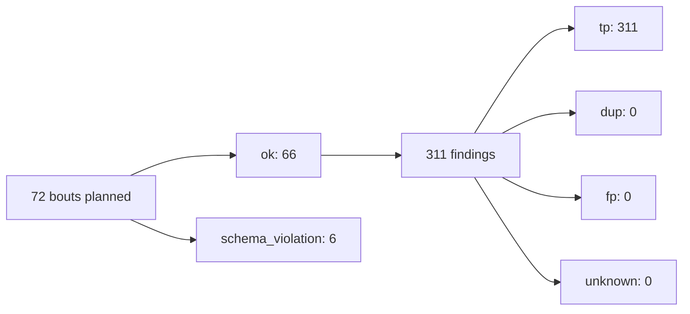
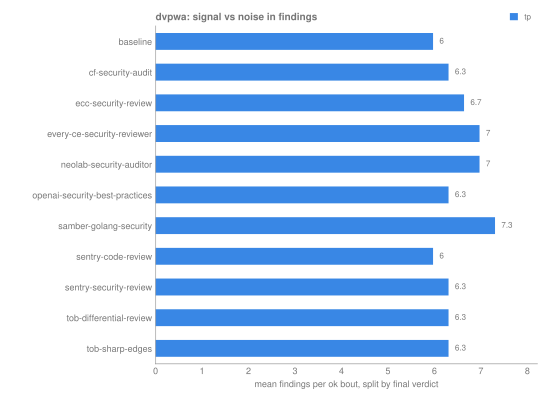
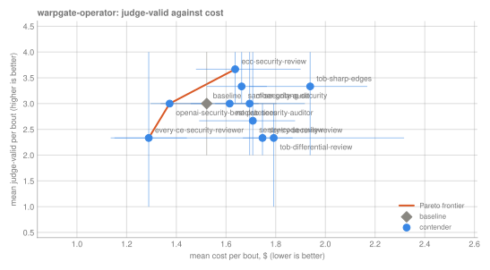
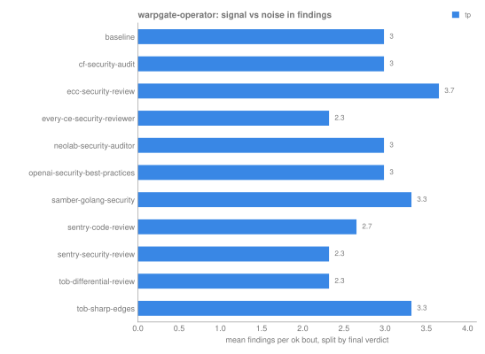
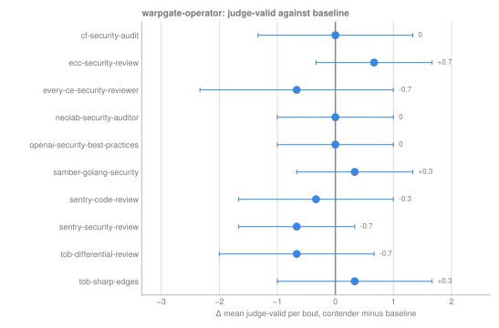
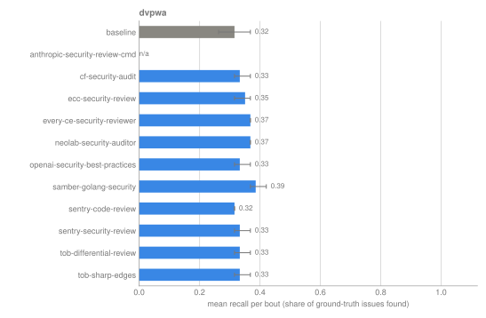
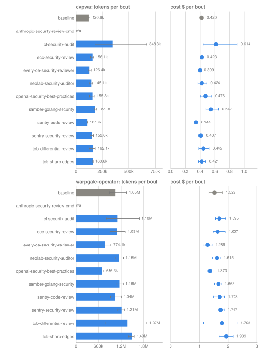
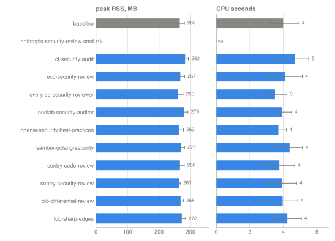

# Secure code review skills, September 2026: round r01

> Which openly available secure-code-review skills find more real vulnerabilities per dollar than a plain Claude Code baseline?

| | |
|---|---|
| trial | `2026-09-secure-coding-audit` |
| lock hash | `d6880b06fd4ef346b80347e678f1aa0767cac9c1409e713cb0d7d3acb0c928f9` |
| engine | skillordeal 0.1.2 |
| agent CLI | claude-code 2.1.280 |
| image | `ghcr.io/thereisnotime/skillordeal-runner:v0.1.2` id `819ae9ea1b12` digest `sha256:3b70b0ff01291bd5dc55f799f01ee4dceb69fbf60c435552bf990a5f1f9744fe` |
| models | `claude-opus-4-8 (effort high)` |
| judge | `claude-sonnet-5` |
| reps, invocation | 3, forced |
| bouts | 66 ok of 72; $68.70 spent (client-side estimate) |
| scores from | `scores/summary.parquet` |
| generated | 2026-09-23 11:04 UTC |

Cells show the mean over ok bouts with a 95% bootstrap CI in brackets (2000 resamples, seed 20260923); no interval means n < 2. **n** is ok bouts over all bouts in the cell. Cost and resource numbers are per bout. Resource numbers describe the client harness, not model-side compute.

## Round at a glance



Findings and verdicts count ok bouts only; verdicts are the final ones when scored, else ground truth, else the judge.

## Charts

### dvpwa


*Up and to the left is better; the orange line joins contenders no one beats on both TP and cost, whiskers are 95% CIs, gray is the baseline. n = 33 ok bouts of 33.*



*Mean findings per bout split by final verdict; the blue share is signal, the rest is noise or undecided. n = 33 ok bouts of 33.*


*Right of the line beats the baseline; a CI that crosses zero isn't a clear difference. n = 33 ok bouts of 33.*

### warpgate-operator



*Up and to the left is better; the orange line joins contenders no one beats on both judge-valid and cost, whiskers are 95% CIs, gray is the baseline. n = 33 ok bouts of 33.*



*Mean findings per bout split by final verdict; the blue share is signal, the rest is noise or undecided. n = 33 ok bouts of 33.*



*Right of the line beats the baseline; a CI that crosses zero isn't a clear difference. n = 33 ok bouts of 33.*

### All arenas



*Share of each arena's ground-truth issues a bout found, mean with 95% CI; gray is the baseline. n = 33 ok bouts of 36.*



*Mean tokens (bars) and cost (dots) per ok bout, one row per arena, whiskers 95% CI; gray is the baseline. n = 66 ok bouts of 72.*



*Peak RSS and CPU time of the client harness per ok bout, pooled over arenas, whiskers 95% CI (not model-side compute). n = 66 ok bouts of 72.*

## dvpwa · security-audit · `claude-opus-4-8@high`

**Quality**

| contender | n | findings | TP | recall | judge-valid | bouts |
|---|---|---:|---:|---:|---:|---|
| baseline | 3/3 | 6 [5, 7] | 6 [5, 7] | 0.32 [0.26, 0.37] | 6 [5, 7] | [#1](bouts/b-451cb0cbf8d3d39f/) [#2](bouts/b-81d5a569957aec07/) [#3](bouts/b-0948285cdfbd009e/) |
| anthropic-security-review-cmd | 0/3 | n/a | n/a | n/a | n/a | [#1 (schema_violation)](bouts/b-08dd1d9fb474d4a5/) [#2 (schema_violation)](bouts/b-1459059465f378aa/) [#3 (schema_violation)](bouts/b-daabc0ef32f8a9c3/) |
| cf-security-audit | 3/3 | 6.3 [6, 7] | 6.3 [6, 7] | 0.33 [0.32, 0.37] | 6.3 [6, 7] | [#1](bouts/b-31983800358aff05/) [#2](bouts/b-7c9ec5dfea8b00f0/) [#3](bouts/b-804bdfee01c983a4/) |
| ecc-security-review | 3/3 | 6.7 [6, 7] | 6.7 [6, 7] | 0.35 [0.32, 0.37] | 6.7 [6, 7] | [#1](bouts/b-2ced92f493905977/) [#2](bouts/b-ba883032b40f4cc6/) [#3](bouts/b-8c02f71718d194f9/) |
| every-ce-security-reviewer | 3/3 | 7 [7, 7] | 7 [7, 7] | 0.37 [0.37, 0.37] | 7 [7, 7] | [#1](bouts/b-b8899439c83812cd/) [#2](bouts/b-e3091b2c2dbe53b9/) [#3](bouts/b-6df1e36caf1209b6/) |
| neolab-security-auditor | 3/3 | 7 [7, 7] | 7 [7, 7] | 0.37 [0.37, 0.37] | 7 [7, 7] | [#1](bouts/b-301eceadefed5b1d/) [#2](bouts/b-6f80a9523c599403/) [#3](bouts/b-c28cac0fd14b2094/) |
| openai-security-best-practices | 3/3 | 6.3 [6, 7] | 6.3 [6, 7] | 0.33 [0.32, 0.37] | 6.3 [6, 7] | [#1](bouts/b-1f92577235dc9338/) [#2](bouts/b-c1156de5ee691d8d/) [#3](bouts/b-add8a984f3049dd1/) |
| samber-golang-security | 3/3 | 7.3 [7, 8] | 7.3 [7, 8] | 0.39 [0.37, 0.42] | 7.3 [7, 8] | [#1](bouts/b-a7a7ec5865fde305/) [#2](bouts/b-012a098fe655c672/) [#3](bouts/b-22f879233b1a37a5/) |
| sentry-code-review | 3/3 | 6 [6, 6] | 6 [6, 6] | 0.32 [0.32, 0.32] | 6 [6, 6] | [#1](bouts/b-fb08d8b8fa9931d1/) [#2](bouts/b-3628e1593a51e3a9/) [#3](bouts/b-17179680af456bd5/) |
| sentry-security-review | 3/3 | 6.3 [6, 7] | 6.3 [6, 7] | 0.33 [0.32, 0.37] | 6.3 [6, 7] | [#1](bouts/b-faf3fb8e784d797a/) [#2](bouts/b-38b305986b0a9dae/) [#3](bouts/b-76fc29074a147acb/) |
| tob-differential-review | 3/3 | 6.3 [6, 7] | 6.3 [6, 7] | 0.33 [0.32, 0.37] | 6.3 [6, 7] | [#1](bouts/b-be64f32258e6fc0b/) [#2](bouts/b-03189a2ffa95cccd/) [#3](bouts/b-6e24aac2bac7947f/) |
| tob-sharp-edges | 3/3 | 6.3 [6, 7] | 6.3 [6, 7] | 0.33 [0.32, 0.37] | 6.3 [6, 7] | [#1](bouts/b-903a610341585706/) [#2](bouts/b-9dbcb8fdeaa5180f/) [#3](bouts/b-6ce90cfa7b122c73/) |

**Cost and resources**

| contender | n | cost $ | tokens | duration s | turns | RSS peak MB | spent, all bouts |
|---|---|---:|---:|---:|---:|---:|---:|
| baseline | 3/3 | 0.420 [0.387, 0.447] | 120.6k [114.3k, 132.3k] | 81 [75, 86] | 20.7 [20, 22] | 280 [268, 288] | $1.261 |
| anthropic-security-review-cmd | 0/3 | n/a | n/a | n/a | n/a | n/a | $0.000 |
| cf-security-audit | 3/3 | 0.614 [0.445, 0.905] | 348.3k [183.0k, 670.4k] | 112 [97, 135] | 23.3 [21, 25] | 294 [291, 296] | $1.843 |
| ecc-security-review | 3/3 | 0.423 [0.404, 0.448] | 156.1k [136.8k, 166.2k] | 79 [71, 88] | 21.7 [20, 23] | 260 [247, 282] | $1.270 |
| every-ce-security-reviewer | 3/3 | 0.399 [0.381, 0.410] | 126.4k [116.4k, 143.7k] | 87 [82, 94] | 20 [19, 21] | 251 [235, 282] | $1.196 |
| neolab-security-auditor | 3/3 | 0.424 [0.371, 0.496] | 145.1k [125.5k, 157.1k] | 82 [78, 91] | 21.3 [19, 24] | 292 [290, 294] | $1.272 |
| openai-security-best-practices | 3/3 | 0.476 [0.401, 0.559] | 155.8k [127.6k, 175.1k] | 89 [76, 98] | 27.7 [26, 30] | 257 [238, 291] | $1.429 |
| samber-golang-security | 3/3 | 0.547 [0.483, 0.655] | 183.0k [176.6k, 194.8k] | 106 [100, 111] | 28.3 [25, 35] | 267 [254, 275] | $1.640 |
| sentry-code-review | 3/3 | 0.344 [0.330, 0.367] | 107.7k [106.9k, 108.2k] | 66 [63, 68] | 18.7 [18, 19] | 254 [241, 269] | $1.033 |
| sentry-security-review | 3/3 | 0.407 [0.376, 0.438] | 152.6k [132.8k, 164.7k] | 77 [74, 80] | 20 [18, 22] | 260 [254, 266] | $1.222 |
| tob-differential-review | 3/3 | 0.445 [0.382, 0.524] | 162.1k [124.1k, 184.1k] | 96 [85, 103] | 22.7 [20, 25] | 260 [247, 273] | $1.334 |
| tob-sharp-edges | 3/3 | 0.421 [0.377, 0.478] | 160.6k [158.0k, 162.1k] | 85 [81, 87] | 21.7 [20, 23] | 268 [242, 283] | $1.264 |

**Against baseline**

| contender | Δ TP | Δ F1 | Δ cost $ | cost per TP $ | skill fired | first-turn tokens vs baseline | check |
|---|---:|---:|---:|---:|---:|---:|---|
| anthropic-security-review-cmd | n/a | n/a | n/a | n/a | n/a | n/a |  |
| cf-security-audit | +0.3 [-0.7, 1.3] | n/a | +0.194 [0.024, 0.472] | 0.097 | 100% (n=3) | +9,408 | ok |
| ecc-security-review | +0.7 [-0.3, 1.7] | n/a | +0.003 [-0.030, 0.038] | 0.063 | 100% (n=3) | +7,465 | ok |
| every-ce-security-reviewer | +1 [0, 2] | n/a | -0.022 [-0.050, 0.010] | 0.057 | 100% (n=3) | +4,066 | ok |
| neolab-security-auditor | +1 [0, 2] | n/a | +0.004 [-0.053, 0.068] | 0.061 | 100% (n=3) | +5,633 | ok |
| openai-security-best-practices | +0.3 [-0.7, 1.3] | n/a | +0.056 [-0.019, 0.132] | 0.075 | 100% (n=3) | +4,481 | ok |
| samber-golang-security | +1.3 [0.3, 2.3] | n/a | +0.126 [0.049, 0.221] | 0.075 | 100% (n=3) | +7,274 | ok |
| sentry-code-review | 0 [-1, 1] | n/a | -0.076 [-0.107, -0.044] | 0.057 | 100% (n=3) | +3,091 | ok |
| sentry-security-review | +0.3 [-0.7, 1.3] | n/a | -0.013 [-0.051, 0.028] | 0.064 | 100% (n=3) | +6,889 | ok |
| tob-differential-review | +0.3 [-0.7, 1.3] | n/a | +0.024 [-0.043, 0.097] | 0.070 | 100% (n=3) | +5,020 | ok |
| tob-sharp-edges | +0.3 [-0.7, 1.3] | n/a | +0.001 [-0.053, 0.058] | 0.067 | 100% (n=3) | +6,490 | ok |

## warpgate-operator · security-audit · `claude-opus-4-8@high`

**Quality**

| contender | n | findings | TP | judge-valid | bouts |
|---|---|---:|---:|---:|---|
| baseline | 3/3 | 3 [2, 4] | n/a | 3 [2, 4] | [#1](bouts/b-654071d0681ebd3c/) [#2](bouts/b-259b9259b3f17a57/) [#3](bouts/b-b462e00c512ab75f/) |
| anthropic-security-review-cmd | 0/3 | n/a | n/a | n/a | [#1 (schema_violation)](bouts/b-ddbb49a7d6458c6d/) [#2 (schema_violation)](bouts/b-42720681044a1b70/) [#3 (schema_violation)](bouts/b-dfecf314fbe26617/) |
| cf-security-audit | 3/3 | 3 [2, 4] | n/a | 3 [2, 4] | [#1](bouts/b-12ba8651f5033db1/) [#2](bouts/b-24e36a49998de2de/) [#3](bouts/b-18e18d909a683352/) |
| ecc-security-review | 3/3 | 3.7 [3, 4] | n/a | 3.7 [3, 4] | [#1](bouts/b-ded7e2d21ba11170/) [#2](bouts/b-12ee5184ce532933/) [#3](bouts/b-eaeee864a0f635dc/) |
| every-ce-security-reviewer | 3/3 | 2.3 [1, 4] | n/a | 2.3 [1, 4] | [#1](bouts/b-e6678b9062024b29/) [#2](bouts/b-31572c580fb48d65/) [#3](bouts/b-177691869dcc2ff6/) |
| neolab-security-auditor | 3/3 | 3 [3, 3] | n/a | 3 [3, 3] | [#1](bouts/b-d72092394c638c3c/) [#2](bouts/b-360a0d69e3b47249/) [#3](bouts/b-e8c3e586227cffe1/) |
| openai-security-best-practices | 3/3 | 3 [3, 3] | n/a | 3 [3, 3] | [#1](bouts/b-8cf65b8faa333583/) [#2](bouts/b-f78f7216039fa301/) [#3](bouts/b-fb7c02ac3a6eb369/) |
| samber-golang-security | 3/3 | 3.3 [3, 4] | n/a | 3.3 [3, 4] | [#1](bouts/b-a712c1f0d617102f/) [#2](bouts/b-727196b09036ee11/) [#3](bouts/b-c8bff40931aa21e1/) |
| sentry-code-review | 3/3 | 2.7 [2, 4] | n/a | 2.7 [2, 4] | [#1](bouts/b-39d2d2bad56357dd/) [#2](bouts/b-c1e46773a300bb5f/) [#3](bouts/b-420c5f9114f7c3b0/) |
| sentry-security-review | 3/3 | 2.3 [2, 3] | n/a | 2.3 [2, 3] | [#1](bouts/b-780cbe96e439ff2f/) [#2](bouts/b-3a504c9ad501eb39/) [#3](bouts/b-44ae5d1c4213ad73/) |
| tob-differential-review | 3/3 | 2.3 [1, 3] | n/a | 2.3 [1, 3] | [#1](bouts/b-929e2986604958da/) [#2](bouts/b-b35deca9d5855f34/) [#3](bouts/b-0686275246850f0f/) |
| tob-sharp-edges | 3/3 | 3.3 [2, 4] | n/a | 3.3 [2, 4] | [#1](bouts/b-9429e15cfa55309a/) [#2](bouts/b-b30175294edf3197/) [#3](bouts/b-fa3a994ee516c746/) |

**Cost and resources**

| contender | n | cost $ | tokens | duration s | turns | RSS peak MB | spent, all bouts |
|---|---|---:|---:|---:|---:|---:|---:|
| baseline | 3/3 | 1.522 [1.337, 1.804] | 1.05M [895.3k, 1.35M] | 181 [133, 244] | 23.7 [19, 28] | 251 [232, 269] | $4.567 |
| anthropic-security-review-cmd | 0/3 | n/a | n/a | n/a | n/a | n/a | $0.000 |
| cf-security-audit | 3/3 | 1.695 [1.556, 1.917] | 1.10M [801.6k, 1.68M] | 219 [210, 226] | 25 [22, 29] | 271 [249, 285] | $5.085 |
| ecc-security-review | 3/3 | 1.637 [1.479, 1.900] | 1.09M [910.4k, 1.31M] | 203 [180, 221] | 22 [21, 23] | 274 [256, 292] | $4.910 |
| every-ce-security-reviewer | 3/3 | 1.289 [1.136, 1.442] | 774.1k [591.1k, 931.2k] | 152 [118, 176] | 20.3 [18, 23] | 268 [250, 288] | $3.867 |
| neolab-security-auditor | 3/3 | 1.615 [1.458, 1.731] | 1.15M [1.05M, 1.26M] | 175 [165, 181] | 20.3 [20, 21] | 267 [243, 288] | $4.844 |
| openai-security-best-practices | 3/3 | 1.373 [1.296, 1.506] | 686.3k [614.5k, 738.5k] | 152 [149, 156] | 24.7 [23, 26] | 268 [264, 272] | $4.119 |
| samber-golang-security | 3/3 | 1.663 [1.523, 1.765] | 1.16M [1.09M, 1.25M] | 220 [212, 236] | 24.3 [19, 27] | 274 [254, 294] | $4.988 |
| sentry-code-review | 3/3 | 1.708 [1.492, 1.878] | 1.04M [923.6k, 1.20M] | 190 [157, 214] | 23.7 [20, 26] | 278 [264, 293] | $5.123 |
| sentry-security-review | 3/3 | 1.747 [1.668, 1.868] | 1.21M [1.11M, 1.29M] | 181 [178, 185] | 24.7 [23, 27] | 266 [262, 271] | $5.240 |
| tob-differential-review | 3/3 | 1.792 [1.151, 2.317] | 1.37M [791.3k, 1.88M] | 206 [150, 255] | 23.3 [21, 26] | 277 [271, 286] | $5.376 |
| tob-sharp-edges | 3/3 | 1.939 [1.693, 2.169] | 1.49M [1.39M, 1.55M] | 227 [219, 234] | 25.3 [23, 29] | 275 [261, 293] | $5.816 |

**Against baseline**

| contender | Δ TP | Δ F1 | Δ cost $ | cost per TP $ | skill fired | first-turn tokens vs baseline | check |
|---|---:|---:|---:|---:|---:|---:|---|
| anthropic-security-review-cmd | n/a | n/a | n/a | n/a | n/a | n/a |  |
| cf-security-audit | n/a | n/a | +0.173 [-0.109, 0.449] | n/a | 100% (n=3) | +9,416 | ok |
| ecc-security-review | n/a | n/a | +0.115 [-0.169, 0.411] | n/a | 100% (n=3) | +7,473 | ok |
| every-ce-security-reviewer | n/a | n/a | -0.233 [-0.515, 0.025] | n/a | 100% (n=3) | +4,074 | ok |
| neolab-security-auditor | n/a | n/a | +0.093 [-0.189, 0.339] | n/a | 100% (n=3) | +5,641 | ok |
| openai-security-best-practices | n/a | n/a | -0.149 [-0.381, 0.076] | n/a | 100% (n=3) | +4,489 | ok |
| samber-golang-security | n/a | n/a | +0.141 [-0.125, 0.377] | n/a | 100% (n=3) | +7,282 | ok |
| sentry-code-review | n/a | n/a | +0.186 [-0.099, 0.470] | n/a | 100% (n=3) | +3,099 | ok |
| sentry-security-review | n/a | n/a | +0.225 [-0.010, 0.447] | n/a | 100% (n=3) | +6,897 | ok |
| tob-differential-review | n/a | n/a | +0.270 [-0.371, 0.814] | n/a | 100% (n=3) | +5,028 | ok |
| tob-sharp-edges | n/a | n/a | +0.417 [0.102, 0.731] | n/a | 100% (n=3) | +6,498 | ok |

## Bouts that did not finish ok

**schema_violation**: 6. These are excluded from the means above but counted in **n** and in spend.

| bout | contender | arena | task | model | rep | status | reason |
|---|---|---|---|---|---|---|---|
| [b-08dd1d9fb474d4a5](bouts/b-08dd1d9fb474d4a5/) | anthropic-security-review-cmd | dvpwa | security-audit | `claude-opus-4-8@high` | 1 | schema_violation | no /out/findings.json written |
| [b-1459059465f378aa](bouts/b-1459059465f378aa/) | anthropic-security-review-cmd | dvpwa | security-audit | `claude-opus-4-8@high` | 2 | schema_violation | no /out/findings.json written |
| [b-daabc0ef32f8a9c3](bouts/b-daabc0ef32f8a9c3/) | anthropic-security-review-cmd | dvpwa | security-audit | `claude-opus-4-8@high` | 3 | schema_violation | no /out/findings.json written |
| [b-ddbb49a7d6458c6d](bouts/b-ddbb49a7d6458c6d/) | anthropic-security-review-cmd | warpgate-operator | security-audit | `claude-opus-4-8@high` | 1 | schema_violation | no /out/findings.json written |
| [b-42720681044a1b70](bouts/b-42720681044a1b70/) | anthropic-security-review-cmd | warpgate-operator | security-audit | `claude-opus-4-8@high` | 2 | schema_violation | no /out/findings.json written |
| [b-dfecf314fbe26617](bouts/b-dfecf314fbe26617/) | anthropic-security-review-cmd | warpgate-operator | security-audit | `claude-opus-4-8@high` | 3 | schema_violation | no /out/findings.json written |

## How to reproduce

```bash
git clone https://github.com/thereisnotime/skillordeal-trials
cd skillordeal-trials
uv tool install git+https://github.com/thereisnotime/skillordeal@v0.1.2
skillordeal run    trials/2026-09-secure-coding-audit/trial.yaml -r r01   # refuses to start on lock drift
skillordeal score  trials/2026-09-secure-coding-audit/trial.yaml -r r01
skillordeal judge  trials/2026-09-secure-coding-audit/trial.yaml -r r01   # optional, costs money
skillordeal report trials/2026-09-secure-coding-audit/trial.yaml -r r01
```

Finished bouts are skipped, so `run` on an existing round only fills gaps. For an independent reproduction, lock a new round from the same trial (`skillordeal lock ... -r r02`) and compare.

## Reading the numbers

- **TP / precision / recall / F1** come from `scores/` (human labels override ground truth, which overrides the judge). Recall is measured against the issues listed in the arena's ground truth. Unless that list is marked complete, unmatched findings are `unknown` rather than false positives, so precision is only a lower bound.
- **Δ** columns are contender minus baseline in the same arena, task and model, with a CI from resampling both sides.
- **cost per TP** is total cost of the ok bouts over their total TPs.
- **first-turn tokens vs baseline** is this contender's mean first-turn prompt tokens minus the baseline's. A skill that loaded should add tokens; zero or less is flagged.
- **skill fired** is the share of ok bouts where the skill was invoked (forced invocation counts as fired).
- Cost is the CLI's client-side estimate (notional under OAuth).
