# Secure code review skills, September 2026: round r01

> Which openly available secure-code-review skills find more real vulnerabilities per dollar than a plain Claude Code baseline?

| | |
|---|---|
| trial | `2026-09-secure-coding-audit` |
| lock hash | `c40c0eeec3ebcc058ba2bb0826a775cefd2ba909d6f6a4247580217c141775c2` |
| engine | skillordeal 0.1.3 |
| agent CLI | claude-code 2.1.280 |
| image | `ghcr.io/thereisnotime/skillordeal-runner:v0.1.2` id `819ae9ea1b12` digest `sha256:3b70b0ff01291bd5dc55f799f01ee4dceb69fbf60c435552bf990a5f1f9744fe` |
| models | `claude-opus-4-8 (effort high)` |
| judge | `claude-sonnet-5`, panel of 3: reachability, impact, correctness |
| reps, invocation | 3, forced |
| bouts | 144 ok of 150; $161.24 spent (client-side estimate) |
| scores from | `scores/summary.parquet` |
| generated | 2026-10-04 21:19 UTC |

Cells show the mean over ok bouts with a 95% bootstrap CI in brackets (2000 resamples, seed 20260923); no interval means n < 2. **n** is ok bouts over all bouts in the cell. Cost and resource numbers are per bout. Resource numbers describe the client harness, not model-side compute.

## Key takeaways

- 144 of 150 bouts finished `ok`; the rest are left out of every mean and chart. `anthropic-security-review-cmd`: no bout finished ok (6 schema_violation; bouts [dvpwa #1](bouts/b-08dd1d9fb474d4a5/) [dvpwa #2](bouts/b-1459059465f378aa/) [dvpwa #3](bouts/b-daabc0ef32f8a9c3/) [warpgate-operator #1](bouts/b-ddbb49a7d6458c6d/) [warpgate-operator #2](bouts/b-42720681044a1b70/) [warpgate-operator #3](bouts/b-dfecf314fbe26617/)).
- Judge: panel mode, 3 blinded voters (reachability, impact, correctness) each trying to refute every finding, verdict by majority. Of 695 judged findings in ok bouts, 565 are panel-valid, 128 panel-invalid and 2 unverifiable; 513 (74%) had unanimous votes.
- **dvpwa**: highest mean TP per bout: `anthropic-security-auditor` 8 [8, 8] (n=3; bouts [#1](bouts/b-03e8db4d52b98d3e/) [#2](bouts/b-b7a53f7c51dbf387/) [#3](bouts/b-d9b4f43862cb3118/)); baseline 6 [5, 7] (n=3).
- **dvpwa**: Δ TP vs baseline with a 95% CI excluding 0 (n=3 ok bouts each), above the baseline: `agamm-owasp-security` +1.7 [0.7, 2.7], `anthropic-security-auditor` +2 [1, 3], `samber-golang-security` +1.3 [0.3, 2.3]. The other 20 contenders' CIs include 0.
- **dvpwa**: lowest cost per TP: `every-ce-security-reviewer` $0.057 (21 TP over 3 bouts); highest: `sentry-then-fp-check` $0.229 (18 over 3 bouts); baseline $0.070.
- **dvpwa**: 12 of 19 ground-truth issues were found by at least one bout; no contender found 7: `xss-student-name`, `default-admin-credentials`, `postgres-exposed-no-password`, `xss-course-fields`, `container-runs-as-root`, `error-page-info-leak`, `unverified-download`. 5 were found in every ok bout of every contender. Found by one contender only: `missing-authz-course-create` (`claude-security-researcher`, 1 bout), `session-fixation` (`agamm-owasp-security`, 1 bout), `vulnerable-dependencies` (`sari3l-security-code-audit`, 1 bout).
- **dvpwa**: 4 of 13 distinct problems (finding clusters) were reported by a single contender: `addyosmani-security-auditor` 1, `agamm-owasp-security` 1, `anthropic-security-auditor` 1, `sari3l-security-code-audit` 1.
- **warpgate-operator**: highest mean panel-valid per bout: `ecc-security-review` 2.3 [2, 3] (n=3; bouts [#1](bouts/b-ded7e2d21ba11170/) [#2](bouts/b-12ee5184ce532933/) [#3](bouts/b-eaeee864a0f635dc/)), `samber-golang-security` 2.3 [2, 3] (n=3; bouts [#1](bouts/b-a712c1f0d617102f/) [#2](bouts/b-727196b09036ee11/) [#3](bouts/b-c8bff40931aa21e1/)), `tob-sharp-edges` 2.3 [1, 3] (n=3; bouts [#1](bouts/b-9429e15cfa55309a/) [#2](bouts/b-b30175294edf3197/) [#3](bouts/b-fa3a994ee516c746/)); baseline 1 [0, 2] (n=3).
- **warpgate-operator**: Δ panel-valid vs baseline with a 95% CI excluding 0 (n=3 ok bouts each), above the baseline: `ecc-security-review` +1.3 [0.3, 2.3], `samber-golang-security` +1.3 [0.3, 2.3]. The other 21 contenders' CIs include 0.
- **warpgate-operator**: lowest cost per panel-valid: `ecc-security-review` $0.701 (7 panel-valid over 3 bouts); highest: `sentry-then-fp-check` $3.238 (2 over 3 bouts); baseline $1.522.
- **warpgate-operator**: 6 of 20 distinct problems (finding clusters) were reported by a single contender: `ecc-security-review` 1, `gemini-security-analyze-full` 1, `ivan-sincek-cwe-secure-code-review` 1, `sentry-code-review` 1, `tob-sharp-edges` 1, `unitone-secure-code-review` 1.
- Every skill contender's first-turn prompt was larger than the baseline's (+3,091 to +39,330 tokens), as expected when the skill loads.

Generated from the numbers below, without interpretation: means are over ok bouts, brackets are 95% bootstrap CIs, and numbers link to the bouts behind them.

## Round at a glance

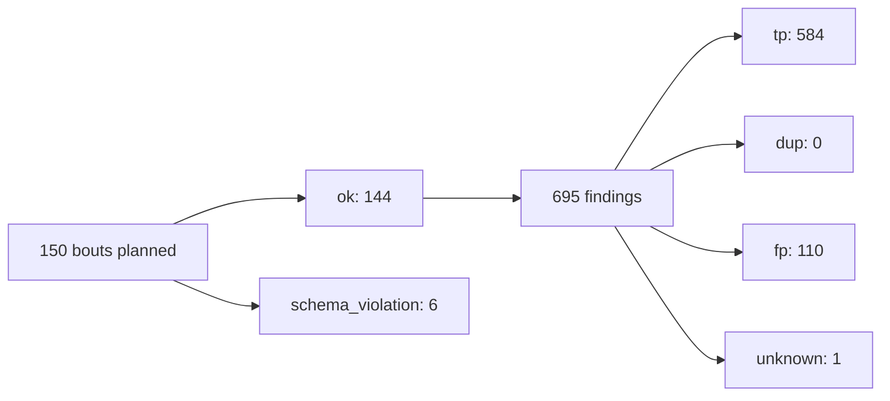
```mermaid
flowchart LR
    n0["150 bouts planned"]
    n1["ok: 144"]
    n0 --> n1
    n2["schema_violation: 6"]
    n0 --> n2
    n3["695 findings"]
    n1 --> n3
    n4["tp: 584"]
    n3 --> n4
    n5["dup: 0"]
    n3 --> n5
    n6["fp: 110"]
    n3 --> n6
    n7["unknown: 1"]
    n3 --> n7
```

Findings and verdicts count ok bouts only; verdicts are the final ones when scored, else ground truth, else the judge.

### Pipelines

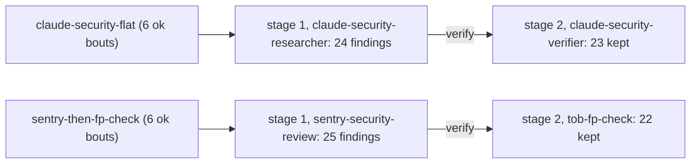
```mermaid
flowchart LR
    n0["claude-security-flat (6 ok bouts)"]
    n1["stage 1, claude-security-researcher: 24 findings"]
    n0 --> n1
    n2["stage 2, claude-security-verifier: 23 kept"]
    n1 -->|"verify"| n2
    n3["sentry-then-fp-check (6 ok bouts)"]
    n4["stage 1, sentry-security-review: 25 findings"]
    n3 --> n4
    n5["stage 2, tob-fp-check: 22 kept"]
    n4 -->|"verify"| n5
```

Findings each stage passed on, summed over the pipeline's ok bouts.

## dvpwa

### Charts

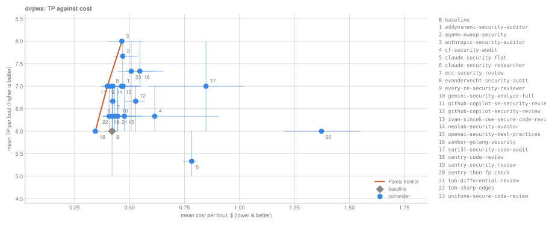

*How to read: Up and to the left is better; the orange line joins contenders no one beats on both TP and cost, whiskers are 95% CIs, gray is the baseline. n = 72 ok bouts of 72.*

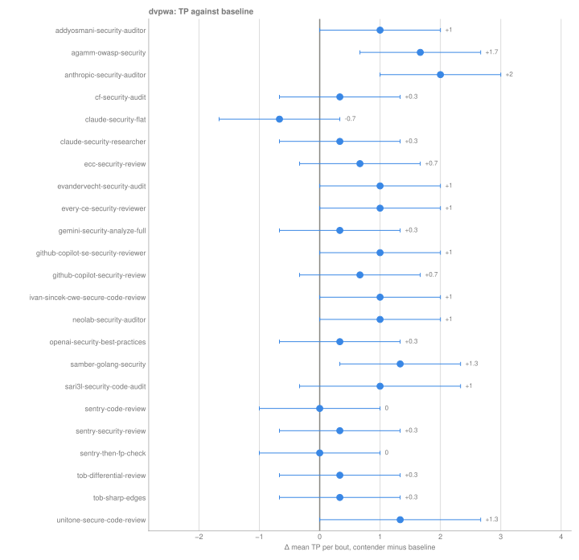

*How to read: Right of the line beats the baseline; a CI that crosses zero isn't a clear difference. n = 72 ok bouts of 72.*

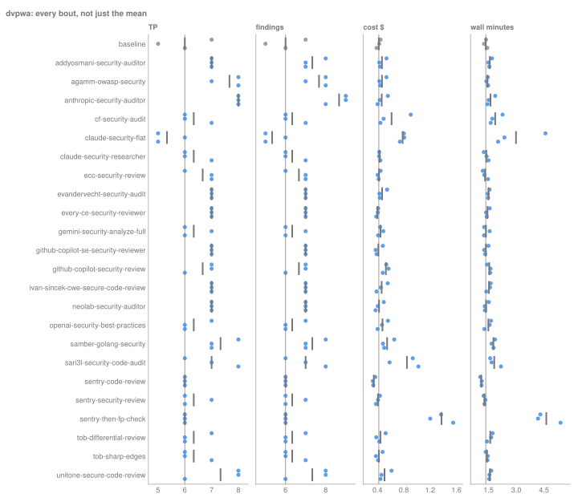

*How to read: Each dot is one ok bout, the dark tick is the mean and the gray line is the baseline's mean; dots far apart mean the contender is inconsistent from run to run. n = 72 ok bouts of 72.*

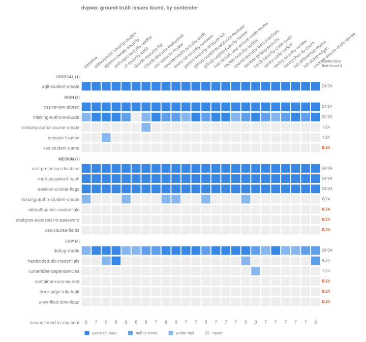

*How to read: Each row is a known issue (grouped by severity), each column a contender; darker means found in more of its ok bouts. The right column counts contenders that found the issue at least once (7 of 19 issues: none). n = 72 ok bouts of 75.*

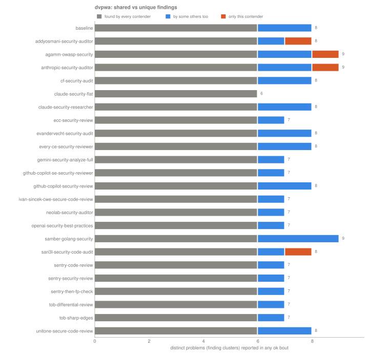

*How to read: Distinct problems each contender reported across its bouts, split by how many other contenders reported them too; orange is what only this contender found (13 problems in all). n = 72 ok bouts of 75.*

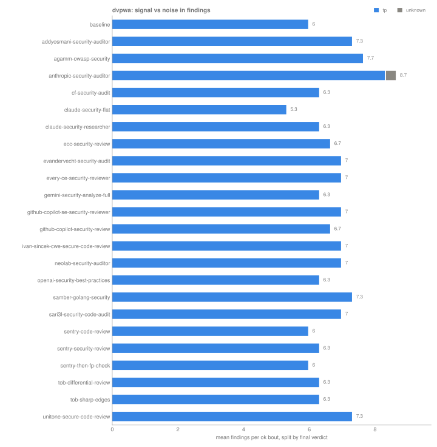

*How to read: Mean findings per bout split by final verdict; the blue share is signal, the rest is noise or undecided. n = 72 ok bouts of 72.*

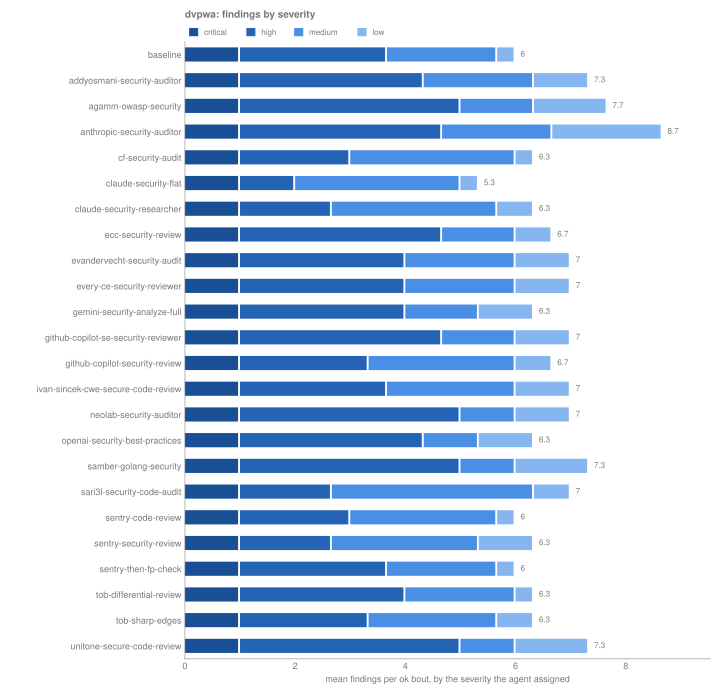

*How to read: Mean findings per bout stacked by self-reported severity, darkest is critical; a contender that rates the same issues higher shows more dark. n = 72 ok bouts of 75.*

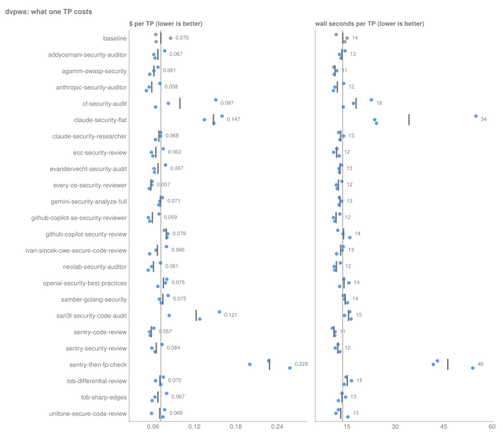

*How to read: Dollars and wall-clock seconds per TP: dots are single bouts (bouts with no TP are left out), the tick and number are the pooled ratio (total over total). n = 72 ok bouts of 75.*

### Tables · security-audit · `claude-opus-4-8@high`

**Quality**

| contender | n | findings | TP | recall | panel-valid | bouts |
|---|---|---:|---:|---:|---:|---|
| baseline | 3/3 | 6 [5, 7] | 6 [5, 7] | 0.32 [0.26, 0.37] | 6 [5, 7] | [#1](bouts/b-451cb0cbf8d3d39f/) [#2](bouts/b-81d5a569957aec07/) [#3](bouts/b-0948285cdfbd009e/) |
| addyosmani-security-auditor | 3/3 | 7.3 [7, 8] | 7 [7, 7] | 0.37 [0.37, 0.37] | 7.3 [7, 8] | [#1](bouts/b-04a7ec235b7ebf07/) [#2](bouts/b-1643efa123763e7d/) [#3](bouts/b-3844b5f631a47dab/) |
| agamm-owasp-security | 3/3 | 7.7 [7, 8] | 7.7 [7, 8] | 0.40 [0.37, 0.42] | 7.3 [7, 8] | [#1](bouts/b-9dd955a5c9c0357c/) [#2](bouts/b-6f695b9cde49dde2/) [#3](bouts/b-0f0040f4f6311464/) |
| anthropic-security-auditor | 3/3 | 8.7 [8, 9] | 8 [8, 8] | 0.42 [0.42, 0.42] | 7.3 [6, 9] | [#1](bouts/b-03e8db4d52b98d3e/) [#2](bouts/b-b7a53f7c51dbf387/) [#3](bouts/b-d9b4f43862cb3118/) |
| anthropic-security-review-cmd | 0/3 | n/a | n/a | n/a | n/a | [#1 (schema_violation)](bouts/b-08dd1d9fb474d4a5/) [#2 (schema_violation)](bouts/b-1459059465f378aa/) [#3 (schema_violation)](bouts/b-daabc0ef32f8a9c3/) |
| cf-security-audit | 3/3 | 6.3 [6, 7] | 6.3 [6, 7] | 0.33 [0.32, 0.37] | 6.3 [6, 7] | [#1](bouts/b-31983800358aff05/) [#2](bouts/b-7c9ec5dfea8b00f0/) [#3](bouts/b-804bdfee01c983a4/) |
| claude-security-flat | 3/3 | 5.3 [5, 6] | 5.3 [5, 6] | 0.28 [0.26, 0.32] | 5 [5, 5] | [#1](bouts/b-32e1bd35f066b7c8/) [#2](bouts/b-7274ef30b87277d1/) [#3](bouts/b-568ffe163a45e649/) |
| claude-security-researcher | 3/3 | 6.3 [6, 7] | 6.3 [6, 7] | 0.33 [0.32, 0.37] | 5.7 [5, 6] | [#1](bouts/b-a4dbe5cd76faac8d/) [#2](bouts/b-23966641f45eba37/) [#3](bouts/b-cfd75ae04e6c60f4/) |
| ecc-security-review | 3/3 | 6.7 [6, 7] | 6.7 [6, 7] | 0.35 [0.32, 0.37] | 6.7 [6, 7] | [#1](bouts/b-2ced92f493905977/) [#2](bouts/b-ba883032b40f4cc6/) [#3](bouts/b-8c02f71718d194f9/) |
| evandervecht-security-audit | 3/3 | 7 [7, 7] | 7 [7, 7] | 0.37 [0.37, 0.37] | 6.3 [6, 7] | [#1](bouts/b-7b178dbf573400fc/) [#2](bouts/b-15d489ede015e97a/) [#3](bouts/b-13e544849058cef4/) |
| every-ce-security-reviewer | 3/3 | 7 [7, 7] | 7 [7, 7] | 0.37 [0.37, 0.37] | 7 [7, 7] | [#1](bouts/b-b8899439c83812cd/) [#2](bouts/b-e3091b2c2dbe53b9/) [#3](bouts/b-6df1e36caf1209b6/) |
| gemini-security-analyze-full | 3/3 | 6.3 [6, 7] | 6.3 [6, 7] | 0.33 [0.32, 0.37] | 6 [5, 7] | [#1](bouts/b-c2ccaa26130a0bf7/) [#2](bouts/b-fa8c3867fac23f31/) [#3](bouts/b-f89a2d7e0afe07ef/) |
| github-copilot-se-security-reviewer | 3/3 | 7 [7, 7] | 7 [7, 7] | 0.37 [0.37, 0.37] | 7 [7, 7] | [#1](bouts/b-fa875bbc8db93d16/) [#2](bouts/b-1fcc34972017855f/) [#3](bouts/b-2d8aab97846fcfa0/) |
| github-copilot-security-review | 3/3 | 6.7 [6, 7] | 6.7 [6, 7] | 0.35 [0.32, 0.37] | 6.3 [6, 7] | [#1](bouts/b-8193dd834e705db1/) [#2](bouts/b-421218f269a1b527/) [#3](bouts/b-40d35aeabf7b3e4a/) |
| ivan-sincek-cwe-secure-code-review | 3/3 | 7 [7, 7] | 7 [7, 7] | 0.37 [0.37, 0.37] | 7 [7, 7] | [#1](bouts/b-5bc74ed61cacab81/) [#2](bouts/b-989fd6358dc51bd1/) [#3](bouts/b-b5e3b5f3086ed061/) |
| neolab-security-auditor | 3/3 | 7 [7, 7] | 7 [7, 7] | 0.37 [0.37, 0.37] | 6.7 [6, 7] | [#1](bouts/b-301eceadefed5b1d/) [#2](bouts/b-6f80a9523c599403/) [#3](bouts/b-c28cac0fd14b2094/) |
| openai-security-best-practices | 3/3 | 6.3 [6, 7] | 6.3 [6, 7] | 0.33 [0.32, 0.37] | 5.7 [5, 7] | [#1](bouts/b-1f92577235dc9338/) [#2](bouts/b-c1156de5ee691d8d/) [#3](bouts/b-add8a984f3049dd1/) |
| samber-golang-security | 3/3 | 7.3 [7, 8] | 7.3 [7, 8] | 0.39 [0.37, 0.42] | 7 [6, 8] | [#1](bouts/b-a7a7ec5865fde305/) [#2](bouts/b-012a098fe655c672/) [#3](bouts/b-22f879233b1a37a5/) |
| sari3l-security-code-audit | 3/3 | 7 [6, 8] | 7 [6, 8] | 0.37 [0.32, 0.42] | 6.7 [6, 7] | [#1](bouts/b-06151d54e4d5d1ee/) [#2](bouts/b-a8e5cba972d63676/) [#3](bouts/b-9c7f5c64b1086696/) |
| sentry-code-review | 3/3 | 6 [6, 6] | 6 [6, 6] | 0.32 [0.32, 0.32] | 6 [6, 6] | [#1](bouts/b-fb08d8b8fa9931d1/) [#2](bouts/b-3628e1593a51e3a9/) [#3](bouts/b-17179680af456bd5/) |
| sentry-security-review | 3/3 | 6.3 [6, 7] | 6.3 [6, 7] | 0.33 [0.32, 0.37] | 6.3 [6, 7] | [#1](bouts/b-faf3fb8e784d797a/) [#2](bouts/b-38b305986b0a9dae/) [#3](bouts/b-76fc29074a147acb/) |
| sentry-then-fp-check | 3/3 | 6 [6, 6] | 6 [6, 6] | 0.32 [0.32, 0.32] | 5.7 [5, 6] | [#1](bouts/b-d1d637b6ba226bf0/) [#2](bouts/b-2ca35255abd04a39/) [#3](bouts/b-33575c9481a3f904/) |
| tob-differential-review | 3/3 | 6.3 [6, 7] | 6.3 [6, 7] | 0.33 [0.32, 0.37] | 6.3 [6, 7] | [#1](bouts/b-be64f32258e6fc0b/) [#2](bouts/b-03189a2ffa95cccd/) [#3](bouts/b-6e24aac2bac7947f/) |
| tob-sharp-edges | 3/3 | 6.3 [6, 7] | 6.3 [6, 7] | 0.33 [0.32, 0.37] | 6.3 [6, 7] | [#1](bouts/b-903a610341585706/) [#2](bouts/b-9dbcb8fdeaa5180f/) [#3](bouts/b-6ce90cfa7b122c73/) |
| unitone-secure-code-review | 3/3 | 7.3 [6, 8] | 7.3 [6, 8] | 0.39 [0.32, 0.42] | 6.7 [6, 7] | [#1](bouts/b-6c6088fa0c79f8cb/) [#2](bouts/b-3f3fe3704ebc23c6/) [#3](bouts/b-debfd93f565d0c1a/) |

**Against baseline**

| contender | Δ TP | Δ F1 | Δ cost $ | cost per TP $ | skill fired | first-turn tokens vs baseline | check |
|---|---:|---:|---:|---:|---:|---:|---|
| addyosmani-security-auditor | +1 [0, 2] | n/a | +0.048 [-0.006, 0.114] | 0.067 | 100% (n=3) | +3,948 | ok |
| agamm-owasp-security | +1.7 [0.7, 2.7] | n/a | +0.049 [-0.005, 0.114] | 0.061 | 100% (n=3) | +7,851 | ok |
| anthropic-security-auditor | +2 [1, 3] | n/a | +0.044 [-0.024, 0.130] | 0.058 | 100% (n=3) | +3,829 | ok |
| anthropic-security-review-cmd | n/a | n/a | n/a | n/a | n/a | n/a |  |
| cf-security-audit | +0.3 [-0.7, 1.3] | n/a | +0.194 [0.024, 0.472] | 0.097 | 100% (n=3) | +9,408 | ok |
| claude-security-flat | -0.7 [-1.7, 0.3] | n/a | +0.362 [0.320, 0.404] | 0.147 | 100% (n=3) | +4,244 | ok |
| claude-security-researcher | +0.3 [-0.7, 1.3] | n/a | +0.011 [-0.016, 0.045] | 0.068 | 100% (n=3) | +4,244 | ok |
| ecc-security-review | +0.7 [-0.3, 1.7] | n/a | +0.003 [-0.030, 0.038] | 0.063 | 100% (n=3) | +7,465 | ok |
| evandervecht-security-audit | +1 [0, 2] | n/a | +0.050 [-0.007, 0.121] | 0.067 | 100% (n=3) | +6,586 | ok |
| every-ce-security-reviewer | +1 [0, 2] | n/a | -0.022 [-0.050, 0.010] | 0.057 | 100% (n=3) | +4,066 | ok |
| gemini-security-analyze-full | +0.3 [-0.7, 1.3] | n/a | +0.026 [-0.020, 0.073] | 0.071 | 100% (n=3) | +5,746 | ok |
| github-copilot-se-security-reviewer | +1 [0, 2] | n/a | -0.007 [-0.062, 0.058] | 0.059 | 100% (n=3) | +3,718 | ok |
| github-copilot-security-review | +0.7 [-0.3, 1.7] | n/a | +0.108 [0.058, 0.157] | 0.079 | 100% (n=3) | +5,559 | ok |
| ivan-sincek-cwe-secure-code-review | +1 [0, 2] | n/a | +0.043 [-0.035, 0.129] | 0.066 | 100% (n=3) | +5,754 | ok |
| neolab-security-auditor | +1 [0, 2] | n/a | +0.004 [-0.053, 0.068] | 0.061 | 100% (n=3) | +5,633 | ok |
| openai-security-best-practices | +0.3 [-0.7, 1.3] | n/a | +0.056 [-0.019, 0.132] | 0.075 | 100% (n=3) | +4,481 | ok |
| samber-golang-security | +1.3 [0.3, 2.3] | n/a | +0.126 [0.049, 0.221] | 0.075 | 100% (n=3) | +7,274 | ok |
| sari3l-security-code-audit | +1 [-0.3, 2.3] | n/a | +0.427 [0.164, 0.595] | 0.121 | 100% (n=3) | +39,322 | ok |
| sentry-code-review | 0 [-1, 1] | n/a | -0.076 [-0.107, -0.044] | 0.057 | 100% (n=3) | +3,091 | ok |
| sentry-security-review | +0.3 [-0.7, 1.3] | n/a | -0.013 [-0.051, 0.028] | 0.064 | 100% (n=3) | +6,889 | ok |
| sentry-then-fp-check | 0 [-1, 1] | n/a | +0.952 [0.781, 1.116] | 0.229 | 100% (n=3) | +6,889 | ok |
| tob-differential-review | +0.3 [-0.7, 1.3] | n/a | +0.024 [-0.043, 0.097] | 0.070 | 100% (n=3) | +5,020 | ok |
| tob-sharp-edges | +0.3 [-0.7, 1.3] | n/a | +0.001 [-0.053, 0.058] | 0.067 | 100% (n=3) | +6,490 | ok |
| unitone-secure-code-review | +1.3 [0, 2.7] | n/a | +0.087 [0.016, 0.180] | 0.069 | 100% (n=3) | +12,756 | ok |

<details>
<summary>Cost and resources per bout, mean [95% CI]</summary>

| contender | n | cost $ | tokens | duration s | turns | RSS peak MB | spent, all bouts |
|---|---|---:|---:|---:|---:|---:|---:|
| baseline | 3/3 | 0.420 [0.387, 0.447] | 120.6k [114.3k, 132.3k] | 81 [75, 86] | 20.7 [20, 22] | 280 [268, 288] | $1.261 |
| addyosmani-security-auditor | 3/3 | 0.469 [0.428, 0.538] | 150.3k [147.3k, 155.8k] | 94 [89, 101] | 24.7 [24, 26] | 250 [231, 265] | $1.406 |
| agamm-owasp-security | 3/3 | 0.469 [0.429, 0.537] | 190.6k [173.9k, 199.9k] | 86 [83, 89] | 22.7 [22, 23] | 268 [235, 286] | $1.407 |
| anthropic-security-auditor | 3/3 | 0.465 [0.402, 0.558] | 148.4k [120.0k, 179.8k] | 96 [87, 112] | 23 [21, 26] | 258 [243, 279] | $1.395 |
| anthropic-security-review-cmd | 0/3 | n/a | n/a | n/a | n/a | n/a | $0.000 |
| cf-security-audit | 3/3 | 0.614 [0.445, 0.905] | 348.3k [183.0k, 670.4k] | 112 [97, 135] | 23.3 [21, 25] | 294 [291, 296] | $1.843 |
| claude-security-flat | 3/3 | 0.783 [0.741, 0.807] | 261.4k [250.9k, 270.2k] | 179 [121, 275] | 36 [34, 38] | 258 [243, 270] | $2.348 |
| claude-security-researcher | 3/3 | 0.432 [0.424, 0.445] | 151.6k [141.4k, 160.1k] | 83 [75, 90] | 22.3 [19, 24] | 260 [243, 275] | $1.296 |
| ecc-security-review | 3/3 | 0.423 [0.404, 0.448] | 156.1k [136.8k, 166.2k] | 79 [71, 88] | 21.7 [20, 23] | 260 [247, 282] | $1.270 |
| evandervecht-security-audit | 3/3 | 0.470 [0.430, 0.546] | 166.0k [162.6k, 171.5k] | 90 [88, 93] | 23.7 [23, 25] | 265 [237, 289] | $1.411 |
| every-ce-security-reviewer | 3/3 | 0.399 [0.381, 0.410] | 126.4k [116.4k, 143.7k] | 87 [82, 94] | 20 [19, 21] | 251 [235, 282] | $1.196 |
| gemini-security-analyze-full | 3/3 | 0.447 [0.410, 0.489] | 154.4k [127.8k, 175.7k] | 82 [75, 94] | 24.7 [21, 29] | 278 [277, 280] | $1.340 |
| github-copilot-se-security-reviewer | 3/3 | 0.413 [0.372, 0.481] | 126.6k [115.4k, 145.6k] | 81 [76, 90] | 21.7 [20, 24] | 274 [263, 285] | $1.239 |
| github-copilot-security-review | 3/3 | 0.528 [0.481, 0.569] | 161.6k [156.8k, 167.0k] | 92 [85, 96] | 24 [22, 27] | 242 [234, 255] | $1.584 |
| ivan-sincek-cwe-secure-code-review | 3/3 | 0.464 [0.385, 0.556] | 160.8k [129.1k, 191.5k] | 91 [83, 97] | 23 [20, 26] | 249 [236, 263] | $1.391 |
| neolab-security-auditor | 3/3 | 0.424 [0.371, 0.496] | 145.1k [125.5k, 157.1k] | 82 [78, 91] | 21.3 [19, 24] | 292 [290, 294] | $1.272 |
| openai-security-best-practices | 3/3 | 0.476 [0.401, 0.559] | 155.8k [127.6k, 175.1k] | 89 [76, 98] | 27.7 [26, 30] | 257 [238, 291] | $1.429 |
| samber-golang-security | 3/3 | 0.547 [0.483, 0.655] | 183.0k [176.6k, 194.8k] | 106 [100, 111] | 28.3 [25, 35] | 267 [254, 275] | $1.640 |
| sari3l-security-code-audit | 3/3 | 0.848 [0.584, 1.022] | 671.9k [392.7k, 1.23M] | 108 [95, 130] | 22.3 [21, 24] | 259 [246, 283] | $2.543 |
| sentry-code-review | 3/3 | 0.344 [0.330, 0.367] | 107.7k [106.9k, 108.2k] | 66 [63, 68] | 18.7 [18, 19] | 254 [241, 269] | $1.033 |
| sentry-security-review | 3/3 | 0.407 [0.376, 0.438] | 152.6k [132.8k, 164.7k] | 77 [74, 80] | 20 [18, 22] | 260 [254, 266] | $1.222 |
| sentry-then-fp-check | 3/3 | 1.373 [1.202, 1.550] | 575.0k [523.0k, 640.1k] | 278 [251, 324] | 43.3 [41, 47] | 273 [270, 276] | $4.119 |
| tob-differential-review | 3/3 | 0.445 [0.382, 0.524] | 162.1k [124.1k, 184.1k] | 96 [85, 103] | 22.7 [20, 25] | 260 [247, 273] | $1.334 |
| tob-sharp-edges | 3/3 | 0.421 [0.377, 0.478] | 160.6k [158.0k, 162.1k] | 85 [81, 87] | 21.7 [20, 23] | 268 [242, 283] | $1.264 |
| unitone-secure-code-review | 3/3 | 0.507 [0.446, 0.614] | 208.3k [205.8k, 210.8k] | 94 [92, 99] | 21.7 [21, 22] | 257 [237, 288] | $1.522 |

</details>


### What each contender found

<details>
<summary>Ground-truth issues: who found what (19 issues, 7 found by nobody)</summary>

| issue | title | severity | CWE | contenders | found by (ok bouts that found it) |
|---|---|---|---|---:|---|
| `sqli-student-create` | SQL injection in student creation | critical | CWE-89 | 24/24 | every contender, every ok bout |
| `xss-review-stored` | Stored XSS in course reviews (Jinja2 autoescape disabled) | high | CWE-79, CWE-80 | 24/24 | every contender, every ok bout |
| `missing-authz-evaluate` | Grading endpoint has no authentication or admin check | high | CWE-862, CWE-285 | 23/24 | baseline 1/3; addyosmani-security-auditor 3/3; agamm-owasp-security 3/3; anthropic-security-auditor 3/3; cf-security-audit 2/3; claude-security-researcher 1/3; ecc-security-review 3/3; evandervecht-security-audit 2/3; every-ce-security-reviewer 2/3; gemini-security-analyze-full 1/3; github-copilot-se-security-reviewer 3/3; github-copilot-security-review 2/3; ivan-sincek-cwe-secure-code-review 3/3; neolab-security-auditor 3/3; openai-security-best-practices 1/3; samber-golang-security 2/3; sari3l-security-code-audit 3/3; sentry-code-review 2/3; sentry-security-review 1/3; sentry-then-fp-check 2/3; tob-differential-review 3/3; tob-sharp-edges 2/3; unitone-secure-code-review 3/3 |
| `missing-authz-course-create` | Course creation has no authentication or admin check | high | CWE-862, CWE-285 | 1/24 | claude-security-researcher 1/3 [#2](bouts/b-23966641f45eba37/) |
| `session-fixation` | Session identifier not rotated on login or logout | high | CWE-384 | 1/24 | agamm-owasp-security 1/3 [#1](bouts/b-9dd955a5c9c0357c/) |
| `xss-student-name` | Stored XSS via student name on list and evaluate pages | high | CWE-79, CWE-80 | 0/24 | nobody |
| `csrf-protection-disabled` | CSRF middleware disabled, state-changing POSTs unprotected | medium | CWE-352 | 24/24 | every contender, every ok bout |
| `md5-password-hash` | Passwords stored as unsalted MD5 | medium | CWE-916, CWE-328, CWE-759, CWE-327, CWE-326 | 24/24 | every contender, every ok bout |
| `session-cookie-flags` | Session cookie set without HttpOnly or Secure | medium | CWE-1004, CWE-614 | 24/24 | every contender, every ok bout |
| `missing-authn-student-create` | Student creation has no authentication check | medium | CWE-306, CWE-862 | 6/24 | baseline 1/3 [#1](bouts/b-451cb0cbf8d3d39f/); cf-security-audit 1/3 [#2](bouts/b-7c9ec5dfea8b00f0/); evandervecht-security-audit 1/3 [#2](bouts/b-15d489ede015e97a/); every-ce-security-reviewer 1/3 [#1](bouts/b-b8899439c83812cd/); github-copilot-security-review 1/3 [#2](bouts/b-421218f269a1b527/); samber-golang-security 1/3 [#2](bouts/b-012a098fe655c672/) |
| `default-admin-credentials` | Seeded admin account with password equal to username | medium | CWE-1392, CWE-521 | 0/24 | nobody |
| `postgres-exposed-no-password` | Postgres published on the host with trust authentication | medium | CWE-306, CWE-1188 | 0/24 | nobody |
| `xss-course-fields` | Stored XSS via course title and description | medium | CWE-79, CWE-80 | 0/24 | nobody |
| `debug-mode` | Application runs in debug mode with DEBUG logging | low | CWE-489, CWE-215 | 24/24 | baseline 1/3; addyosmani-security-auditor 3/3; agamm-owasp-security 3/3; anthropic-security-auditor 3/3; cf-security-audit 1/3; claude-security-flat 1/3; claude-security-researcher 2/3; ecc-security-review 2/3; evandervecht-security-audit 3/3; every-ce-security-reviewer 3/3; gemini-security-analyze-full 3/3; github-copilot-se-security-reviewer 3/3; github-copilot-security-review 2/3; ivan-sincek-cwe-secure-code-review 3/3; neolab-security-auditor 3/3; openai-security-best-practices 3/3; samber-golang-security 3/3; sari3l-security-code-audit 2/3; sentry-code-review 1/3; sentry-security-review 3/3; sentry-then-fp-check 1/3; tob-differential-review 1/3; tob-sharp-edges 2/3; unitone-secure-code-review 2/3 |
| `hardcoded-db-credentials` | Database credentials hardcoded in committed config | low | CWE-798, CWE-260 | 4/24 | agamm-owasp-security 1/3 [#3](bouts/b-0f0040f4f6311464/); anthropic-security-auditor 3/3 [#1](bouts/b-03e8db4d52b98d3e/) [#2](bouts/b-b7a53f7c51dbf387/) [#3](bouts/b-d9b4f43862cb3118/); samber-golang-security 1/3 [#1](bouts/b-a7a7ec5865fde305/); unitone-secure-code-review 2/3 [#1](bouts/b-6c6088fa0c79f8cb/) [#2](bouts/b-3f3fe3704ebc23c6/) |
| `vulnerable-dependencies` | Pinned dependencies with known vulnerabilities | low | CWE-1395, CWE-1104 | 1/24 | sari3l-security-code-audit 1/3 [#3](bouts/b-9c7f5c64b1086696/) |
| `container-runs-as-root` | Application container runs as root | low | CWE-250 | 0/24 | nobody |
| `error-page-info-leak` | 5xx error page dumps exception internals | low | CWE-209 | 0/24 | nobody |
| `unverified-download` | Build downloads a script from a moving branch without verification | low | CWE-494, CWE-829 | 0/24 | nobody |

</details>

<details>
<summary>Distinct problems (finding clusters): who reported what (13 problems, 4 reported by one contender only)</summary>

| problem | title | severity | CWE | contenders | found by (ok bouts that found it) |
|---|---|---|---|---:|---|
| `sqli/app.py:24 CWE-352` | CSRF protection middleware disabled | high | CWE-352 | 24/24 | every contender, every ok bout |
| `sqli/app.py:33 CWE-79` | Stored XSS from globally disabled Jinja2 autoescaping | high | CWE-79 | 24/24 | every contender, every ok bout |
| `sqli/dao/student.py:42 CWE-89` | Unauthenticated SQL injection in Student.create | critical | CWE-89 | 24/24 | every contender, every ok bout |
| `sqli/dao/user.py:40 CWE-916` | Passwords hashed with unsalted MD5 | high | CWE-916 | 24/24 | every contender, every ok bout |
| `sqli/middlewares.py:20 CWE-1004` | Session cookie set with HttpOnly disabled | high | CWE-1004 | 24/24 | every contender, every ok bout |
| `sqli/app.py:23 CWE-489` | Application runs with debug mode enabled | low | CWE-489 | 24/24 | baseline 1/3; addyosmani-security-auditor 3/3; agamm-owasp-security 3/3; anthropic-security-auditor 3/3; cf-security-audit 1/3; claude-security-flat 1/3; claude-security-researcher 2/3; ecc-security-review 2/3; evandervecht-security-audit 3/3; every-ce-security-reviewer 3/3; gemini-security-analyze-full 3/3; github-copilot-se-security-reviewer 3/3; github-copilot-security-review 2/3; ivan-sincek-cwe-secure-code-review 3/3; neolab-security-auditor 3/3; openai-security-best-practices 3/3; samber-golang-security 3/3; sari3l-security-code-audit 2/3; sentry-code-review 1/3; sentry-security-review 3/3; sentry-then-fp-check 1/3; tob-differential-review 1/3; tob-sharp-edges 2/3; unitone-secure-code-review 2/3 |
| `sqli/views.py:134 CWE-862` | Missing authorization on state-changing endpoints (evaluate, create student/course/review) | high | CWE-862 | 23/24 | baseline 1/3; addyosmani-security-auditor 3/3; agamm-owasp-security 3/3; anthropic-security-auditor 3/3; cf-security-audit 2/3; claude-security-researcher 1/3; ecc-security-review 3/3; evandervecht-security-audit 2/3; every-ce-security-reviewer 2/3; gemini-security-analyze-full 1/3; github-copilot-se-security-reviewer 3/3; github-copilot-security-review 2/3; ivan-sincek-cwe-secure-code-review 3/3; neolab-security-auditor 3/3; openai-security-best-practices 1/3; samber-golang-security 2/3; sari3l-security-code-audit 3/3; sentry-code-review 2/3; sentry-security-review 1/3; sentry-then-fp-check 2/3; tob-differential-review 3/3; tob-sharp-edges 2/3; unitone-secure-code-review 3/3 |
| `sqli/views.py:51 CWE-862` | Missing authorization on state-changing POST endpoints | high | CWE-862 | 7/24 | baseline 1/3 [#1](bouts/b-451cb0cbf8d3d39f/); cf-security-audit 1/3 [#2](bouts/b-7c9ec5dfea8b00f0/); claude-security-researcher 1/3 [#2](bouts/b-23966641f45eba37/); evandervecht-security-audit 1/3 [#2](bouts/b-15d489ede015e97a/); every-ce-security-reviewer 1/3 [#1](bouts/b-b8899439c83812cd/); github-copilot-security-review 1/3 [#2](bouts/b-421218f269a1b527/); samber-golang-security 1/3 [#2](bouts/b-012a098fe655c672/) |
| `config/dev.yaml:1 CWE-798` | Hardcoded database credentials in committed config | low | CWE-798 | 4/24 | agamm-owasp-security 1/3 [#3](bouts/b-0f0040f4f6311464/); anthropic-security-auditor 3/3 [#1](bouts/b-03e8db4d52b98d3e/) [#2](bouts/b-b7a53f7c51dbf387/) [#3](bouts/b-d9b4f43862cb3118/); samber-golang-security 1/3 [#1](bouts/b-a7a7ec5865fde305/); unitone-secure-code-review 2/3 [#1](bouts/b-6c6088fa0c79f8cb/) [#2](bouts/b-3f3fe3704ebc23c6/) |
| `requirements.txt:3 CWE-1035` | Outdated dependencies with known CVEs (aiohttp 3.5.3 static route, Jinja2 2.10, PyYAML 3.13) | medium | CWE-1035 | 1/24 | anthropic-security-auditor 2/3 [#1](bouts/b-03e8db4d52b98d3e/) [#2](bouts/b-b7a53f7c51dbf387/) |
| `migrations/001-fixtures.sql:10 CWE-798` | Default/seeded administrator credentials (superadmin:superadmin) | medium | CWE-798 | 1/24 | addyosmani-security-auditor 1/3 [#1](bouts/b-04a7ec235b7ebf07/) |
| `requirements.txt:1 CWE-1395` | Outdated dependencies with known CVEs (aiohttp, jinja2, pyyaml) | medium | CWE-1395 | 1/24 | sari3l-security-code-audit 1/3 [#3](bouts/b-9c7f5c64b1086696/) |
| `sqli/views.py:41 CWE-384` | Session not regenerated on login (session fixation) | medium | CWE-384 | 1/24 | agamm-owasp-security 1/3 [#1](bouts/b-9dd955a5c9c0357c/) |

</details>

<details>
<summary>Findings by CWE (11 CWEs)</summary>

| CWE | findings | contenders | findings per contender (all ok bouts) |
|---|---:|---:|---|
| CWE-1004 | 72 | 24/24 | addyosmani-security-auditor 3, agamm-owasp-security 3, anthropic-security-auditor 3, baseline 3, cf-security-audit 3, claude-security-flat 3, claude-security-researcher 3, ecc-security-review 3, evandervecht-security-audit 3, every-ce-security-reviewer 3, gemini-security-analyze-full 3, github-copilot-se-security-reviewer 3, github-copilot-security-review 3, ivan-sincek-cwe-secure-code-review 3, neolab-security-auditor 3, openai-security-best-practices 3, samber-golang-security 3, sari3l-security-code-audit 3, sentry-code-review 3, sentry-security-review 3, sentry-then-fp-check 3, tob-differential-review 3, tob-sharp-edges 3, unitone-secure-code-review 3 |
| CWE-352 | 72 | 24/24 | addyosmani-security-auditor 3, agamm-owasp-security 3, anthropic-security-auditor 3, baseline 3, cf-security-audit 3, claude-security-flat 3, claude-security-researcher 3, ecc-security-review 3, evandervecht-security-audit 3, every-ce-security-reviewer 3, gemini-security-analyze-full 3, github-copilot-se-security-reviewer 3, github-copilot-security-review 3, ivan-sincek-cwe-secure-code-review 3, neolab-security-auditor 3, openai-security-best-practices 3, samber-golang-security 3, sari3l-security-code-audit 3, sentry-code-review 3, sentry-security-review 3, sentry-then-fp-check 3, tob-differential-review 3, tob-sharp-edges 3, unitone-secure-code-review 3 |
| CWE-79 | 72 | 24/24 | addyosmani-security-auditor 3, agamm-owasp-security 3, anthropic-security-auditor 3, baseline 3, cf-security-audit 3, claude-security-flat 3, claude-security-researcher 3, ecc-security-review 3, evandervecht-security-audit 3, every-ce-security-reviewer 3, gemini-security-analyze-full 3, github-copilot-se-security-reviewer 3, github-copilot-security-review 3, ivan-sincek-cwe-secure-code-review 3, neolab-security-auditor 3, openai-security-best-practices 3, samber-golang-security 3, sari3l-security-code-audit 3, sentry-code-review 3, sentry-security-review 3, sentry-then-fp-check 3, tob-differential-review 3, tob-sharp-edges 3, unitone-secure-code-review 3 |
| CWE-89 | 72 | 24/24 | addyosmani-security-auditor 3, agamm-owasp-security 3, anthropic-security-auditor 3, baseline 3, cf-security-audit 3, claude-security-flat 3, claude-security-researcher 3, ecc-security-review 3, evandervecht-security-audit 3, every-ce-security-reviewer 3, gemini-security-analyze-full 3, github-copilot-se-security-reviewer 3, github-copilot-security-review 3, ivan-sincek-cwe-secure-code-review 3, neolab-security-auditor 3, openai-security-best-practices 3, samber-golang-security 3, sari3l-security-code-audit 3, sentry-code-review 3, sentry-security-review 3, sentry-then-fp-check 3, tob-differential-review 3, tob-sharp-edges 3, unitone-secure-code-review 3 |
| CWE-916 | 72 | 24/24 | addyosmani-security-auditor 3, agamm-owasp-security 3, anthropic-security-auditor 3, baseline 3, cf-security-audit 3, claude-security-flat 3, claude-security-researcher 3, ecc-security-review 3, evandervecht-security-audit 3, every-ce-security-reviewer 3, gemini-security-analyze-full 3, github-copilot-se-security-reviewer 3, github-copilot-security-review 3, ivan-sincek-cwe-secure-code-review 3, neolab-security-auditor 3, openai-security-best-practices 3, samber-golang-security 3, sari3l-security-code-audit 3, sentry-code-review 3, sentry-security-review 3, sentry-then-fp-check 3, tob-differential-review 3, tob-sharp-edges 3, unitone-secure-code-review 3 |
| CWE-862 | 58 | 23/24 | addyosmani-security-auditor 3, agamm-owasp-security 3, anthropic-security-auditor 3, cf-security-audit 3, ecc-security-review 3, evandervecht-security-audit 3, every-ce-security-reviewer 3, github-copilot-se-security-reviewer 3, github-copilot-security-review 3, ivan-sincek-cwe-secure-code-review 3, neolab-security-auditor 3, samber-golang-security 3, sari3l-security-code-audit 3, tob-differential-review 3, unitone-secure-code-review 3, baseline 2, claude-security-researcher 2, sentry-code-review 2, sentry-then-fp-check 2, tob-sharp-edges 2, gemini-security-analyze-full 1, openai-security-best-practices 1, sentry-security-review 1 |
| CWE-489 | 54 | 24/24 | addyosmani-security-auditor 3, agamm-owasp-security 3, anthropic-security-auditor 3, evandervecht-security-audit 3, every-ce-security-reviewer 3, gemini-security-analyze-full 3, github-copilot-se-security-reviewer 3, ivan-sincek-cwe-secure-code-review 3, neolab-security-auditor 3, openai-security-best-practices 3, samber-golang-security 3, sentry-security-review 3, claude-security-researcher 2, ecc-security-review 2, github-copilot-security-review 2, sari3l-security-code-audit 2, tob-sharp-edges 2, unitone-secure-code-review 2, baseline 1, cf-security-audit 1, claude-security-flat 1, sentry-code-review 1, sentry-then-fp-check 1, tob-differential-review 1 |
| CWE-798 | 8 | 5/24 | anthropic-security-auditor 3, unitone-secure-code-review 2, addyosmani-security-auditor 1, agamm-owasp-security 1, samber-golang-security 1 |
| CWE-1035 | 2 | 1/24 | anthropic-security-auditor 2 |
| CWE-1395 | 1 | 1/24 | sari3l-security-code-audit 1 |
| CWE-384 | 1 | 1/24 | agamm-owasp-security 1 |

</details>

<details>
<summary>Findings per bout by severity</summary>

| contender | ok bouts | critical | high | medium | low |
|---|---:|---:|---:|---:|---:|
| baseline | 3 | 1 | 2.7 | 2 | 0.3 |
| addyosmani-security-auditor | 3 | 1 | 3.3 | 2 | 1 |
| agamm-owasp-security | 3 | 1 | 4 | 1.3 | 1.3 |
| anthropic-security-auditor | 3 | 1 | 3.7 | 2 | 2 |
| cf-security-audit | 3 | 1 | 2 | 3 | 0.3 |
| claude-security-flat | 3 | 1 | 1 | 3 | 0.3 |
| claude-security-researcher | 3 | 1 | 1.7 | 3 | 0.7 |
| ecc-security-review | 3 | 1 | 3.7 | 1.3 | 0.7 |
| evandervecht-security-audit | 3 | 1 | 3 | 2 | 1 |
| every-ce-security-reviewer | 3 | 1 | 3 | 2 | 1 |
| gemini-security-analyze-full | 3 | 1 | 3 | 1.3 | 1 |
| github-copilot-se-security-reviewer | 3 | 1 | 3.7 | 1.3 | 1 |
| github-copilot-security-review | 3 | 1 | 2.3 | 2.7 | 0.7 |
| ivan-sincek-cwe-secure-code-review | 3 | 1 | 2.7 | 2.3 | 1 |
| neolab-security-auditor | 3 | 1 | 4 | 1 | 1 |
| openai-security-best-practices | 3 | 1 | 3.3 | 1 | 1 |
| samber-golang-security | 3 | 1 | 4 | 1 | 1.3 |
| sari3l-security-code-audit | 3 | 1 | 1.7 | 3.7 | 0.7 |
| sentry-code-review | 3 | 1 | 2 | 2.7 | 0.3 |
| sentry-security-review | 3 | 1 | 1.7 | 2.7 | 1 |
| sentry-then-fp-check | 3 | 1 | 2.7 | 2 | 0.3 |
| tob-differential-review | 3 | 1 | 3 | 2 | 0.3 |
| tob-sharp-edges | 3 | 1 | 2.3 | 2.3 | 0.7 |
| unitone-secure-code-review | 3 | 1 | 4 | 1 | 1.3 |

</details>

<details>
<summary>Panel judge verdicts per contender (judge agreement: share of findings with unanimous votes)</summary>

| contender | judged | panel-valid | panel-invalid | unverifiable | judge agreement |
|---|---:|---:|---:|---:|---:|
| baseline | 18 | 18 | 0 | 0 | 89% |
| addyosmani-security-auditor | 22 | 22 | 0 | 0 | 86% |
| agamm-owasp-security | 23 | 22 | 1 | 0 | 78% |
| anthropic-security-auditor | 26 | 22 | 3 | 1 | 65% |
| cf-security-audit | 19 | 19 | 0 | 0 | 84% |
| claude-security-flat | 16 | 15 | 1 | 0 | 69% |
| claude-security-researcher | 19 | 17 | 2 | 0 | 84% |
| ecc-security-review | 20 | 20 | 0 | 0 | 85% |
| evandervecht-security-audit | 21 | 19 | 1 | 1 | 76% |
| every-ce-security-reviewer | 21 | 21 | 0 | 0 | 76% |
| gemini-security-analyze-full | 19 | 18 | 1 | 0 | 84% |
| github-copilot-se-security-reviewer | 21 | 21 | 0 | 0 | 81% |
| github-copilot-security-review | 20 | 19 | 1 | 0 | 90% |
| ivan-sincek-cwe-secure-code-review | 21 | 21 | 0 | 0 | 76% |
| neolab-security-auditor | 21 | 20 | 1 | 0 | 76% |
| openai-security-best-practices | 19 | 17 | 2 | 0 | 68% |
| samber-golang-security | 22 | 21 | 1 | 0 | 68% |
| sari3l-security-code-audit | 21 | 20 | 1 | 0 | 76% |
| sentry-code-review | 18 | 18 | 0 | 0 | 83% |
| sentry-security-review | 19 | 19 | 0 | 0 | 74% |
| sentry-then-fp-check | 18 | 17 | 1 | 0 | 83% |
| tob-differential-review | 19 | 19 | 0 | 0 | 74% |
| tob-sharp-edges | 19 | 19 | 0 | 0 | 84% |
| unitone-secure-code-review | 22 | 20 | 2 | 0 | 73% |

</details>

## warpgate-operator

### Charts

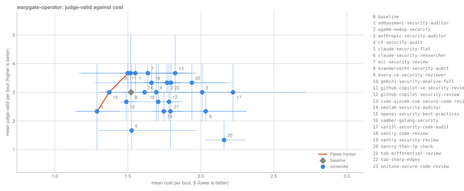

*How to read: Up and to the left is better; the orange line joins contenders no one beats on both panel-valid and cost, whiskers are 95% CIs, gray is the baseline. n = 72 ok bouts of 72.*

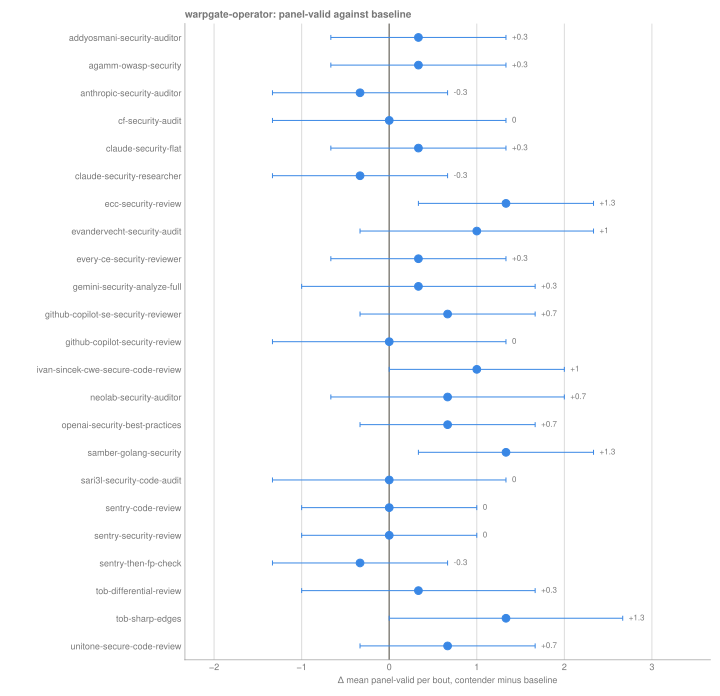

*How to read: Right of the line beats the baseline; a CI that crosses zero isn't a clear difference. n = 72 ok bouts of 72.*

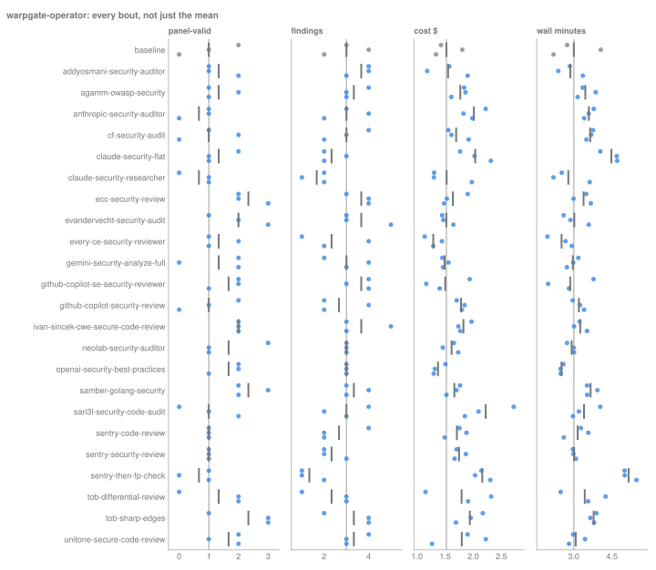

*How to read: Each dot is one ok bout, the dark tick is the mean and the gray line is the baseline's mean; dots far apart mean the contender is inconsistent from run to run. n = 72 ok bouts of 72.*

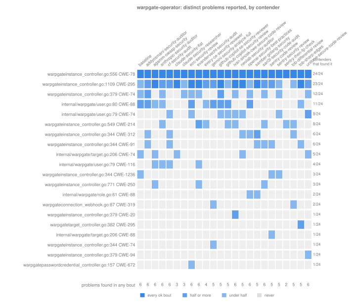

*How to read: No ground truth here, so rows are clusters of findings about the same code (file, lines ±5, CWE), labelled by their most common location and CWE. Darker means reported in more ok bouts; rows near the top are consensus, rows with 1 in the right column are one contender's alone (6 of 20). n = 72 ok bouts of 75.*

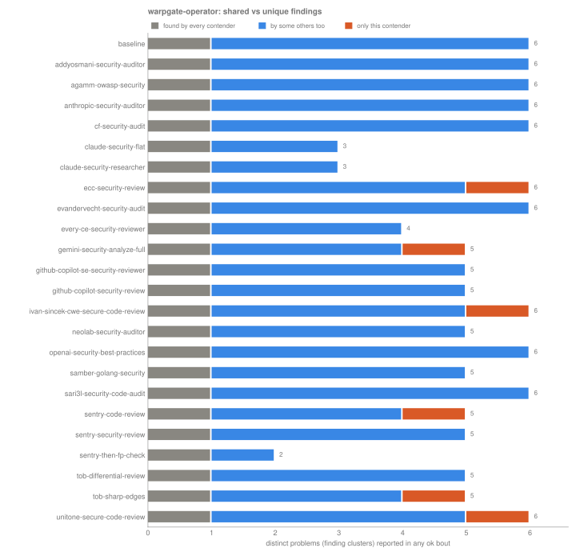

*How to read: Distinct problems each contender reported across its bouts, split by how many other contenders reported them too; orange is what only this contender found (20 problems in all). n = 72 ok bouts of 75.*

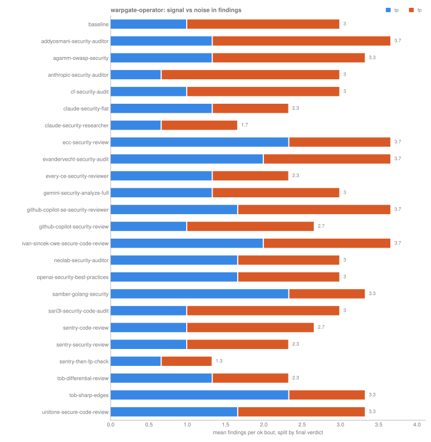

*How to read: Mean findings per bout split by final verdict; the blue share is signal, the rest is noise or undecided. n = 72 ok bouts of 72.*

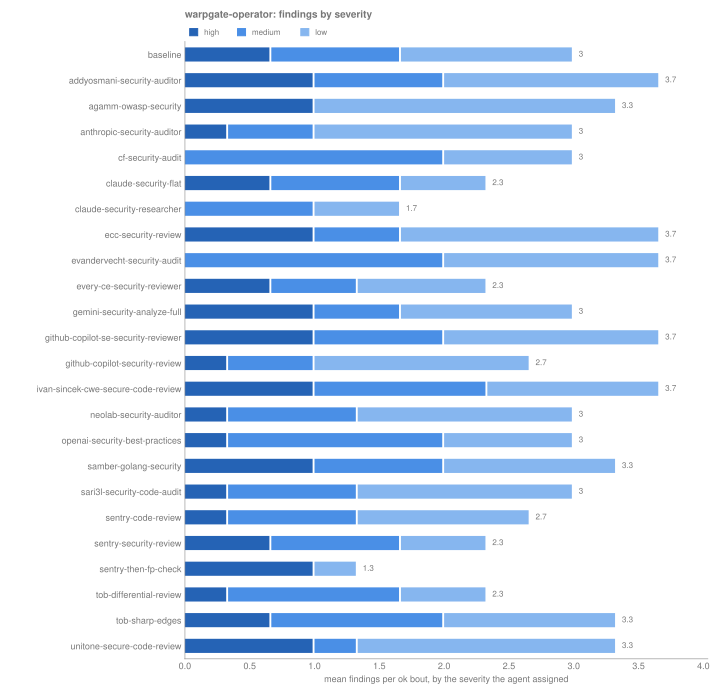

*How to read: Mean findings per bout stacked by self-reported severity, darkest is critical; a contender that rates the same issues higher shows more dark. n = 72 ok bouts of 75.*

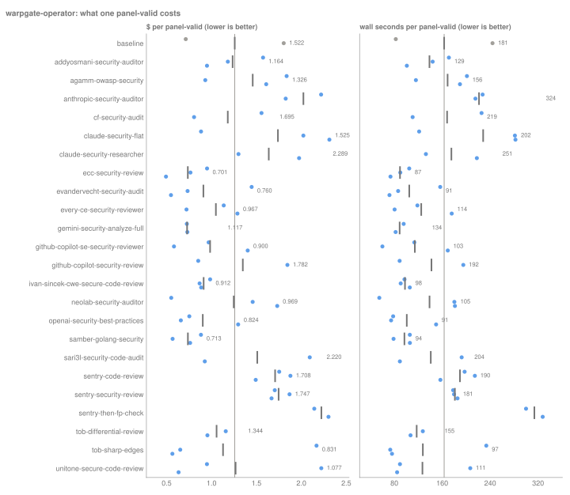

*How to read: Dollars and wall-clock seconds per panel-valid: dots are single bouts (bouts with no panel-valid are left out), the tick and number are the pooled ratio (total over total). n = 72 ok bouts of 75.*

### Tables · security-audit · `claude-opus-4-8@high`

**Quality**

| contender | n | findings | TP | panel-valid | bouts |
|---|---|---:|---:|---:|---|
| baseline | 3/3 | 3 [2, 4] | n/a | 1 [0, 2] | [#1](bouts/b-654071d0681ebd3c/) [#2](bouts/b-259b9259b3f17a57/) [#3](bouts/b-b462e00c512ab75f/) |
| addyosmani-security-auditor | 3/3 | 3.7 [3, 4] | n/a | 1.3 [1, 2] | [#1](bouts/b-b4fe4db3237ebb71/) [#2](bouts/b-1713fa59928d5994/) [#3](bouts/b-36820c46158dfcf0/) |
| agamm-owasp-security | 3/3 | 3.3 [3, 4] | n/a | 1.3 [1, 2] | [#1](bouts/b-64f73dc38ec37c01/) [#2](bouts/b-beb755e846ee1161/) [#3](bouts/b-e3db9161e178ca04/) |
| anthropic-security-auditor | 3/3 | 3 [2, 4] | n/a | 0.7 [0, 1] | [#1](bouts/b-3280a23a3c40f5d9/) [#2](bouts/b-42c007f9c6362a44/) [#3](bouts/b-f43aeea3facd688f/) |
| anthropic-security-review-cmd | 0/3 | n/a | n/a | n/a | [#1 (schema_violation)](bouts/b-ddbb49a7d6458c6d/) [#2 (schema_violation)](bouts/b-42720681044a1b70/) [#3 (schema_violation)](bouts/b-dfecf314fbe26617/) |
| cf-security-audit | 3/3 | 3 [2, 4] | n/a | 1 [0, 2] | [#1](bouts/b-12ba8651f5033db1/) [#2](bouts/b-24e36a49998de2de/) [#3](bouts/b-18e18d909a683352/) |
| claude-security-flat | 3/3 | 2.3 [2, 3] | n/a | 1.3 [1, 2] | [#1](bouts/b-67c39e038fc3aa31/) [#2](bouts/b-de8de5efec0d5429/) [#3](bouts/b-38f22d6b7294b1b7/) |
| claude-security-researcher | 3/3 | 1.7 [1, 2] | n/a | 0.7 [0, 1] | [#1](bouts/b-316cd035d45c1d7d/) [#2](bouts/b-9291f20a9a1bb6c6/) [#3](bouts/b-5cf1daa98eff2958/) |
| ecc-security-review | 3/3 | 3.7 [3, 4] | n/a | 2.3 [2, 3] | [#1](bouts/b-ded7e2d21ba11170/) [#2](bouts/b-12ee5184ce532933/) [#3](bouts/b-eaeee864a0f635dc/) |
| evandervecht-security-audit | 3/3 | 3.7 [3, 5] | n/a | 2 [1, 3] | [#1](bouts/b-4262d9ba9fe5a6ae/) [#2](bouts/b-b2240a1a57c49e44/) [#3](bouts/b-ca6cb9f9202a5585/) |
| every-ce-security-reviewer | 3/3 | 2.3 [1, 4] | n/a | 1.3 [1, 2] | [#1](bouts/b-e6678b9062024b29/) [#2](bouts/b-31572c580fb48d65/) [#3](bouts/b-177691869dcc2ff6/) |
| gemini-security-analyze-full | 3/3 | 3 [2, 4] | n/a | 1.3 [0, 2] | [#1](bouts/b-ba99d016565a194a/) [#2](bouts/b-b26bb6233b1a6c54/) [#3](bouts/b-826d69862cfe3114/) |
| github-copilot-se-security-reviewer | 3/3 | 3.7 [3, 4] | n/a | 1.7 [1, 2] | [#1](bouts/b-03e34a617d220248/) [#2](bouts/b-d1fc2f4393268892/) [#3](bouts/b-74512d6bcf227e31/) |
| github-copilot-security-review | 3/3 | 2.7 [2, 4] | n/a | 1 [0, 2] | [#1](bouts/b-2ba7a434c99ddefd/) [#2](bouts/b-4579334abc5fad0b/) [#3](bouts/b-4dc27e94caf24384/) |
| ivan-sincek-cwe-secure-code-review | 3/3 | 3.7 [3, 5] | n/a | 2 [2, 2] | [#1](bouts/b-6a47b6b7d660f818/) [#2](bouts/b-4cf084a5511195db/) [#3](bouts/b-53ed0bec31f47eb7/) |
| neolab-security-auditor | 3/3 | 3 [3, 3] | n/a | 1.7 [1, 3] | [#1](bouts/b-d72092394c638c3c/) [#2](bouts/b-360a0d69e3b47249/) [#3](bouts/b-e8c3e586227cffe1/) |
| openai-security-best-practices | 3/3 | 3 [3, 3] | n/a | 1.7 [1, 2] | [#1](bouts/b-8cf65b8faa333583/) [#2](bouts/b-f78f7216039fa301/) [#3](bouts/b-fb7c02ac3a6eb369/) |
| samber-golang-security | 3/3 | 3.3 [3, 4] | n/a | 2.3 [2, 3] | [#1](bouts/b-a712c1f0d617102f/) [#2](bouts/b-727196b09036ee11/) [#3](bouts/b-c8bff40931aa21e1/) |
| sari3l-security-code-audit | 3/3 | 3 [2, 4] | n/a | 1 [0, 2] | [#1](bouts/b-c85f33c2443d4682/) [#2](bouts/b-673ddd2d1df82220/) [#3](bouts/b-cb301d01233249eb/) |
| sentry-code-review | 3/3 | 2.7 [2, 4] | n/a | 1 [1, 1] | [#1](bouts/b-39d2d2bad56357dd/) [#2](bouts/b-c1e46773a300bb5f/) [#3](bouts/b-420c5f9114f7c3b0/) |
| sentry-security-review | 3/3 | 2.3 [2, 3] | n/a | 1 [1, 1] | [#1](bouts/b-780cbe96e439ff2f/) [#2](bouts/b-3a504c9ad501eb39/) [#3](bouts/b-44ae5d1c4213ad73/) |
| sentry-then-fp-check | 3/3 | 1.3 [1, 2] | n/a | 0.7 [0, 1] | [#1](bouts/b-dfe8c957b82b17ae/) [#2](bouts/b-2264ea92b9d39712/) [#3](bouts/b-e40859cab9d9648a/) |
| tob-differential-review | 3/3 | 2.3 [1, 3] | n/a | 1.3 [0, 2] | [#1](bouts/b-929e2986604958da/) [#2](bouts/b-b35deca9d5855f34/) [#3](bouts/b-0686275246850f0f/) |
| tob-sharp-edges | 3/3 | 3.3 [2, 4] | n/a | 2.3 [1, 3] | [#1](bouts/b-9429e15cfa55309a/) [#2](bouts/b-b30175294edf3197/) [#3](bouts/b-fa3a994ee516c746/) |
| unitone-secure-code-review | 3/3 | 3.3 [3, 4] | n/a | 1.7 [1, 2] | [#1](bouts/b-fae5978d7171be23/) [#2](bouts/b-da7417ca6f012c98/) [#3](bouts/b-5b3d3ddacf55ae36/) |

**Against baseline**

| contender | Δ TP | Δ F1 | Δ cost $ | cost per TP $ | skill fired | first-turn tokens vs baseline | check |
|---|---:|---:|---:|---:|---:|---:|---|
| addyosmani-security-auditor | n/a | n/a | +0.029 [-0.366, 0.424] | n/a | 100% (n=3) | +3,956 | ok |
| agamm-owasp-security | n/a | n/a | +0.246 [-0.035, 0.486] | n/a | 100% (n=3) | +7,859 | ok |
| anthropic-security-auditor | n/a | n/a | +0.487 [0.200, 0.752] | n/a | 100% (n=3) | +3,837 | ok |
| anthropic-security-review-cmd | n/a | n/a | n/a | n/a | n/a | n/a |  |
| cf-security-audit | n/a | n/a | +0.173 [-0.109, 0.449] | n/a | 100% (n=3) | +9,416 | ok |
| claude-security-flat | n/a | n/a | +0.511 [0.174, 0.849] | n/a | 100% (n=3) | +4,252 | ok |
| claude-security-researcher | n/a | n/a | +0.004 [-0.377, 0.423] | n/a | 100% (n=3) | +4,252 | ok |
| ecc-security-review | n/a | n/a | +0.115 [-0.169, 0.411] | n/a | 100% (n=3) | +7,473 | ok |
| evandervecht-security-audit | n/a | n/a | -0.002 [-0.277, 0.220] | n/a | 100% (n=3) | +6,594 | ok |
| every-ce-security-reviewer | n/a | n/a | -0.233 [-0.515, 0.025] | n/a | 100% (n=3) | +4,074 | ok |
| gemini-security-analyze-full | n/a | n/a | -0.032 [-0.282, 0.159] | n/a | 100% (n=3) | +5,754 | ok |
| github-copilot-se-security-reviewer | n/a | n/a | -0.021 [-0.434, 0.391] | n/a | 100% (n=3) | +3,726 | ok |
| github-copilot-security-review | n/a | n/a | +0.260 [-0.006, 0.461] | n/a | 100% (n=3) | +5,567 | ok |
| ivan-sincek-cwe-secure-code-review | n/a | n/a | +0.302 [0.057, 0.536] | n/a | 100% (n=3) | +5,762 | ok |
| neolab-security-auditor | n/a | n/a | +0.093 [-0.189, 0.339] | n/a | 100% (n=3) | +5,641 | ok |
| openai-security-best-practices | n/a | n/a | -0.149 [-0.381, 0.076] | n/a | 100% (n=3) | +4,489 | ok |
| samber-golang-security | n/a | n/a | +0.141 [-0.125, 0.377] | n/a | 100% (n=3) | +7,282 | ok |
| sari3l-security-code-audit | n/a | n/a | +0.698 [0.283, 1.166] | n/a | 100% (n=3) | +39,330 | ok |
| sentry-code-review | n/a | n/a | +0.186 [-0.099, 0.470] | n/a | 100% (n=3) | +3,099 | ok |
| sentry-security-review | n/a | n/a | +0.225 [-0.010, 0.447] | n/a | 100% (n=3) | +6,897 | ok |
| sentry-then-fp-check | n/a | n/a | +0.637 [0.355, 0.876] | n/a | 100% (n=3) | +6,897 | ok |
| tob-differential-review | n/a | n/a | +0.270 [-0.371, 0.814] | n/a | 100% (n=3) | +5,028 | ok |
| tob-sharp-edges | n/a | n/a | +0.417 [0.102, 0.731] | n/a | 100% (n=3) | +6,498 | ok |
| unitone-secure-code-review | n/a | n/a | +0.273 [-0.256, 0.747] | n/a | 100% (n=3) | +12,764 | ok |

<details>
<summary>Cost and resources per bout, mean [95% CI]</summary>

| contender | n | cost $ | tokens | duration s | turns | RSS peak MB | spent, all bouts |
|---|---|---:|---:|---:|---:|---:|---:|
| baseline | 3/3 | 1.522 [1.337, 1.804] | 1.05M [895.3k, 1.35M] | 181 [133, 244] | 23.7 [19, 28] | 251 [232, 269] | $4.567 |
| addyosmani-security-auditor | 3/3 | 1.551 [1.182, 1.899] | 1.03M [559.8k, 1.51M] | 172 [144, 202] | 21.7 [19, 25] | 268 [259, 281] | $4.654 |
| agamm-owasp-security | 3/3 | 1.769 [1.609, 1.861] | 1.31M [1.20M, 1.45M] | 208 [190, 232] | 26 [23, 30] | 270 [252, 292] | $5.306 |
| anthropic-security-auditor | 3/3 | 2.010 [1.826, 2.220] | 1.50M [1.29M, 1.73M] | 216 [205, 227] | 24 [23, 26] | 281 [264, 290] | $6.029 |
| anthropic-security-review-cmd | 0/3 | n/a | n/a | n/a | n/a | n/a | $0.000 |
| cf-security-audit | 3/3 | 1.695 [1.556, 1.917] | 1.10M [801.6k, 1.68M] | 219 [210, 226] | 25 [22, 29] | 271 [249, 285] | $5.085 |
| claude-security-flat | 3/3 | 2.034 [1.766, 2.312] | 1.19M [997.9k, 1.32M] | 269 [243, 282] | 36.7 [32, 40] | 266 [243, 282] | $6.101 |
| claude-security-researcher | 3/3 | 1.526 [1.300, 1.975] | 901.1k [703.5k, 1.16M] | 168 [133, 218] | 23 [20, 28] | 259 [247, 270] | $4.578 |
| ecc-security-review | 3/3 | 1.637 [1.479, 1.900] | 1.09M [910.4k, 1.31M] | 203 [180, 221] | 22 [21, 23] | 274 [256, 292] | $4.910 |
| evandervecht-security-audit | 3/3 | 1.520 [1.447, 1.646] | 769.8k [677.5k, 818.1k] | 182 [157, 216] | 22.7 [21, 24] | 261 [234, 281] | $4.559 |
| every-ce-security-reviewer | 3/3 | 1.289 [1.136, 1.442] | 774.1k [591.1k, 931.2k] | 152 [118, 176] | 20.3 [18, 23] | 268 [250, 288] | $3.867 |
| gemini-security-analyze-full | 3/3 | 1.490 [1.450, 1.557] | 1.02M [913.6k, 1.18M] | 178 [164, 191] | 24.3 [21, 29] | 271 [264, 280] | $4.469 |
| github-copilot-se-security-reviewer | 3/3 | 1.501 [1.164, 1.936] | 852.1k [576.1k, 1.33M] | 172 [120, 227] | 21.3 [18, 24] | 271 [244, 285] | $4.502 |
| github-copilot-security-review | 3/3 | 1.782 [1.704, 1.845] | 1.19M [1.02M, 1.34M] | 192 [178, 205] | 26 [22, 28] | 270 [262, 276] | $5.345 |
| ivan-sincek-cwe-secure-code-review | 3/3 | 1.824 [1.735, 1.969] | 1.34M [1.24M, 1.46M] | 196 [181, 212] | 22 [21, 23] | 273 [262, 287] | $5.473 |
| neolab-security-auditor | 3/3 | 1.615 [1.458, 1.731] | 1.15M [1.05M, 1.26M] | 175 [165, 181] | 20.3 [20, 21] | 267 [243, 288] | $4.844 |
| openai-security-best-practices | 3/3 | 1.373 [1.296, 1.506] | 686.3k [614.5k, 738.5k] | 152 [149, 156] | 24.7 [23, 26] | 268 [264, 272] | $4.119 |
| samber-golang-security | 3/3 | 1.663 [1.523, 1.765] | 1.16M [1.09M, 1.25M] | 220 [212, 236] | 24.3 [19, 27] | 274 [254, 294] | $4.988 |
| sari3l-security-code-audit | 3/3 | 2.220 [1.850, 2.718] | 1.95M [1.60M, 2.28M] | 204 [178, 243] | 22.7 [18, 27] | 266 [253, 282] | $6.661 |
| sentry-code-review | 3/3 | 1.708 [1.492, 1.878] | 1.04M [923.6k, 1.20M] | 190 [157, 214] | 23.7 [20, 26] | 278 [264, 293] | $5.123 |
| sentry-security-review | 3/3 | 1.747 [1.668, 1.868] | 1.21M [1.11M, 1.29M] | 181 [178, 185] | 24.7 [23, 27] | 266 [262, 271] | $5.240 |
| sentry-then-fp-check | 3/3 | 2.159 [2.031, 2.302] | 1.25M [1.06M, 1.38M] | 309 [300, 328] | 37 [34, 39] | 263 [247, 274] | $6.477 |
| tob-differential-review | 3/3 | 1.792 [1.151, 2.317] | 1.37M [791.3k, 1.88M] | 206 [150, 255] | 23.3 [21, 26] | 277 [271, 286] | $5.376 |
| tob-sharp-edges | 3/3 | 1.939 [1.693, 2.169] | 1.49M [1.39M, 1.55M] | 227 [219, 234] | 25.3 [23, 29] | 275 [261, 293] | $5.816 |
| unitone-secure-code-review | 3/3 | 1.795 [1.267, 2.222] | 1.36M [732.7k, 1.95M] | 185 [169, 207] | 23 [18, 30] | 270 [265, 274] | $5.386 |

</details>


### What each contender found

<details>
<summary>Distinct problems (finding clusters): who reported what (20 problems, 6 reported by one contender only)</summary>

| problem | title | severity | CWE | contenders | found by (ok bouts that found it) |
|---|---|---|---|---:|---|
| `warpgateinstance_controller.go:556 CWE-78` | OS command injection via spec.databaseURL in WarpgateInstance init-container script | high | CWE-78 | 24/24 | every contender, every ok bout |
| `warpgateinstance_controller.go:1109 CWE-295` | Auto-created WarpgateConnection hardcodes InsecureSkipVerify=true, disabling TLS verification | medium | CWE-295 | 23/24 | baseline 1/3; addyosmani-security-auditor 2/3; agamm-owasp-security 3/3; anthropic-security-auditor 2/3; cf-security-audit 2/3; claude-security-flat 3/3; claude-security-researcher 1/3; ecc-security-review 3/3; evandervecht-security-audit 3/3; every-ce-security-reviewer 2/3; gemini-security-analyze-full 2/3; github-copilot-se-security-reviewer 3/3; github-copilot-security-review 1/3; ivan-sincek-cwe-secure-code-review 3/3; neolab-security-auditor 3/3; openai-security-best-practices 1/3; samber-golang-security 3/3; sari3l-security-code-audit 2/3; sentry-code-review 2/3; sentry-security-review 1/3; tob-differential-review 1/3; tob-sharp-edges 3/3; unitone-secure-code-review 2/3 |
| `warpgateinstance_controller.go:379 CWE-74` | Config (YAML) injection via spec.externalHost and spec.databaseURL in generated warpgate.yaml | medium | CWE-74 | 12/24 | baseline 1/3; addyosmani-security-auditor 2/3; anthropic-security-auditor 1/3; claude-security-researcher 1/3; ecc-security-review 1/3; evandervecht-security-audit 1/3; github-copilot-se-security-reviewer 2/3; ivan-sincek-cwe-secure-code-review 1/3; openai-security-best-practices 1/3; sari3l-security-code-audit 1/3; sentry-security-review 1/3; unitone-secure-code-review 1/3 |
| `internal/warpgate/user.go:80 CWE-88` | Unencoded search parameter in ListUsers/ListTargets allows query-string injection | low | CWE-88 | 11/24 | baseline 2/3; addyosmani-security-auditor 2/3; agamm-owasp-security 1/3; anthropic-security-auditor 1/3; ecc-security-review 2/3; every-ce-security-reviewer 1/3; gemini-security-analyze-full 2/3; github-copilot-se-security-reviewer 2/3; github-copilot-security-review 2/3; openai-security-best-practices 2/3; tob-sharp-edges 1/3 |
| `internal/warpgate/user.go:79 CWE-74` | Unencoded CR-controlled search term concatenated into Warpgate API query string | low | CWE-74 | 8/24 | cf-security-audit 1/3 [#1](bouts/b-12ba8651f5033db1/); ecc-security-review 1/3 [#3](bouts/b-eaeee864a0f635dc/); github-copilot-se-security-reviewer 1/3 [#2](bouts/b-d1fc2f4393268892/); github-copilot-security-review 1/3 [#2](bouts/b-4579334abc5fad0b/); ivan-sincek-cwe-secure-code-review 1/3 [#2](bouts/b-4cf084a5511195db/); neolab-security-auditor 1/3 [#2](bouts/b-360a0d69e3b47249/); sentry-security-review 1/3 [#3](bouts/b-44ae5d1c4213ad73/); unitone-secure-code-review 2/3 [#1](bouts/b-fae5978d7171be23/) [#2](bouts/b-da7417ca6f012c98/) |
| `warpgateinstance_controller.go:549 CWE-214` | Warpgate admin password exposed via process arguments in init container | medium | CWE-214 | 8/24 | anthropic-security-auditor 1/3 [#2](bouts/b-42c007f9c6362a44/); evandervecht-security-audit 2/3 [#2](bouts/b-b2240a1a57c49e44/) [#3](bouts/b-ca6cb9f9202a5585/); every-ce-security-reviewer 1/3 [#2](bouts/b-31572c580fb48d65/); github-copilot-security-review 1/3 [#2](bouts/b-4579334abc5fad0b/); ivan-sincek-cwe-secure-code-review 1/3 [#2](bouts/b-4cf084a5511195db/); sari3l-security-code-audit 1/3 [#1](bouts/b-c85f33c2443d4682/); sentry-then-fp-check 1/3 [#3](bouts/b-e40859cab9d9648a/); tob-differential-review 1/3 [#3](bouts/b-0686275246850f0f/) |
| `warpgateinstance_controller.go:344 CWE-312` | Database connection URL with embedded credentials stored in plaintext ConfigMap | medium | CWE-312 | 6/24 | addyosmani-security-auditor 1/3 [#3](bouts/b-36820c46158dfcf0/); cf-security-audit 1/3 [#2](bouts/b-24e36a49998de2de/); neolab-security-auditor 1/3 [#1](bouts/b-d72092394c638c3c/); openai-security-best-practices 1/3 [#1](bouts/b-8cf65b8faa333583/); samber-golang-security 2/3 [#1](bouts/b-a712c1f0d617102f/) [#3](bouts/b-c8bff40931aa21e1/); tob-differential-review 1/3 [#3](bouts/b-0686275246850f0f/) |
| `warpgateinstance_controller.go:344 CWE-91` | Unescaped CR values interpolated into generated warpgate.yaml ConfigMap | medium | CWE-91 | 6/24 | addyosmani-security-auditor 1/3 [#3](bouts/b-36820c46158dfcf0/); cf-security-audit 1/3 [#1](bouts/b-12ba8651f5033db1/); samber-golang-security 1/3 [#2](bouts/b-727196b09036ee11/); sari3l-security-code-audit 1/3 [#1](bouts/b-c85f33c2443d4682/); sentry-code-review 1/3 [#3](bouts/b-420c5f9114f7c3b0/); tob-sharp-edges 1/3 [#3](bouts/b-fa3a994ee516c746/) |
| `internal/warpgate/target.go:206 CWE-74` | Search terms interpolated into API query string without URL-encoding in Warpgate client | low | CWE-74 | 5/24 | baseline 1/3 [#2](bouts/b-259b9259b3f17a57/); agamm-owasp-security 1/3 [#3](bouts/b-e3db9161e178ca04/); claude-security-flat 1/3 [#2](bouts/b-de8de5efec0d5429/); neolab-security-auditor 1/3 [#3](bouts/b-e8c3e586227cffe1/); unitone-secure-code-review 1/3 [#3](bouts/b-5b3d3ddacf55ae36/) |
| `internal/warpgate/user.go:79 CWE-116` | CR-derived search terms concatenated into Warpgate API query string without URL-encoding | low | CWE-116 | 4/24 | agamm-owasp-security 1/3 [#2](bouts/b-beb755e846ee1161/); anthropic-security-auditor 1/3 [#1](bouts/b-3280a23a3c40f5d9/); cf-security-audit 1/3 [#3](bouts/b-18e18d909a683352/); evandervecht-security-audit 1/3 [#3](bouts/b-ca6cb9f9202a5585/) |
| `warpgateinstance_controller.go:344 CWE-1236` | Warpgate config file injection via spec.externalHost and spec.databaseURL in buildWarpgateConfig | medium | CWE-1236 | 3/24 | baseline 1/3 [#2](bouts/b-259b9259b3f17a57/); sentry-code-review 1/3 [#1](bouts/b-39d2d2bad56357dd/); sentry-security-review 1/3 [#3](bouts/b-44ae5d1c4213ad73/) |
| `warpgateinstance_controller.go:771 CWE-250` | Operator-generated Warpgate Deployment runs without any securityContext (root, writable filesystem) | low | CWE-250 | 3/24 | agamm-owasp-security 1/3 [#1](bouts/b-64f73dc38ec37c01/); evandervecht-security-audit 1/3 [#3](bouts/b-ca6cb9f9202a5585/); sari3l-security-code-audit 1/3 [#1](bouts/b-c85f33c2443d4682/) |
| `internal/warpgate/role.go:61 CWE-88` | Unencoded search value in ListRoles/ListUsers URL query construction | low | CWE-88 | 2/24 | openai-security-best-practices 1/3 [#1](bouts/b-8cf65b8faa333583/); samber-golang-security 1/3 [#2](bouts/b-727196b09036ee11/) |
| `warpgateconnection_webhook.go:87 CWE-319` | WarpgateConnection webhook permits http:// hosts, allowing cleartext admin credential transmission | low | CWE-319 | 2/24 | gemini-security-analyze-full 1/3 [#2](bouts/b-b26bb6233b1a6c54/); tob-differential-review 1/3 [#2](bouts/b-b35deca9d5855f34/) |
| `warpgateinstance_controller.go:379 CWE-20` | Config/YAML injection via spec.externalHost and spec.databaseURL into generated warpgate.yaml | medium | CWE-20 | 1/24 | ivan-sincek-cwe-secure-code-review 2/3 [#2](bouts/b-4cf084a5511195db/) [#3](bouts/b-53ed0bec31f47eb7/) |
| `warpgatetarget_controller.go:382 CWE-295` | Target TLS certificate verification silently disabled when a partial tls block is set | medium | CWE-295 | 1/24 | tob-sharp-edges 2/3 [#2](bouts/b-b30175294edf3197/) [#3](bouts/b-fa3a994ee516c746/) |
| `internal/warpgate/target.go:206 CWE-88` | Unencoded CR-controlled search value concatenated into Warpgate API request URL | low | CWE-88 | 1/24 | sentry-code-review 1/3 [#1](bouts/b-39d2d2bad56357dd/) |
| `warpgateinstance_controller.go:344 CWE-74` | YAML config injection via spec.databaseURL / spec.externalHost in generated warpgate.yaml | medium | CWE-74 | 1/24 | gemini-security-analyze-full 1/3 [#2](bouts/b-b26bb6233b1a6c54/) |
| `warpgateinstance_controller.go:379 CWE-94` | warpgate.yaml config injection via unescaped spec.externalHost and spec.databaseURL | low | CWE-94 | 1/24 | unitone-secure-code-review 1/3 [#1](bouts/b-fae5978d7171be23/) |
| `warpgatepasswordcredential_controller.go:157 CWE-672` | Password credential is never re-synced after the source Secret rotates | low | CWE-672 | 1/24 | ecc-security-review 1/3 [#3](bouts/b-eaeee864a0f635dc/) |

</details>

<details>
<summary>Findings by CWE (14 CWEs)</summary>

| CWE | findings | contenders | findings per contender (all ok bouts) |
|---|---:|---:|---|
| CWE-78 | 72 | 24/24 | addyosmani-security-auditor 3, agamm-owasp-security 3, anthropic-security-auditor 3, baseline 3, cf-security-audit 3, claude-security-flat 3, claude-security-researcher 3, ecc-security-review 3, evandervecht-security-audit 3, every-ce-security-reviewer 3, gemini-security-analyze-full 3, github-copilot-se-security-reviewer 3, github-copilot-security-review 3, ivan-sincek-cwe-secure-code-review 3, neolab-security-auditor 3, openai-security-best-practices 3, samber-golang-security 3, sari3l-security-code-audit 3, sentry-code-review 3, sentry-security-review 3, sentry-then-fp-check 3, tob-differential-review 3, tob-sharp-edges 3, unitone-secure-code-review 3 |
| CWE-295 | 51 | 23/24 | tob-sharp-edges 5, agamm-owasp-security 3, claude-security-flat 3, ecc-security-review 3, evandervecht-security-audit 3, github-copilot-se-security-reviewer 3, ivan-sincek-cwe-secure-code-review 3, neolab-security-auditor 3, samber-golang-security 3, addyosmani-security-auditor 2, anthropic-security-auditor 2, cf-security-audit 2, every-ce-security-reviewer 2, gemini-security-analyze-full 2, sari3l-security-code-audit 2, sentry-code-review 2, unitone-secure-code-review 2, baseline 1, claude-security-researcher 1, github-copilot-security-review 1, openai-security-best-practices 1, sentry-security-review 1, tob-differential-review 1 |
| CWE-74 | 29 | 18/24 | unitone-secure-code-review 4, github-copilot-se-security-reviewer 3, addyosmani-security-auditor 2, baseline 2, ecc-security-review 2, ivan-sincek-cwe-secure-code-review 2, neolab-security-auditor 2, sentry-security-review 2, agamm-owasp-security 1, anthropic-security-auditor 1, cf-security-audit 1, claude-security-flat 1, claude-security-researcher 1, evandervecht-security-audit 1, gemini-security-analyze-full 1, github-copilot-security-review 1, openai-security-best-practices 1, sari3l-security-code-audit 1 |
| CWE-88 | 21 | 13/24 | openai-security-best-practices 3, addyosmani-security-auditor 2, baseline 2, ecc-security-review 2, gemini-security-analyze-full 2, github-copilot-se-security-reviewer 2, github-copilot-security-review 2, agamm-owasp-security 1, anthropic-security-auditor 1, every-ce-security-reviewer 1, samber-golang-security 1, sentry-code-review 1, tob-sharp-edges 1 |
| CWE-214 | 9 | 8/24 | evandervecht-security-audit 2, anthropic-security-auditor 1, every-ce-security-reviewer 1, github-copilot-security-review 1, ivan-sincek-cwe-secure-code-review 1, sari3l-security-code-audit 1, sentry-then-fp-check 1, tob-differential-review 1 |
| CWE-312 | 7 | 6/24 | samber-golang-security 2, addyosmani-security-auditor 1, cf-security-audit 1, neolab-security-auditor 1, openai-security-best-practices 1, tob-differential-review 1 |
| CWE-91 | 6 | 6/24 | addyosmani-security-auditor 1, cf-security-audit 1, samber-golang-security 1, sari3l-security-code-audit 1, sentry-code-review 1, tob-sharp-edges 1 |
| CWE-116 | 4 | 4/24 | agamm-owasp-security 1, anthropic-security-auditor 1, cf-security-audit 1, evandervecht-security-audit 1 |
| CWE-1236 | 3 | 3/24 | baseline 1, sentry-code-review 1, sentry-security-review 1 |
| CWE-250 | 3 | 3/24 | agamm-owasp-security 1, evandervecht-security-audit 1, sari3l-security-code-audit 1 |
| CWE-20 | 2 | 1/24 | ivan-sincek-cwe-secure-code-review 2 |
| CWE-319 | 2 | 2/24 | gemini-security-analyze-full 1, tob-differential-review 1 |
| CWE-672 | 1 | 1/24 | ecc-security-review 1 |
| CWE-94 | 1 | 1/24 | unitone-secure-code-review 1 |

</details>

<details>
<summary>Findings per bout by severity</summary>

| contender | ok bouts | high | medium | low |
|---|---:|---:|---:|---:|
| baseline | 3 | 0.7 | 1 | 1.3 |
| addyosmani-security-auditor | 3 | 1 | 1 | 1.7 |
| agamm-owasp-security | 3 | 1 | 0 | 2.3 |
| anthropic-security-auditor | 3 | 0.3 | 0.7 | 2 |
| cf-security-audit | 3 | 0 | 2 | 1 |
| claude-security-flat | 3 | 0.7 | 1 | 0.7 |
| claude-security-researcher | 3 | 0 | 1 | 0.7 |
| ecc-security-review | 3 | 1 | 0.7 | 2 |
| evandervecht-security-audit | 3 | 0 | 2 | 1.7 |
| every-ce-security-reviewer | 3 | 0.7 | 0.7 | 1 |
| gemini-security-analyze-full | 3 | 1 | 0.7 | 1.3 |
| github-copilot-se-security-reviewer | 3 | 1 | 1 | 1.7 |
| github-copilot-security-review | 3 | 0.3 | 0.7 | 1.7 |
| ivan-sincek-cwe-secure-code-review | 3 | 1 | 1.3 | 1.3 |
| neolab-security-auditor | 3 | 0.3 | 1 | 1.7 |
| openai-security-best-practices | 3 | 0.3 | 1.7 | 1 |
| samber-golang-security | 3 | 1 | 1 | 1.3 |
| sari3l-security-code-audit | 3 | 0.3 | 1 | 1.7 |
| sentry-code-review | 3 | 0.3 | 1 | 1.3 |
| sentry-security-review | 3 | 0.7 | 1 | 0.7 |
| sentry-then-fp-check | 3 | 1 | 0 | 0.3 |
| tob-differential-review | 3 | 0.3 | 1.3 | 0.7 |
| tob-sharp-edges | 3 | 0.7 | 1.3 | 1.3 |
| unitone-secure-code-review | 3 | 1 | 0.3 | 2 |

</details>

<details>
<summary>Panel judge verdicts per contender (judge agreement: share of findings with unanimous votes)</summary>

| contender | judged | panel-valid | panel-invalid | unverifiable | judge agreement |
|---|---:|---:|---:|---:|---:|
| baseline | 9 | 3 | 6 | 0 | 67% |
| addyosmani-security-auditor | 11 | 4 | 7 | 0 | 73% |
| agamm-owasp-security | 10 | 4 | 6 | 0 | 70% |
| anthropic-security-auditor | 9 | 2 | 7 | 0 | 44% |
| cf-security-audit | 9 | 3 | 6 | 0 | 67% |
| claude-security-flat | 7 | 4 | 3 | 0 | 57% |
| claude-security-researcher | 5 | 2 | 3 | 0 | 80% |
| ecc-security-review | 11 | 7 | 4 | 0 | 36% |
| evandervecht-security-audit | 11 | 6 | 5 | 0 | 55% |
| every-ce-security-reviewer | 7 | 4 | 3 | 0 | 43% |
| gemini-security-analyze-full | 9 | 4 | 5 | 0 | 22% |
| github-copilot-se-security-reviewer | 11 | 5 | 6 | 0 | 64% |
| github-copilot-security-review | 8 | 3 | 5 | 0 | 50% |
| ivan-sincek-cwe-secure-code-review | 11 | 6 | 5 | 0 | 55% |
| neolab-security-auditor | 9 | 5 | 4 | 0 | 56% |
| openai-security-best-practices | 9 | 5 | 4 | 0 | 89% |
| samber-golang-security | 10 | 7 | 3 | 0 | 80% |
| sari3l-security-code-audit | 9 | 3 | 6 | 0 | 78% |
| sentry-code-review | 8 | 3 | 5 | 0 | 38% |
| sentry-security-review | 7 | 3 | 4 | 0 | 86% |
| sentry-then-fp-check | 4 | 2 | 2 | 0 | 100% |
| tob-differential-review | 7 | 4 | 3 | 0 | 71% |
| tob-sharp-edges | 10 | 7 | 3 | 0 | 80% |
| unitone-secure-code-review | 10 | 5 | 5 | 0 | 90% |

</details>

## All arenas

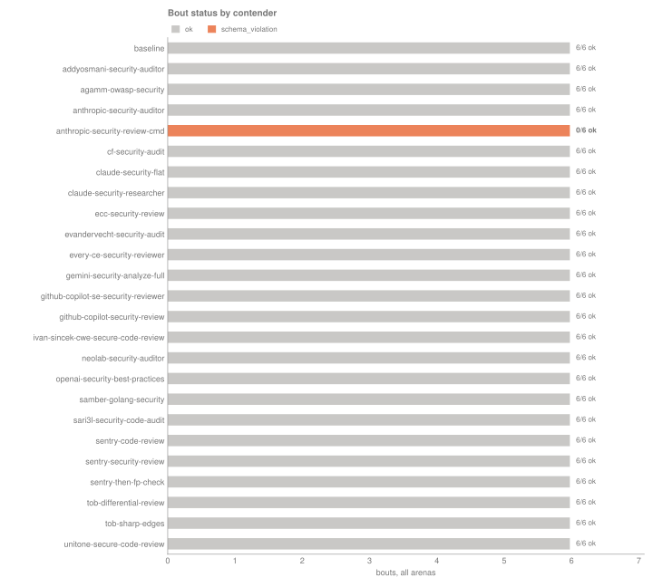

*How to read: How every bout ended; colored segments are the 6 that did not finish ok and are left out of every mean (reasons in the table at the end). n = 144 ok bouts of 150.*

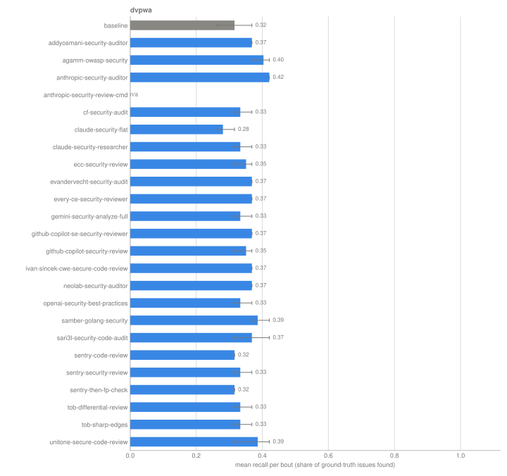

*How to read: Share of each arena's ground-truth issues a bout found, mean with 95% CI; gray is the baseline. n = 72 ok bouts of 75.*

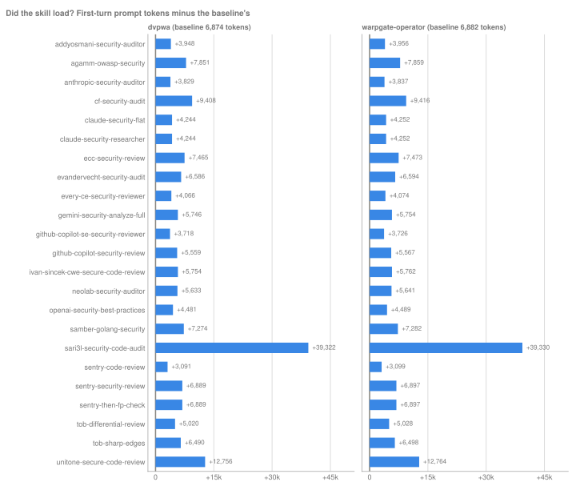

*How to read: How many more tokens each contender's first prompt carried than the baseline's (mean over ok bouts). A loaded skill adds tokens; zero or less is flagged: none at or below zero. n = 144 ok bouts of 150.*

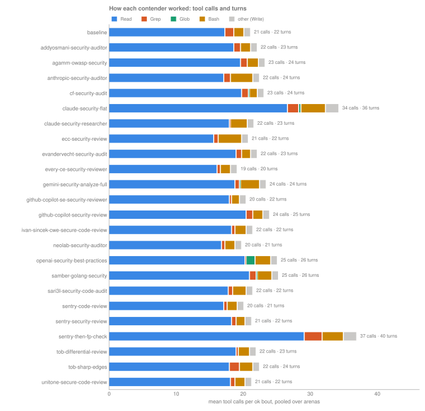

*How to read: Mean tool calls per bout by tool (from each bout's record.json), with mean agent turns at the end of the bar, pooled over arenas. n = 144 ok bouts of 150.*

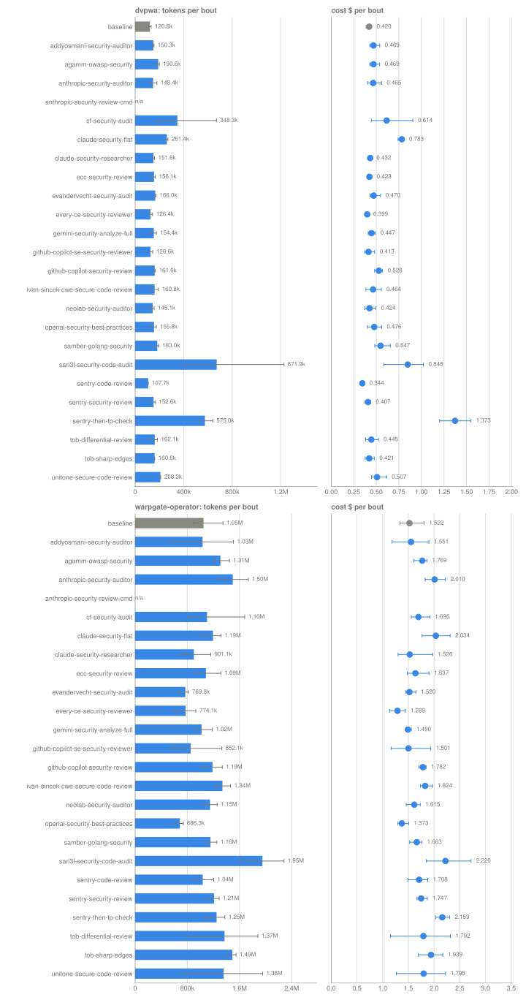

*How to read: Mean tokens (bars) and cost (dots) per ok bout, one row per arena, whiskers 95% CI; gray is the baseline. n = 144 ok bouts of 150.*

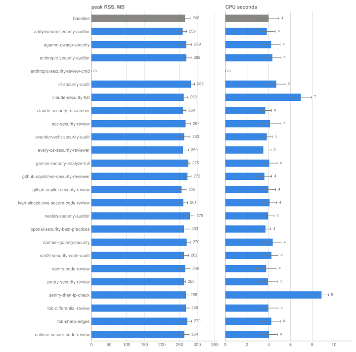

*How to read: Peak RSS and CPU time of the client harness per ok bout, pooled over arenas, whiskers 95% CI (not model-side compute). n = 144 ok bouts of 150.*

<details>
<summary>Tool calls per bout (mean over ok bouts, all arenas)</summary>

| contender | bouts | turns | Read | Bash | Write | Grep | Glob |
|---|---:|---:|---:|---:|---:|---:|---:|
| baseline | 6 | 22.2 | 17.3 | 1.5 | 1 | 1.3 | 0 |
| addyosmani-security-auditor | 6 | 23.2 | 18.7 | 1.5 | 1 | 1 | 0 |
| agamm-owasp-security | 6 | 24.3 | 19.7 | 1.7 | 1 | 1 | 0 |
| anthropic-security-auditor | 6 | 23.5 | 17.2 | 3.3 | 1 | 1 | 0 |
| cf-security-audit | 6 | 24.2 | 19.8 | 1.2 | 1 | 1 | 0.2 |
| claude-security-flat | 6 | 36.3 | 26.7 | 3.7 | 2 | 1.7 | 0.3 |
| claude-security-researcher | 6 | 22.7 | 18 | 2.5 | 1 | 0.2 | 0 |
| ecc-security-review | 6 | 21.8 | 15.7 | 3.5 | 1 | 0.7 | 0 |
| evandervecht-security-audit | 6 | 23.2 | 19 | 1.3 | 1 | 0.8 | 0 |
| every-ce-security-reviewer | 6 | 20.2 | 16.2 | 1.5 | 1 | 0.5 | 0 |
| gemini-security-analyze-full | 6 | 24.5 | 18.8 | 2.8 | 1 | 0.7 | 0.2 |
| github-copilot-se-security-reviewer | 6 | 21.5 | 18 | 1.2 | 1 | 0.3 | 0 |
| github-copilot-security-review | 6 | 25 | 20.5 | 1.5 | 1 | 1 | 0 |
| ivan-sincek-cwe-secure-code-review | 6 | 22.5 | 18.3 | 1.7 | 1 | 0.5 | 0 |
| neolab-security-auditor | 6 | 20.8 | 16.8 | 1.5 | 1 | 0.5 | 0 |
| openai-security-best-practices | 6 | 26.2 | 20.3 | 2.3 | 1 | 0.2 | 1.3 |
| samber-golang-security | 6 | 26.3 | 21 | 2.2 | 1 | 1 | 0.2 |
| sari3l-security-code-audit | 6 | 22.5 | 17.8 | 2 | 1 | 0.7 | 0 |
| sentry-code-review | 6 | 21.2 | 17.2 | 1.5 | 1 | 0.5 | 0 |
| sentry-security-review | 6 | 22.3 | 18.3 | 1.3 | 1 | 0.7 | 0 |
| sentry-then-fp-check | 6 | 40.2 | 29.2 | 3.2 | 2 | 2.7 | 0 |
| tob-differential-review | 6 | 23 | 19 | 1.7 | 1 | 0.3 | 0 |
| tob-sharp-edges | 6 | 23.5 | 18 | 2 | 1 | 1.5 | 0 |
| unitone-secure-code-review | 6 | 22.3 | 18.2 | 1.5 | 1 | 0.7 | 0 |

</details>

## Bouts that did not finish ok

**schema_violation**: 6. These are excluded from the means above but counted in **n** and in spend.

| bout | contender | arena | task | model | rep | status | reason |
|---|---|---|---|---|---|---|---|
| [b-08dd1d9fb474d4a5](bouts/b-08dd1d9fb474d4a5/) | anthropic-security-review-cmd | dvpwa | security-audit | `claude-opus-4-8@high` | 1 | schema_violation | no /out/findings.json written |
| [b-1459059465f378aa](bouts/b-1459059465f378aa/) | anthropic-security-review-cmd | dvpwa | security-audit | `claude-opus-4-8@high` | 2 | schema_violation | no /out/findings.json written |
| [b-daabc0ef32f8a9c3](bouts/b-daabc0ef32f8a9c3/) | anthropic-security-review-cmd | dvpwa | security-audit | `claude-opus-4-8@high` | 3 | schema_violation | no /out/findings.json written |
| [b-ddbb49a7d6458c6d](bouts/b-ddbb49a7d6458c6d/) | anthropic-security-review-cmd | warpgate-operator | security-audit | `claude-opus-4-8@high` | 1 | schema_violation | no /out/findings.json written |
| [b-42720681044a1b70](bouts/b-42720681044a1b70/) | anthropic-security-review-cmd | warpgate-operator | security-audit | `claude-opus-4-8@high` | 2 | schema_violation | no /out/findings.json written |
| [b-dfecf314fbe26617](bouts/b-dfecf314fbe26617/) | anthropic-security-review-cmd | warpgate-operator | security-audit | `claude-opus-4-8@high` | 3 | schema_violation | no /out/findings.json written |

## How to reproduce

```bash
git clone https://github.com/thereisnotime/skillordeal-trials
cd skillordeal-trials
uv tool install git+https://github.com/thereisnotime/skillordeal@v0.1.3
skillordeal run    trials/2026-09-secure-coding-audit/trial.yaml -r r01   # refuses to start on lock drift
skillordeal score  trials/2026-09-secure-coding-audit/trial.yaml -r r01
skillordeal judge  trials/2026-09-secure-coding-audit/trial.yaml -r r01   # optional, costs money
skillordeal report trials/2026-09-secure-coding-audit/trial.yaml -r r01
```

Finished bouts are skipped, so `run` on an existing round only fills gaps. For an independent reproduction, lock a new round from the same trial (`skillordeal lock ... -r r02`) and compare.

## Reading the numbers

- **TP / precision / recall / F1** come from `scores/` (human labels override ground truth, which overrides the judge). Recall is measured against the issues listed in the arena's ground truth. Unless that list is marked complete, unmatched findings are `unknown` rather than false positives, so precision is only a lower bound.
- **Δ** columns are contender minus baseline in the same arena, task and model, with a CI from resampling both sides.
- **cost per TP** is total cost of the ok bouts over their total TPs.
- **first-turn tokens vs baseline** is this contender's mean first-turn prompt tokens minus the baseline's. A skill that loaded should add tokens; zero or less is flagged.
- **skill fired** is the share of ok bouts where the skill was invoked (forced invocation counts as fired).
- **Distinct problems** are clusters of findings about the same code across all bouts of an arena (same file, lines within ±5, same CWE or category).
- Cost is the CLI's client-side estimate (notional under OAuth).
