# Confirmation on a real codebase with known CVEs: round r01

> On a real Go web app with 11 published CVEs, do the r01 leads and the finder + verifier pipelines find more of the real vulnerabilities, more precisely, than a plain Claude Code baseline?

| | |
|---|---|
| trial | `2026-10-filebrowser-cve-audit` |
| lock hash | `ac5725f025fb0415f97e671ff152deaa10f0dc8905b7c292e110ee5df87715ac` |
| engine | skillordeal 0.1.4 |
| agent CLI | claude-code 2.1.280 |
| image | `ghcr.io/thereisnotime/skillordeal-runner:v0.1.2` id `819ae9ea1b12` digest `sha256:3b70b0ff01291bd5dc55f799f01ee4dceb69fbf60c435552bf990a5f1f9744fe` |
| models | `claude-opus-4-8 (effort high)` |
| judge | `claude-opus-4-8`, panel of 3: reachability, impact, correctness |
| reps, invocation | 3, forced |
| bouts | 32 ok of 33; $93.51 spent (client-side estimate) |
| scores from | `scores/summary.parquet` |
| generated | 2026-10-04 05:48 UTC |

Cells show the mean over ok bouts with a 95% bootstrap CI in brackets (2000 resamples, seed 20260923); no interval means n < 2. **n** is ok bouts over all bouts in the cell. Cost and resource numbers are per bout. Resource numbers describe the client harness, not model-side compute.

## Key takeaways

- 32 of 33 bouts finished `ok`; the rest are left out of every mean and chart. `baseline`: 2 of 3 bouts ok (1 limit_exceeded; bouts [#2](bouts/b-db37a6cc44f67f83/)).
- Judge: panel mode, 3 blinded voters (reachability, impact, correctness) each trying to refute every finding, verdict by majority. Of 96 judged findings in ok bouts, 71 are panel-valid, 25 panel-invalid and 0 unverifiable; 68 (71%) had unanimous votes.
- **filebrowser**: highest mean TP per bout: `claude-security-flat` 0.7 [0, 2] (n=3; bouts [#1](bouts/b-d83e9252bd6b39f1/) [#2](bouts/b-9e382bb9a7bed447/) [#3](bouts/b-c1f28329bc5814ab/)), `github-copilot-security-review` 0.7 [0, 1] (n=3; bouts [#1](bouts/b-8d621e3eddd2e4fd/) [#2](bouts/b-c1c354a6b9d6206f/) [#3](bouts/b-640510c766e94826/)); baseline 0.5 [0, 1] (n=2).
- **filebrowser**: none of the 10 contenders differs from the baseline on mean TP with a 95% CI that excludes 0 (n=2 to 3 ok bouts each).
- **filebrowser**: lowest cost per TP: `github-copilot-security-review` $3.514 (2 TP over 3 bouts); highest: `sentry-then-fp-check` $10.77 (1 over 3 bouts); baseline $6.701.
- **filebrowser**: 4 of 11 ground-truth issues were found by at least one bout; no contender found 7: `fb-hook-auth-cmd-injection`, `fb-provisioned-users-root-scope`, `fb-recursive-ops-ignore-rules`, `fb-share-nonexistent-path`, `fb-signup-username-home-collision`, `fb-archive-backslash-zipslip`, `fb-checksum-download-bypass`. Found by one contender only: `fb-share-delete-prefix-cross-user` (`sentry-then-fp-check`, 1 bout), `fb-share-api-leaks-secrets` (`claude-security-flat`, 1 bout).
- **filebrowser**: 14 of 24 distinct problems (finding clusters) were reported by a single contender: `anthropic-security-auditor` 2, `claude-security-flat` 2, `sentry-then-fp-check` 2, `unitone-secure-code-review` 2, `agamm-owasp-security` 1, `baseline` 1, `cf-security-audit` 1, `every-ce-security-reviewer` 1, `github-copilot-security-review` 1, `samber-golang-security` 1.
- Every skill contender's first-turn prompt was larger than the baseline's (+3,829 to +12,756 tokens), as expected when the skill loads.

Generated from the numbers below, without interpretation: means are over ok bouts, brackets are 95% bootstrap CIs, and numbers link to the bouts behind them.

## Round at a glance

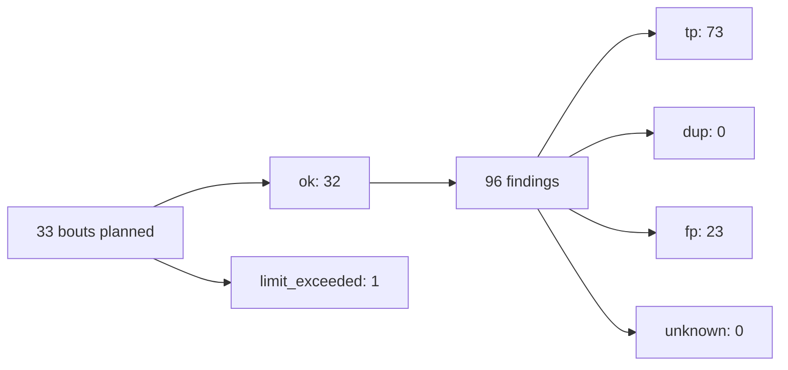

Findings and verdicts count ok bouts only; verdicts are the final ones when scored, else ground truth, else the judge.

### Pipelines

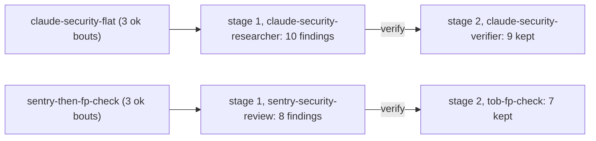

Findings each stage passed on, summed over the pipeline's ok bouts.

## filebrowser

### Charts

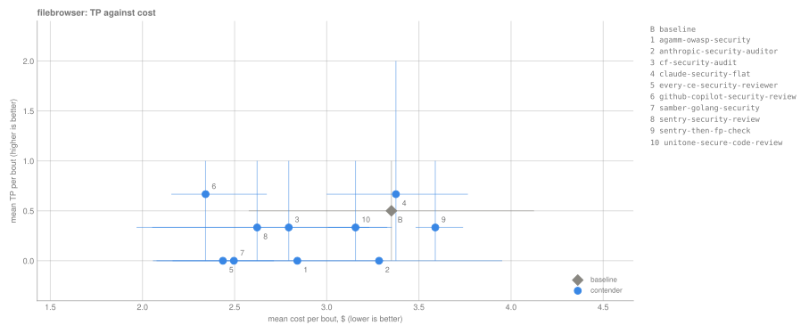

*How to read: Up and to the left is better; whiskers are 95% CIs, gray is the baseline. n = 32 ok bouts of 33.*

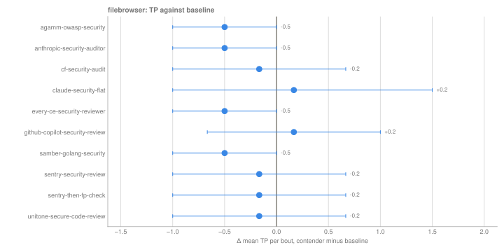

*How to read: Right of the line beats the baseline; a CI that crosses zero isn't a clear difference. n = 32 ok bouts of 33.*

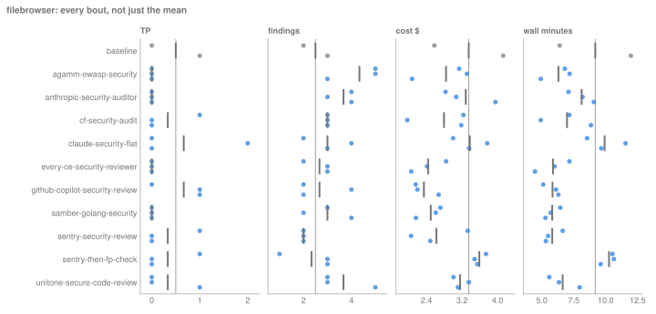

*How to read: Each dot is one ok bout, the dark tick is the mean and the gray line is the baseline's mean; dots far apart mean the contender is inconsistent from run to run. n = 32 ok bouts of 33.*

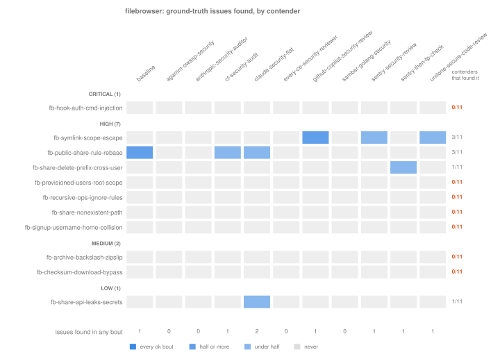

*How to read: Each row is a known issue (grouped by severity), each column a contender; darker means found in more of its ok bouts. The right column counts contenders that found the issue at least once (7 of 11 issues: none). n = 32 ok bouts of 33.*

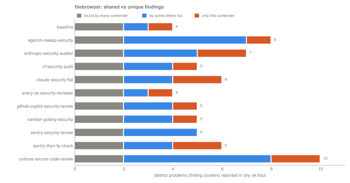

*How to read: Distinct problems each contender reported across its bouts, split by how many other contenders reported them too; orange is what only this contender found (24 problems in all). n = 32 ok bouts of 33.*

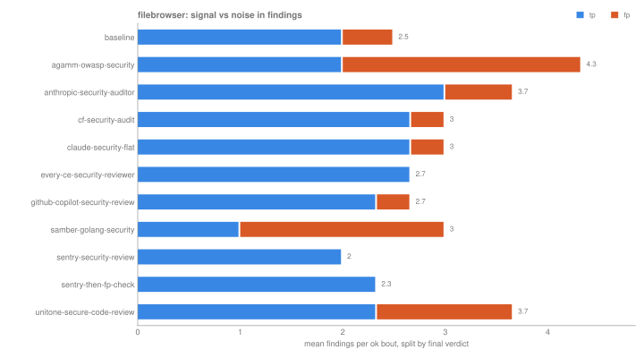

*How to read: Mean findings per bout split by final verdict; the blue share is signal, the rest is noise or undecided. n = 32 ok bouts of 33.*

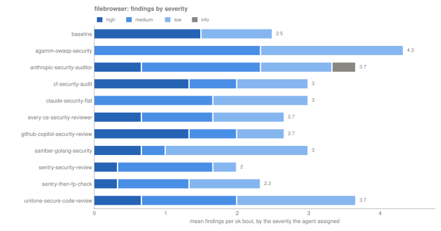

*How to read: Mean findings per bout stacked by self-reported severity, darkest is critical; a contender that rates the same issues higher shows more dark. n = 32 ok bouts of 33.*

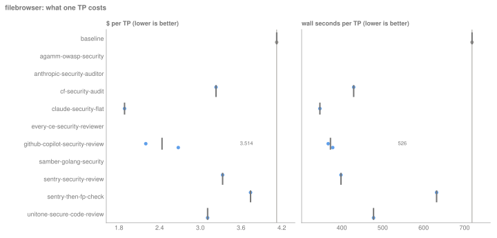

*How to read: Dollars and wall-clock seconds per TP: dots are single bouts (bouts with no TP are left out), the tick and number are the pooled ratio (total over total). n = 32 ok bouts of 33.*

### Tables · security-audit · `claude-opus-4-8@high`

**Quality**

| contender | n | findings | TP | recall | panel-valid | bouts |
|---|---|---:|---:|---:|---:|---|
| baseline | 2/3 | 2.5 [2, 3] | 0.5 [0, 1] | 0.05 [0.00, 0.09] | 2 [1, 3] | [#1](bouts/b-49faae21481ac250/) [#2 (limit_exceeded)](bouts/b-db37a6cc44f67f83/) [#3](bouts/b-abed107b0b52e593/) |
| agamm-owasp-security | 3/3 | 4.3 [3, 5] | 0 [0, 0] | 0.00 [0.00, 0.00] | 2 [1, 3] | [#1](bouts/b-7b98c55d31b2be03/) [#2](bouts/b-65516dfb470cc57d/) [#3](bouts/b-040efba0c14012ec/) |
| anthropic-security-auditor | 3/3 | 3.7 [3, 4] | 0 [0, 0] | 0.00 [0.00, 0.00] | 3 [2, 4] | [#1](bouts/b-0340d9ba56643e4a/) [#2](bouts/b-b363f469ce157186/) [#3](bouts/b-41ff07faf7bb2ae6/) |
| cf-security-audit | 3/3 | 3 [3, 3] | 0.3 [0, 1] | 0.03 [0.00, 0.09] | 2.7 [2, 3] | [#1](bouts/b-2b2444b4b479af08/) [#2](bouts/b-f011cd3aa51364e7/) [#3](bouts/b-d0cc19b01a50947b/) |
| claude-security-flat | 3/3 | 3 [2, 4] | 0.7 [0, 2] | 0.06 [0.00, 0.18] | 2.3 [2, 3] | [#1](bouts/b-d83e9252bd6b39f1/) [#2](bouts/b-9e382bb9a7bed447/) [#3](bouts/b-c1f28329bc5814ab/) |
| every-ce-security-reviewer | 3/3 | 2.7 [2, 3] | 0 [0, 0] | 0.00 [0.00, 0.00] | 2.7 [2, 3] | [#1](bouts/b-12e00fc654df2859/) [#2](bouts/b-a66cfab425eefd5b/) [#3](bouts/b-9357c761e4c5acca/) |
| github-copilot-security-review | 3/3 | 2.7 [2, 4] | 0.7 [0, 1] | 0.06 [0.00, 0.09] | 2 [1, 3] | [#1](bouts/b-8d621e3eddd2e4fd/) [#2](bouts/b-c1c354a6b9d6206f/) [#3](bouts/b-640510c766e94826/) |
| samber-golang-security | 3/3 | 3 [2, 4] | 0 [0, 0] | 0.00 [0.00, 0.00] | 1 [1, 1] | [#1](bouts/b-951d3e1d7fa7f380/) [#2](bouts/b-f5d21657027a750a/) [#3](bouts/b-ee3dd3ecb8275bdb/) |
| sentry-security-review | 3/3 | 2 [2, 2] | 0.3 [0, 1] | 0.03 [0.00, 0.09] | 2 [2, 2] | [#1](bouts/b-a366d17fe7e0fdb0/) [#2](bouts/b-515a753c1aa8f5a3/) [#3](bouts/b-dbf41d995c5d9e39/) |
| sentry-then-fp-check | 3/3 | 2.3 [1, 3] | 0.3 [0, 1] | 0.03 [0.00, 0.09] | 2.3 [1, 3] | [#1](bouts/b-c36211bb017e1b97/) [#2](bouts/b-c4ae82ecf5bea150/) [#3](bouts/b-4ab397fe64fb2452/) |
| unitone-secure-code-review | 3/3 | 3.7 [3, 5] | 0.3 [0, 1] | 0.03 [0.00, 0.09] | 2.3 [1, 4] | [#1](bouts/b-a26e5377ad89a2e8/) [#2](bouts/b-6c8d0f9b0b4778a1/) [#3](bouts/b-527f5d428b1ed0ea/) |

**Against baseline**

| contender | Δ TP | Δ F1 | Δ cost $ | cost per TP $ | skill fired | first-turn tokens vs baseline | check |
|---|---:|---:|---:|---:|---:|---:|---|
| agamm-owasp-security | -0.5 [-1, 0] | n/a | -0.510 [-1.695, 0.675] | n/a | 100% (n=3) | +7,851 | ok |
| anthropic-security-auditor | -0.5 [-1, 0] | n/a | -0.067 [-1.215, 1.081] | n/a | 100% (n=3) | +3,829 | ok |
| cf-security-audit | -0.2 [-1, 0.7] | n/a | -0.557 [-1.752, 0.638] | 8.381 | 100% (n=3) | +9,408 | ok |
| claude-security-flat | +0.2 [-1, 1.5] | n/a | +0.024 [-1.005, 1.054] | 5.063 | 100% (n=3) | +4,244 | ok |
| every-ce-security-reviewer | -0.5 [-1, 0] | n/a | -0.914 [-1.949, 0.121] | n/a | 100% (n=3) | +4,066 | ok |
| github-copilot-security-review | +0.2 [-0.7, 1] | n/a | -1.008 [-1.955, -0.062] | 3.514 | 100% (n=3) | +5,559 | ok |
| samber-golang-security | -0.5 [-1, 0] | n/a | -0.855 [-1.812, 0.103] | n/a | 100% (n=3) | +7,274 | ok |
| sentry-security-review | -0.2 [-1, 0.7] | n/a | -0.729 [-1.928, 0.471] | 7.867 | 100% (n=3) | +6,889 | ok |
| sentry-then-fp-check | -0.2 [-1, 0.7] | n/a | +0.238 [-0.622, 1.098] | 10.77 | 100% (n=3) | +6,889 | ok |
| unitone-secure-code-review | -0.2 [-1, 0.7] | n/a | -0.195 [-1.084, 0.694] | 9.468 | 100% (n=3) | +12,756 | ok |

<details>
<summary>Cost and resources per bout, mean [95% CI]</summary>

| contender | n | cost $ | tokens | duration s | turns | RSS peak MB | spent, all bouts |
|---|---|---:|---:|---:|---:|---:|---:|
| baseline | 2/3 | 3.351 [2.577, 4.125] | 2.44M [1.87M, 3.01M] | 551 [384, 718] | 57 [51, 63] | 274 [264, 285] | $6.701 |
| agamm-owasp-security | 3/3 | 2.840 [2.076, 3.309] | 2.74M [1.75M, 3.41M] | 378 [295, 431] | 42.7 [32, 50] | 271 [252, 293] | $8.521 |
| anthropic-security-auditor | 3/3 | 3.284 [2.829, 3.952] | 2.77M [2.18M, 3.60M] | 487 [425, 544] | 59 [55, 66] | 301 [290, 317] | $9.851 |
| cf-security-audit | 3/3 | 2.794 [1.968, 3.231] | 2.36M [1.30M, 3.06M] | 418 [295, 531] | 41 [38, 44] | 275 [260, 292] | $8.381 |
| claude-security-flat | 3/3 | 3.375 [2.999, 3.766] | 2.13M [1.67M, 2.48M] | 595 [513, 693] | 60 [57, 62] | 289 [274, 297] | $10.125 |
| every-ce-security-reviewer | 3/3 | 2.436 [2.057, 2.840] | 1.84M [1.54M, 2.20M] | 352 [268, 430] | 41.7 [41, 43] | 272 [243, 288] | $7.309 |
| github-copilot-security-review | 3/3 | 2.342 [2.157, 2.675] | 1.59M [1.27M, 2.12M] | 350 [306, 378] | 49 [45, 57] | 257 [255, 260] | $7.027 |
| samber-golang-security | 3/3 | 2.496 [2.163, 2.714] | 1.83M [1.54M, 2.01M] | 349 [317, 387] | 47 [42, 50] | 272 [267, 279] | $7.488 |
| sentry-security-review | 3/3 | 2.622 [2.053, 3.328] | 2.22M [1.35M, 3.38M] | 349 [319, 398] | 47 [42, 50] | 259 [256, 262] | $7.867 |
| sentry-then-fp-check | 3/3 | 3.589 [3.482, 3.740] | 2.42M [2.07M, 2.61M] | 616 [577, 639] | 69.7 [65, 73] | 265 [254, 285] | $10.767 |
| unitone-secure-code-review | 3/3 | 3.156 [3.008, 3.353] | 3.00M [2.40M, 3.69M] | 398 [335, 478] | 48.7 [41, 55] | 263 [246, 283] | $9.468 |

</details>


### What each contender found

<details>
<summary>Ground-truth issues: who found what (11 issues, 7 found by nobody)</summary>

| issue | title | severity | CWE | contenders | found by (ok bouts that found it) |
|---|---|---|---|---:|---|
| `fb-hook-auth-cmd-injection` | Pre-auth command/argument injection via os.Expand of login credentials in hook auth | critical | CWE-78, CWE-77, CWE-88, CWE-306 | 0/11 | nobody |
| `fb-symlink-scope-escape` | Handlers follow symlinks out of the user's BasePathFs scope (read, write, share) | high | CWE-59, CWE-61, CWE-22, CWE-23 | 3/11 | github-copilot-security-review 2/3 [#2](bouts/b-c1c354a6b9d6206f/) [#3](bouts/b-640510c766e94826/); sentry-security-review 1/3 [#1](bouts/b-a366d17fe7e0fdb0/); unitone-secure-code-review 1/3 [#3](bouts/b-527f5d428b1ed0ea/) |
| `fb-public-share-rule-rebase` | Public directory shares bypass owner's deny rules after the filesystem is rebased | high | CWE-863, CWE-285, CWE-284, CWE-639 | 3/11 | baseline 1/2 [#3](bouts/b-abed107b0b52e593/); cf-security-audit 1/3 [#1](bouts/b-2b2444b4b479af08/); claude-security-flat 1/3 [#2](bouts/b-9e382bb9a7bed447/) |
| `fb-share-delete-prefix-cross-user` | Deleting a file removes other users' share links via unscoped path-prefix match | high | CWE-639, CWE-863, CWE-285, CWE-284, CWE-862 | 1/11 | sentry-then-fp-check 1/3 [#1](bouts/b-c36211bb017e1b97/) |
| `fb-provisioned-users-root-scope` | Proxy- and hook-auth auto-provisioned users get the server root as scope | high | CWE-284, CWE-863, CWE-266, CWE-269, CWE-1188 | 0/11 | nobody |
| `fb-recursive-ops-ignore-rules` | Copy, rename and delete authorize only the root, then recurse past deny rules | high | CWE-863, CWE-285, CWE-284, CWE-862 | 0/11 | nobody |
| `fb-share-nonexistent-path` | Share can be created for a path that does not exist yet (future-file exposure) | high | CWE-862, CWE-863, CWE-284, CWE-285 | 0/11 | nobody |
| `fb-signup-username-home-collision` | Many-to-one username normalization lets a new signup land in another user's home dir | high | CWE-647, CWE-706, CWE-41, CWE-863, CWE-284 | 0/11 | nobody |
| `fb-archive-backslash-zipslip` | Archive download emits backslash filenames verbatim (zip-slip on Windows extractors) | medium | CWE-22, CWE-23, CWE-29 | 0/11 | nobody |
| `fb-checksum-download-bypass` | ?checksum= on /api/resources hashes file content without Perm.Download | medium | CWE-863, CWE-862, CWE-285, CWE-200 | 0/11 | nobody |
| `fb-share-api-leaks-secrets` | Share API returns bcrypt password hash and password-bypass token | low | CWE-200, CWE-522, CWE-212 | 1/11 | claude-security-flat 1/3 [#2](bouts/b-9e382bb9a7bed447/) |

</details>

<details>
<summary>Distinct problems (finding clusters): who reported what (24 problems, 14 reported by one contender only)</summary>

| problem | title | severity | CWE | contenders | found by (ok bouts that found it) |
|---|---|---|---|---:|---|
| `http/commands.go:72 CWE-78` | Per-user command allow-list bypassed by shell metacharacters in commandsHandler | high | CWE-78 | 11/11 | baseline 2/2; agamm-owasp-security 2/3; anthropic-security-auditor 3/3; cf-security-audit 2/3; claude-security-flat 3/3; every-ce-security-reviewer 3/3; github-copilot-security-review 3/3; samber-golang-security 2/3; sentry-security-review 2/3; sentry-then-fp-check 1/3; unitone-secure-code-review 1/3 |
| `auth/proxy.go:21 CWE-290` | Proxy auth authenticates any user from an unverified client-supplied header | high | CWE-290 | 11/11 | baseline 1/2; agamm-owasp-security 3/3; anthropic-security-auditor 3/3; cf-security-audit 3/3; claude-security-flat 2/3; every-ce-security-reviewer 2/3; github-copilot-security-review 2/3; samber-golang-security 2/3; sentry-security-review 1/3; sentry-then-fp-check 2/3; unitone-secure-code-review 2/3 |
| `http/auth.go:67 CWE-613` | Expired JWT accepted for authenticated requests in proxy-auth mode | low | CWE-613 | 8/11 | agamm-owasp-security 1/3 [#1](bouts/b-7b98c55d31b2be03/); anthropic-security-auditor 1/3 [#3](bouts/b-41ff07faf7bb2ae6/); cf-security-audit 2/3 [#2](bouts/b-f011cd3aa51364e7/) [#3](bouts/b-d0cc19b01a50947b/); claude-security-flat 1/3 [#1](bouts/b-d83e9252bd6b39f1/); every-ce-security-reviewer 2/3 [#1](bouts/b-12e00fc654df2859/) [#3](bouts/b-9357c761e4c5acca/); sentry-security-review 1/3 [#3](bouts/b-dbf41d995c5d9e39/); sentry-then-fp-check 1/3 [#2](bouts/b-c4ae82ecf5bea150/); unitone-secure-code-review 1/3 [#3](bouts/b-527f5d428b1ed0ea/) |
| `http/public.go:134 CWE-208` | Non-constant-time comparison of share bypass token in authenticateShareRequest | low | CWE-208 | 4/11 | agamm-owasp-security 2/3 [#1](bouts/b-7b98c55d31b2be03/) [#2](bouts/b-65516dfb470cc57d/); anthropic-security-auditor 1/3 [#1](bouts/b-0340d9ba56643e4a/); samber-golang-security 3/3 [#1](bouts/b-951d3e1d7fa7f380/) [#2](bouts/b-f5d21657027a750a/) [#3](bouts/b-ee3dd3ecb8275bdb/); unitone-secure-code-review 1/3 [#3](bouts/b-527f5d428b1ed0ea/) |
| `http/auth.go:121 CWE-307` | No anti-automation / rate limiting on the login endpoint | medium | CWE-307 | 3/11 | agamm-owasp-security 2/3 [#1](bouts/b-7b98c55d31b2be03/) [#3](bouts/b-040efba0c14012ec/); samber-golang-security 1/3 [#3](bouts/b-ee3dd3ecb8275bdb/); unitone-secure-code-review 1/3 [#2](bouts/b-6c8d0f9b0b4778a1/) |
| `files/file.go:132 CWE-59` | Symlink inside a user scope escapes BasePathFs confinement (arbitrary file read/serve) | medium | CWE-59 | 3/11 | github-copilot-security-review 1/3 [#3](bouts/b-640510c766e94826/); sentry-security-review 1/3 [#1](bouts/b-a366d17fe7e0fdb0/); unitone-secure-code-review 1/3 [#3](bouts/b-527f5d428b1ed0ea/) |
| `http/public.go:62 CWE-863` | Administrator path rules bypassed for files inside a shared directory (withHashFile) | medium | CWE-863 | 3/11 | baseline 1/2 [#3](bouts/b-abed107b0b52e593/); cf-security-audit 1/3 [#1](bouts/b-2b2444b4b479af08/); claude-security-flat 1/3 [#2](bouts/b-9e382bb9a7bed447/) |
| `runner/parser.go:16 CWE-78` | Per-user command allow-list bypassed (arbitrary command execution) when a shell is configured in ParseCommand | medium | CWE-78 | 3/11 | agamm-owasp-security 1/3 [#1](bouts/b-7b98c55d31b2be03/); sentry-security-review 1/3 [#3](bouts/b-dbf41d995c5d9e39/); sentry-then-fp-check 1/3 [#3](bouts/b-4ab397fe64fb2452/) |
| `runner/runner.go:84 CWE-78` | Command injection via attacker-controlled filename in event-hook runner when Shell is configured | high | CWE-78 | 3/11 | anthropic-security-auditor 1/3 [#2](bouts/b-b363f469ce157186/); github-copilot-security-review 1/3 [#2](bouts/b-c1c354a6b9d6206f/); unitone-secure-code-review 1/3 [#3](bouts/b-527f5d428b1ed0ea/) |
| `frontend/src/utils/auth.ts:13 CWE-614` | Auth JWT cookie set without the Secure attribute | low | CWE-614 | 2/11 | agamm-owasp-security 1/3 [#2](bouts/b-65516dfb470cc57d/); unitone-secure-code-review 1/3 [#2](bouts/b-6c8d0f9b0b4778a1/) |
| `auth/hook.go:70 CWE-203` | Hook auth 'pass' path enables username enumeration via timing (no dummy-hash defense) | low | CWE-203 | 1/11 | cf-security-audit 1/3 [#3](bouts/b-d0cc19b01a50947b/) |
| `cmd/root.go:472 CWE-256` | Operator-supplied admin password stored in cleartext during quick setup | high | CWE-256 | 1/11 | unitone-secure-code-review 1/3 [#1](bouts/b-a26e5377ad89a2e8/) |
| `compose.yaml:12 CWE-798` | Hardcoded weak Redis credential in example compose.yaml | info | CWE-798 | 1/11 | anthropic-security-auditor 1/3 [#1](bouts/b-0340d9ba56643e4a/) |
| `http/data.go:56 CWE-703` | Per-request settings read error calls log.Fatalf, terminating the server | low | CWE-703 | 1/11 | agamm-owasp-security 1/3 [#2](bouts/b-65516dfb470cc57d/) |
| `http/http.go:30 CWE-1021` | Missing clickjacking protection (no X-Frame-Options / CSP frame-ancestors) | low | CWE-1021 | 1/11 | samber-golang-security 1/3 [#1](bouts/b-951d3e1d7fa7f380/) |
| `http/public.go:129 CWE-598` | Password-protected share bypass token accepted from URL query string, leaking via logs/Referer (CWE-598) | low | CWE-598 | 1/11 | every-ce-security-reviewer 1/3 [#2](bouts/b-a66cfab425eefd5b/) |
| `http/resource.go:392 CWE-284` | Recursive listing endpoint skips the rules/HideDotfiles check on the requested root path | low | CWE-284 | 1/11 | sentry-then-fp-check 1/3 [#3](bouts/b-4ab397fe64fb2452/) |
| `http/resource.go:392 CWE-285` | Recursive listing endpoint does not apply the rules checker to the requested root path | low | CWE-285 | 1/11 | anthropic-security-auditor 1/3 [#3](bouts/b-41ff07faf7bb2ae6/) |
| `http/resource.go:392 CWE-400` | Unbounded in-memory recursive directory walk in resourceGetRecursiveHandler | low | CWE-400 | 1/11 | claude-security-flat 1/3 [#3](bouts/b-c1f28329bc5814ab/) |
| `http/resource.go:461 CWE-200` | diskUsage endpoint discloses host filesystem capacity to any authenticated user | low | CWE-200 | 1/11 | baseline 1/2 [#1](bouts/b-49faae21481ac250/) |
| `settings/dir.go:35 CWE-276` | User home directories created with world-accessible permissions (0777) | low | CWE-276 | 1/11 | unitone-secure-code-review 1/3 [#1](bouts/b-a26e5377ad89a2e8/) |
| `share/share.go:15 CWE-200` | Share password bcrypt hash and bypass token returned in share API responses | low | CWE-200 | 1/11 | claude-security-flat 1/3 [#2](bouts/b-9e382bb9a7bed447/) |
| `storage/bolt/share.go:79 CWE-639` | Share cleanup deletes links by unscoped Path string-prefix in shareBackend.DeleteWithPathPrefix | low | CWE-639 | 1/11 | sentry-then-fp-check 1/3 [#1](bouts/b-c36211bb017e1b97/) |
| `users/users.go:93 CWE-59` | User scope (afero BasePathFs) does not resolve symlinks, allowing reads/writes outside the configured scope | low | CWE-59 | 1/11 | github-copilot-security-review 1/3 [#2](bouts/b-c1c354a6b9d6206f/) |

</details>

<details>
<summary>Findings by CWE (20 CWEs)</summary>

| CWE | findings | contenders | findings per contender (all ok bouts) |
|---|---:|---:|---|
| CWE-78 | 30 | 11/11 | anthropic-security-auditor 4, github-copilot-security-review 4, agamm-owasp-security 3, claude-security-flat 3, every-ce-security-reviewer 3, sentry-security-review 3, baseline 2, cf-security-audit 2, samber-golang-security 2, sentry-then-fp-check 2, unitone-secure-code-review 2 |
| CWE-290 | 23 | 11/11 | agamm-owasp-security 3, anthropic-security-auditor 3, cf-security-audit 3, claude-security-flat 2, every-ce-security-reviewer 2, github-copilot-security-review 2, samber-golang-security 2, sentry-then-fp-check 2, unitone-secure-code-review 2, baseline 1, sentry-security-review 1 |
| CWE-613 | 10 | 8/11 | cf-security-audit 2, every-ce-security-reviewer 2, agamm-owasp-security 1, anthropic-security-auditor 1, claude-security-flat 1, sentry-security-review 1, sentry-then-fp-check 1, unitone-secure-code-review 1 |
| CWE-208 | 7 | 4/11 | samber-golang-security 3, agamm-owasp-security 2, anthropic-security-auditor 1, unitone-secure-code-review 1 |
| CWE-307 | 4 | 3/11 | agamm-owasp-security 2, samber-golang-security 1, unitone-secure-code-review 1 |
| CWE-59 | 4 | 3/11 | github-copilot-security-review 2, sentry-security-review 1, unitone-secure-code-review 1 |
| CWE-863 | 3 | 3/11 | baseline 1, cf-security-audit 1, claude-security-flat 1 |
| CWE-200 | 2 | 2/11 | baseline 1, claude-security-flat 1 |
| CWE-614 | 2 | 2/11 | agamm-owasp-security 1, unitone-secure-code-review 1 |
| CWE-1021 | 1 | 1/11 | samber-golang-security 1 |
| CWE-203 | 1 | 1/11 | cf-security-audit 1 |
| CWE-256 | 1 | 1/11 | unitone-secure-code-review 1 |
| CWE-276 | 1 | 1/11 | unitone-secure-code-review 1 |
| CWE-284 | 1 | 1/11 | sentry-then-fp-check 1 |
| CWE-285 | 1 | 1/11 | anthropic-security-auditor 1 |
| CWE-400 | 1 | 1/11 | claude-security-flat 1 |
| CWE-598 | 1 | 1/11 | every-ce-security-reviewer 1 |
| CWE-639 | 1 | 1/11 | sentry-then-fp-check 1 |
| CWE-703 | 1 | 1/11 | agamm-owasp-security 1 |
| CWE-798 | 1 | 1/11 | anthropic-security-auditor 1 |

</details>

<details>
<summary>Findings per bout by severity</summary>

| contender | ok bouts | high | medium | low | info |
|---|---:|---:|---:|---:|---:|
| baseline | 2 | 1.5 | 0 | 1 | 0 |
| agamm-owasp-security | 3 | 0 | 2.3 | 2 | 0 |
| anthropic-security-auditor | 3 | 0.7 | 1.7 | 1 | 0.3 |
| cf-security-audit | 3 | 1.3 | 0.7 | 1 | 0 |
| claude-security-flat | 3 | 0 | 1.7 | 1.3 | 0 |
| every-ce-security-reviewer | 3 | 0.7 | 1 | 1 | 0 |
| github-copilot-security-review | 3 | 1.3 | 0.7 | 0.7 | 0 |
| samber-golang-security | 3 | 0.7 | 0.3 | 2 | 0 |
| sentry-security-review | 3 | 0.3 | 1.3 | 0.3 | 0 |
| sentry-then-fp-check | 3 | 0.3 | 1 | 1 | 0 |
| unitone-secure-code-review | 3 | 0.7 | 1.3 | 1.7 | 0 |

</details>

<details>
<summary>Panel judge verdicts per contender (judge agreement: share of findings with unanimous votes)</summary>

| contender | judged | panel-valid | panel-invalid | unverifiable | judge agreement |
|---|---:|---:|---:|---:|---:|
| baseline | 5 | 4 | 1 | 0 | 60% |
| agamm-owasp-security | 13 | 6 | 7 | 0 | 77% |
| anthropic-security-auditor | 11 | 9 | 2 | 0 | 73% |
| cf-security-audit | 9 | 8 | 1 | 0 | 33% |
| claude-security-flat | 9 | 7 | 2 | 0 | 67% |
| every-ce-security-reviewer | 8 | 8 | 0 | 0 | 88% |
| github-copilot-security-review | 8 | 6 | 2 | 0 | 50% |
| samber-golang-security | 9 | 3 | 6 | 0 | 89% |
| sentry-security-review | 6 | 6 | 0 | 0 | 67% |
| sentry-then-fp-check | 7 | 7 | 0 | 0 | 86% |
| unitone-secure-code-review | 11 | 7 | 4 | 0 | 82% |

</details>

## All arenas

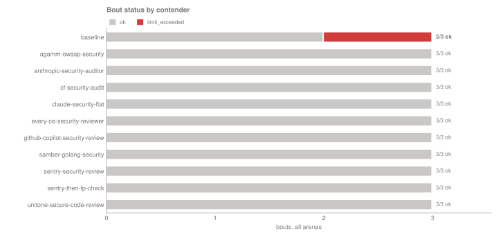

*How to read: How every bout ended; colored segments are the 1 that did not finish ok and are left out of every mean (reasons in the table at the end). n = 32 ok bouts of 33.*

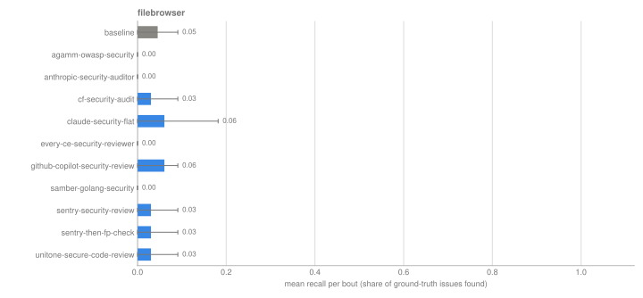

*How to read: Share of each arena's ground-truth issues a bout found, mean with 95% CI; gray is the baseline. n = 32 ok bouts of 33.*

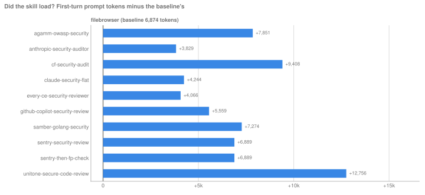

*How to read: How many more tokens each contender's first prompt carried than the baseline's (mean over ok bouts). A loaded skill adds tokens; zero or less is flagged: none at or below zero. n = 32 ok bouts of 33.*

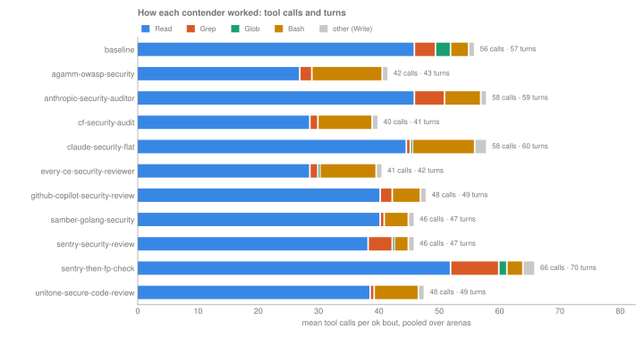

*How to read: Mean tool calls per bout by tool (from each bout's record.json), with mean agent turns at the end of the bar, pooled over arenas. n = 32 ok bouts of 33.*

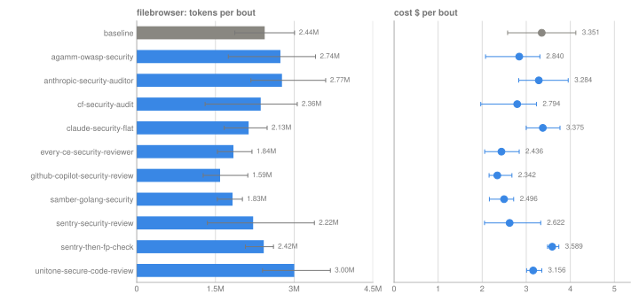

*How to read: Mean tokens (bars) and cost (dots) per ok bout, one row per arena, whiskers 95% CI; gray is the baseline. n = 32 ok bouts of 33.*

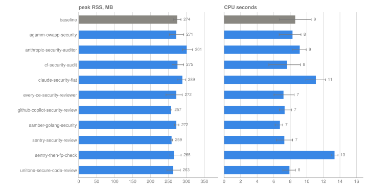

*How to read: Peak RSS and CPU time of the client harness per ok bout, pooled over arenas, whiskers 95% CI (not model-side compute). n = 32 ok bouts of 33.*

<details>
<summary>Tool calls per bout (mean over ok bouts, all arenas)</summary>

| contender | bouts | turns | Read | Bash | Grep | Write | Glob |
|---|---:|---:|---:|---:|---:|---:|---:|
| baseline | 2 | 57 | 46 | 3 | 3.5 | 1 | 2.5 |
| agamm-owasp-security | 3 | 42.7 | 27 | 11.7 | 2 | 1 | 0 |
| anthropic-security-auditor | 3 | 59 | 46 | 6 | 5 | 1 | 0 |
| cf-security-audit | 3 | 41 | 28.7 | 9 | 1.3 | 1 | 0 |
| claude-security-flat | 3 | 60 | 44.7 | 10.3 | 0.7 | 2 | 0.3 |
| every-ce-security-reviewer | 3 | 41.7 | 28.7 | 9.3 | 1.3 | 1 | 0.3 |
| github-copilot-security-review | 3 | 49 | 40.3 | 4.7 | 2 | 1 | 0 |
| samber-golang-security | 3 | 47 | 40.3 | 4 | 0.7 | 1 | 0 |
| sentry-security-review | 3 | 47 | 38.3 | 2.3 | 4 | 1 | 0.3 |
| sentry-then-fp-check | 3 | 69.7 | 52 | 2.7 | 8 | 2 | 1.3 |
| unitone-secure-code-review | 3 | 48.7 | 38.7 | 7.3 | 0.7 | 1 | 0 |

</details>

## Bouts that did not finish ok

**limit_exceeded**: 1. These are excluded from the means above but counted in **n** and in spend.

| bout | contender | arena | task | model | rep | status | reason |
|---|---|---|---|---|---|---|---|
| [b-db37a6cc44f67f83](bouts/b-db37a6cc44f67f83/) | baseline | filebrowser | security-audit | `claude-opus-4-8@high` | 2 | limit_exceeded | limit hit: max_total_tokens 4000000 (seen 4056751) |

## How to reproduce

```bash
git clone https://github.com/thereisnotime/skillordeal-trials
cd skillordeal-trials
uv tool install git+https://github.com/thereisnotime/skillordeal@v0.1.4
skillordeal run    trials/2026-10-filebrowser-cve-audit/trial.yaml -r r01   # refuses to start on lock drift
skillordeal score  trials/2026-10-filebrowser-cve-audit/trial.yaml -r r01
skillordeal judge  trials/2026-10-filebrowser-cve-audit/trial.yaml -r r01   # optional, costs money
skillordeal report trials/2026-10-filebrowser-cve-audit/trial.yaml -r r01
```

Finished bouts are skipped, so `run` on an existing round only fills gaps. For an independent reproduction, lock a new round from the same trial (`skillordeal lock ... -r r02`) and compare.

## Reading the numbers

- **TP / precision / recall / F1** come from `scores/` (human labels override ground truth, which overrides the judge). Recall is measured against the issues listed in the arena's ground truth. Unless that list is marked complete, unmatched findings are `unknown` rather than false positives, so precision is only a lower bound.
- **Δ** columns are contender minus baseline in the same arena, task and model, with a CI from resampling both sides.
- **cost per TP** is total cost of the ok bouts over their total TPs.
- **first-turn tokens vs baseline** is this contender's mean first-turn prompt tokens minus the baseline's. A skill that loaded should add tokens; zero or less is flagged.
- **skill fired** is the share of ok bouts where the skill was invoked (forced invocation counts as fired).
- **Distinct problems** are clusters of findings about the same code across all bouts of an arena (same file, lines within ±5, same CWE or category).
- Cost is the CLI's client-side estimate (notional under OAuth).
